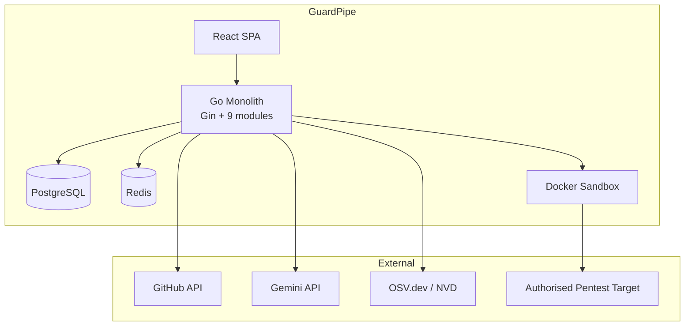

# 02 — Software Requirements Specification (SRS)

| Field | Value |
|---|---|
| **Document** | Software Requirements Specification |
| **Project** | GuardPipe |
| **Version** | 1.0 |
| **Status** | Draft |
| **Standard** | ISO/IEC/IEEE 29148:2018 |
| **Authors** | GuardPipe Team |
| **Last updated** | 2026-07-29 |

### Revision history

| Version | Date | Author | Change |
|---|---|---|---|
| 1.0 | 2026-07-29 | Team | Initial SRS |

> **Change control:** this document is a shared contract. Any modification requires **two approvals** (see [14 — GitHub Workflow](14-github-workflow.md)).

---

## 1. Introduction

### 1.1 Purpose

This document specifies the functional and non-functional requirements for **GuardPipe**, an AI-powered software supply-chain security platform. It is written for the development team, the course instructor, and any future maintainer. It defines *what* the system shall do; the *how* is specified in [03 — Architecture Overview](03-architecture-overview.md) and its dependent documents.

### 1.2 Scope

GuardPipe is a self-hosted web application that analyses a software project's supply chain across seven stages and reports a unified security verdict.

**The system shall:** ingest a Git repository; analyse its documentation, source code, dependencies, container definitions, Kubernetes manifests, and CI/CD workflows; optionally perform an authorised penetration test against a running target; normalise all findings into one model; compute a risk score; and present everything through an interactive dashboard with AI-generated explanations and patches.

**The system shall not:** modify the analysed repository, deploy software, connect to live Kubernetes clusters, or perform exploitation beyond non-destructive reconnaissance.

### 1.3 Definitions, acronyms, abbreviations

See [18 — Glossary](18-glossary.md). Key terms used throughout:

| Term | Meaning in this document |
|---|---|
| **Project** | A user-created container representing one software product under analysis |
| **Target** | A repository URL or a network host/URL that a scan is run against |
| **Scan** | One execution of one or more engines against a target; has a lifecycle and a result |
| **Engine** | One of the nine analysis modules (`docreview`, `codescan`, `depscan`, `containerscan`, `k8sscan`, `cicdscan`, `pentest`, plus `ai` and `scoring` as supporting modules) |
| **Finding** | A single normalised security issue produced by an engine |
| **Rule** | A deterministic detector inside an engine that produces findings of one type |
| **Risk Score** | The unified 0–100 value computed by the `scoring` module |

### 1.4 Requirement conventions

- **shall** — mandatory. Absence is a defect.
- **should** — recommended. Deviation must be justified in the implementing PR.
- **may** — optional.
- IDs are stable and never reused: `FR-<ENGINE>-<nnn>` and `NFR-<ATTRIBUTE>-<nnn>`.
- Every requirement carries a priority: **Core** (must ship) or **Stretch** (ship if schedule allows).

### 1.5 References

| Ref | Source |
|---|---|
| [R1] | ISO/IEC/IEEE 29148:2018 — Requirements engineering |
| [R2] | OWASP Top 10 (2021) |
| [R3] | OWASP ASVS 4.0 |
| [R4] | CWE — Common Weakness Enumeration, MITRE |
| [R5] | CVSS v3.1 / v4.0 Specification, FIRST |
| [R6] | CIS Kubernetes Benchmark |
| [R7] | CIS Docker Benchmark |
| [R8] | NIST SP 800-218 — Secure Software Development Framework |
| [R9] | Kubernetes Pod Security Standards |
| [R10] | OSV.dev / OSV Schema |
| [R11] | RFC 9457 — Problem Details for HTTP APIs |
| [R12] | WCAG 2.1 Level AA |

---

## 2. Overall description

### 2.1 Product perspective

GuardPipe is a new, self-contained product. It is a **modular monolith**: a single Go binary exposing a REST API, backed by PostgreSQL and Redis, with a React single-page application as its only first-party client.

### 2.2 Product functions (summary)

| # | Function |
|---|---|
| F1 | User registration, authentication, and session management |
| F2 | Project and target management |
| F3 | Repository ingestion from GitHub (public or PAT-authenticated) |
| F4 | Full supply-chain scan (all engines, orchestrated) |
| F5 | Individual engine scan (any single stage, on demand) |
| F6 | Standalone authorised penetration test |
| F7 | Finding normalisation, deduplication, and storage |
| F8 | Unified risk scoring and release-gate verdict |
| F9 | AI explanation and patch generation per finding |
| F10 | Interactive dashboard: overview, findings explorer, finding detail, trends |
| F11 | Report export |
| F12 | Finding triage: acknowledge, suppress with justification, reopen |

### 2.3 User classes and characteristics

| Persona | Technical level | Primary need | Frequency |
|---|---|---|---|
| **DevSecOps Engineer** ("Nadia") | High | One view of all supply-chain risk before a release; wants raw detail and export | Daily |
| **Developer** ("Rafi") | Medium–High | Told exactly which line is wrong and how to fix it; hates false positives | Per PR |
| **Engineering Manager** ("Sadia") | Low–Medium | A trustworthy go/no-go verdict and a trend line; will not read raw findings | Weekly |
| **Security Student / Evaluator** | Medium | Wants to see the mechanism work and understand the coverage | Once |

### 2.4 Operating environment

| Element | Requirement |
|---|---|
| Server runtime | Linux container, Go 1.23+ |
| Database | PostgreSQL 16+ |
| Cache/Queue | Redis 7+ |
| Sandbox | Docker Engine 24+ (socket accessible to the application) |
| Client | Chrome, Edge, Firefox, or Safari — current and previous major version |
| Orchestration | Docker Compose (development and demo) |
| Minimum host | 4 vCPU, 8 GB RAM, 20 GB free disk |

### 2.5 Design and implementation constraints

| ID | Constraint |
|---|---|
| C1 | Backend shall be written in Go using the Gin web framework |
| C2 | Architecture shall be a modular monolith — one deployable binary |
| C3 | Persistent state shall be in PostgreSQL; Redis is cache and queue only and shall be treated as losable |
| C4 | The only LLM provider shall be Google Gemini, accessed through an internal provider interface |
| C5 | All external commands shall execute inside a sandboxed container, never on the host |
| C6 | Configuration shall be supplied by environment variables only (12-factor); no secrets in source |
| C7 | The system shall not require a cloud account to run or demo |
| C8 | The frontend shall be a React + Vite single-page application in TypeScript |

### 2.6 Assumptions and dependencies

1. Gemini API availability and free-tier quota.
2. OSV.dev availability for vulnerability lookups; the system shall degrade to "advisory data unavailable" rather than failing the scan.
3. GitHub API rate limits (60/hr unauthenticated, 5000/hr with PAT) — the system shall require a PAT for repositories over a size threshold.
4. Docker socket access on the host running GuardPipe.

---

## 3. Functional requirements

### 3.1 Identity and access — `identity`

| ID | Requirement | Priority |
|---|---|---|
| FR-IAM-001 | The system **shall** allow a user to register with email, display name, and password. | Core |
| FR-IAM-002 | The system **shall** store passwords hashed with Argon2id (or bcrypt cost ≥ 12 as fallback) and **shall never** store or log plaintext passwords. | Core |
| FR-IAM-003 | The system **shall** authenticate users and issue a short-lived JWT access token (15 min) and a long-lived refresh token (7 days). | Core |
| FR-IAM-004 | The system **shall** reject any API request to a protected endpoint without a valid, unexpired access token, returning HTTP 401. | Core |
| FR-IAM-005 | The system **shall** allow a user to refresh an access token using a valid refresh token, and **shall** rotate the refresh token on use. | Core |
| FR-IAM-006 | The system **shall** allow a user to log out, invalidating the refresh token server-side. | Core |
| FR-IAM-007 | The system **shall** enforce role-based access with roles `admin`, `member`, and `viewer`. | Core |
| FR-IAM-008 | The system **shall** ensure a user can only access projects and scans belonging to their organisation, returning HTTP 404 (not 403) for others' resources. | Core |
| FR-IAM-009 | The system **shall** rate-limit authentication endpoints to 5 attempts per minute per IP. | Core |
| FR-IAM-010 | The system **should** support GitHub OAuth login. | Stretch |

### 3.2 Project and target management — `project`

| ID | Requirement | Priority |
|---|---|---|
| FR-PRJ-001 | The system **shall** allow a user to create a project with a name, description, and optional repository URL. | Core |
| FR-PRJ-002 | The system **shall** allow a user to list, view, update, and archive projects. | Core |
| FR-PRJ-003 | The system **shall** accept and encrypt-at-rest a GitHub Personal Access Token per project for private repository access. | Core |
| FR-PRJ-004 | The system **shall never** return a stored PAT through the API; it **shall** return only a masked hint (e.g. `ghp_••••3f9a`). | Core |
| FR-PRJ-005 | The system **shall** validate a repository URL and confirm reachability before saving it. | Core |
| FR-PRJ-006 | The system **shall** allow a user to register a pentest target (host or URL) with an explicit **authorisation attestation** that must be accepted before any pentest scan can run. | Core |
| FR-PRJ-007 | The system **shall** reject pentest targets that resolve to addresses outside the configured allowlist, and **shall** block RFC 1918 / loopback / link-local / cloud-metadata addresses unless explicitly permitted by configuration. | Core |
| FR-PRJ-008 | The system **shall** record the full scan history of a project. | Core |

### 3.3 Scan orchestration — `orchestrator`

| ID | Requirement | Priority |
|---|---|---|
| FR-ORC-001 | The system **shall** allow a user to start a **full supply-chain scan** that executes all enabled engines against a project. | Core |
| FR-ORC-002 | The system **shall** allow a user to start a scan with any **subset** of engines selected. | Core |
| FR-ORC-003 | The system **shall** create one `scan` record with child `scan_job` records — one per engine. | Core |
| FR-ORC-004 | The system **shall** execute independent engine jobs concurrently, bounded by a configurable worker pool size. | Core |
| FR-ORC-005 | The system **shall** respect declared inter-engine dependencies (e.g. `containerscan` requires repository checkout to have completed). | Core |
| FR-ORC-006 | A failed engine job **shall not** fail the parent scan; the scan **shall** complete with that engine marked `failed` and an error recorded. | Core |
| FR-ORC-007 | The system **shall** expose live scan progress with per-engine status: `queued`, `running`, `succeeded`, `failed`, `skipped`, `cancelled`. | Core |
| FR-ORC-008 | The system **shall** allow a user to cancel a running scan; running jobs **shall** terminate within 10 seconds. | Core |
| FR-ORC-009 | The system **shall** enforce a per-engine timeout (default 5 min; `pentest` 15 min) after which the job is marked `failed` with reason `timeout`. | Core |
| FR-ORC-010 | The system **shall** clean up all temporary checkouts and sandbox containers when a scan reaches a terminal state, including on failure. | Core |
| FR-ORC-011 | The system **shall** shallow-clone the target repository (`--depth 1`) into an ephemeral working directory. | Core |
| FR-ORC-012 | The system **shall** reject repositories exceeding a configurable size limit (default 500 MB) before cloning completes. | Core |
| FR-ORC-013 | The system **should** trigger a scan automatically from a GitHub webhook on push or pull request. | Stretch |
| FR-ORC-014 | The system **should** support scheduled recurring scans. | Stretch |

### 3.4 Document review — `docreview`

| ID | Requirement | Priority |
|---|---|---|
| FR-DOC-001 | The system **shall** discover documentation files in the repository (`*.md`, `*.txt`, `*.adoc`, and files under `docs/`, `documentation/`). | Core |
| FR-DOC-002 | The system **shall** submit discovered documents to the AI module for review, chunking documents that exceed the model context budget. | Core |
| FR-DOC-003 | The system **shall** report spelling and grammar issues as `informational` findings with the offending text and a suggested correction. | Core |
| FR-DOC-004 | The system **shall** report **security-relevant documentation gaps** — e.g. an architecture document with no stated authentication mechanism, no data-classification statement, or no threat considerations. | Core |
| FR-DOC-005 | The system **shall** report **questionable design decisions** — e.g. documented plaintext credential storage, custom cryptography, disabled TLS verification, or public exposure of an admin interface. | Core |
| FR-DOC-006 | The system **shall** report internal contradictions between documents (e.g. two documents specifying different authentication schemes). | Core |
| FR-DOC-007 | Every `docreview` finding **shall** cite the file path and, where determinable, the line or section heading. | Core |
| FR-DOC-008 | The system **shall** treat documentation content as untrusted data and **shall not** execute instructions found within it (see [12 — Threat Model](12-security-and-threat-model.md) §Prompt injection). | Core |
| FR-DOC-009 | The system **should** detect broken internal links and stale references in documentation. | Stretch |

### 3.5 Static code analysis — `codescan`

| ID | Requirement | Priority |
|---|---|---|
| FR-CODE-001 | The system **shall** implement its own static analyzer; it **shall not** depend on an external SAST service or binary. | Core |
| FR-CODE-002 | The system **shall** analyse at minimum: JavaScript/TypeScript, Python, Go, Java, and PHP. | Core |
| FR-CODE-003 | The system **shall** detect **SQL injection** — untrusted input reaching a query construction site via string concatenation, formatting, or interpolation. | Core |
| FR-CODE-004 | The system **shall** detect **cross-site scripting (XSS)** — untrusted input reaching a sink such as `innerHTML`, `document.write`, `dangerouslySetInnerHTML`, or an unescaped template output. | Core |
| FR-CODE-005 | The system **shall** detect **OS command injection** — untrusted input reaching `exec`, `system`, `Runtime.exec`, `subprocess` with `shell=True`, or equivalent. | Core |
| FR-CODE-006 | The system **shall** detect **path traversal** — untrusted input reaching file-system APIs without normalisation or containment checks. | Core |
| FR-CODE-007 | The system **shall** detect **hardcoded secrets**: API keys, private keys, database connection strings, JWT signing secrets, and cloud provider credentials, using both pattern rules and Shannon-entropy analysis. | Core |
| FR-CODE-008 | The system **shall** detect **weak cryptography**: MD5/SHA-1 for security purposes, DES/RC4, ECB mode, hardcoded IVs, and insecure random sources used for tokens. | Core |
| FR-CODE-009 | The system **shall** detect **insecure TLS usage**: certificate verification disabled, `InsecureSkipVerify: true`, `verify=False`, or equivalent. | Core |
| FR-CODE-010 | The system **shall** detect **insecure deserialization** patterns (Python `pickle.loads`, Java `ObjectInputStream`, PHP `unserialize`, Node `node-serialize`) on untrusted input. | Core |
| FR-CODE-011 | The system **shall** detect **server-side request forgery (SSRF)** — untrusted input reaching an HTTP client without host validation. | Core |
| FR-CODE-012 | The system **shall** detect **missing/weak authentication or authorisation annotations** on route handlers where sibling routes have them. | Stretch |
| FR-CODE-013 | Every `codescan` finding **shall** include: file path, start line, end line, the offending code snippet with ±3 lines of context, a CWE identifier, and a severity. | Core |
| FR-CODE-014 | The system **shall** honour inline suppression comments of the form `// guardpipe:ignore <rule-id> — <justification>` and **shall** require a justification of at least 10 characters. | Core |
| FR-CODE-015 | The system **shall** exclude vendored, generated, minified, and test-fixture paths from analysis by default, using a configurable ignore list. | Core |
| FR-CODE-016 | The system **shall** deduplicate identical findings occurring at the same file, line, and rule. | Core |
| FR-CODE-017 | The system **should** perform inter-procedural taint tracking within a single file. | Stretch |
| FR-CODE-018 | The system **should** map each finding to the relevant OWASP Top 10 (2021) category. | Core |

### 3.6 Dependency and secret scanning — `depscan`

| ID | Requirement | Priority |
|---|---|---|
| FR-DEP-001 | The system **shall** parse dependency manifests and lockfiles for: npm (`package.json`, `package-lock.json`, `yarn.lock`, `pnpm-lock.yaml`), Python (`requirements.txt`, `Pipfile.lock`, `poetry.lock`, `pyproject.toml`), Go (`go.mod`, `go.sum`), Java (`pom.xml`, `build.gradle`), and PHP (`composer.json`, `composer.lock`). | Core |
| FR-DEP-002 | The system **shall** produce a dependency inventory recording name, version, ecosystem, and direct-vs-transitive status. | Core |
| FR-DEP-003 | The system **shall** query the OSV.dev API in batch to identify known vulnerabilities affecting each dependency version. | Core |
| FR-DEP-004 | Each dependency finding **shall** record: package name, installed version, CVE and/or GHSA identifier, CVSS score and vector, affected range, fixed version, and a link to the advisory. | Core |
| FR-DEP-005 | The system **shall** cache advisory lookups keyed by `ecosystem:package:version` with a configurable TTL (default 24 h). | Core |
| FR-DEP-006 | The system **shall** flag dependencies with no upstream release in over 24 months as `informational` (maintenance risk). | Core |
| FR-DEP-007 | The system **shall** flag license-incompatible dependencies (GPL/AGPL family) as `informational`. | Stretch |
| FR-DEP-008 | The system **shall** detect typosquatting candidates by comparing package names against a list of popular packages using edit distance ≤ 2. | Stretch |
| FR-DEP-009 | The system **shall** scan the full repository (not only manifests) for committed secrets using the `codescan` secret rules, including scanning `.env`, `.pem`, `.p12`, and CI configuration files. | Core |
| FR-DEP-010 | The system **should** generate a CycloneDX-format SBOM for the project. | Stretch |
| FR-DEP-011 | When OSV.dev is unreachable, the system **shall** complete the inventory, mark advisory data as unavailable, and **shall not** fail the job. | Core |

### 3.7 Container scanning — `containerscan`

| ID | Requirement | Priority |
|---|---|---|
| FR-CNT-001 | The system **shall** discover and parse all `Dockerfile`, `*.dockerfile`, and `Containerfile` files in the repository. | Core |
| FR-CNT-002 | The system **shall** report Dockerfile misconfigurations including: running as `root` (no `USER` directive), use of `latest` or unpinned base image tags, secrets passed via `ARG`/`ENV`, use of `ADD` with a remote URL, `curl \| sh` installation patterns, missing `HEALTHCHECK`, and absence of a multi-stage build where build tooling is installed. | Core |
| FR-CNT-003 | The system **shall** report `EXPOSE` of sensitive ports (22, 3306, 5432, 6379, 27017) as a finding. | Core |
| FR-CNT-004 | The system **shall** inspect a container image — either built locally from a discovered Dockerfile or pulled by reference — and enumerate its layers. | Core |
| FR-CNT-005 | The system **shall** extract the OS package inventory from the image by reading the package database appropriate to the detected distribution (`dpkg` status, `rpm` database, `apk` installed). | Core |
| FR-CNT-006 | The system **shall** match extracted packages against known vulnerabilities via OSV.dev and report matches with CVE, CVSS, and fixed version. | Core |
| FR-CNT-007 | The system **shall** detect application-language dependencies inside the image (`node_modules`, `site-packages`, Go binaries' embedded module data) and include them in vulnerability matching. | Stretch |
| FR-CNT-008 | The system **shall** detect secrets embedded in image layers (files matching secret patterns, and secrets present in layer history commands). | Core |
| FR-CNT-009 | The system **shall** report the image's effective user, exposed ports, entrypoint, and declared volumes as informational metadata on the scan result. | Core |
| FR-CNT-010 | Image analysis **shall** occur without executing the image. | Core |
| FR-CNT-011 | The system **shall** cap image size for analysis (default 2 GB) and layer count (default 100), failing the job cleanly if exceeded. | Core |
| FR-CNT-012 | The system **should** map findings to CIS Docker Benchmark control identifiers. | Stretch |

### 3.8 Kubernetes policy scanning — `k8sscan`

| ID | Requirement | Priority |
|---|---|---|
| FR-K8S-001 | The system **shall** discover and parse Kubernetes manifests (`*.yaml`, `*.yml`) in the repository, including multi-document files, and **shall** ignore YAML files that are not Kubernetes resources. | Core |
| FR-K8S-002 | The system **shall** analyse **RBAC** resources and report: wildcard verbs (`*`), wildcard resources, wildcard API groups, `cluster-admin` binding, permission to create/escalate roles, `secrets` read access at cluster scope, and permission to create pods (a known privilege-escalation path). | Core |
| FR-K8S-003 | The system **shall** report workload security issues: `privileged: true`, `allowPrivilegeEscalation: true`, missing `runAsNonRoot`, `runAsUser: 0`, added dangerous capabilities (`SYS_ADMIN`, `NET_ADMIN`, `SYS_PTRACE`), and non-dropped default capabilities. | Core |
| FR-K8S-004 | The system **shall** report host-namespace sharing: `hostNetwork`, `hostPID`, `hostIPC`, and `hostPath` volume mounts (with elevated severity for sensitive paths such as `/`, `/var/run/docker.sock`, `/etc`). | Core |
| FR-K8S-005 | The system **shall** report missing resource requests/limits on containers. | Core |
| FR-K8S-006 | The system **shall** report use of the `default` ServiceAccount and `automountServiceAccountToken` not explicitly disabled where unnecessary. | Core |
| FR-K8S-007 | The system **shall** report namespaces or workloads with no matching `NetworkPolicy`, indicating unrestricted pod-to-pod traffic. | Core |
| FR-K8S-008 | The system **shall** evaluate each workload against the Kubernetes **Pod Security Standards** and report the highest level it satisfies (`privileged`, `baseline`, `restricted`). | Core |
| FR-K8S-009 | The system **shall** report secrets supplied as literal values in manifests or as plaintext `stringData`. | Core |
| FR-K8S-010 | The system **shall** report images referenced by mutable tag rather than digest, and `imagePullPolicy` inconsistencies. | Core |
| FR-K8S-011 | The system **shall** report missing liveness/readiness probes as `informational`. | Core |
| FR-K8S-012 | Every `k8sscan` finding **shall** identify the file, the resource `kind`/`name`/`namespace`, and the YAML path of the offending field. | Core |
| FR-K8S-013 | The system **should** map findings to CIS Kubernetes Benchmark control identifiers. | Stretch |
| FR-K8S-014 | The system **should** render Helm charts and Kustomize overlays before analysis. | Stretch |
| FR-K8S-015 | The system **should** perform an RBAC reachability analysis showing which ServiceAccounts can reach `cluster-admin` through a chain of permissions. | Stretch |

### 3.9 CI/CD pipeline scanning — `cicdscan`

| ID | Requirement | Priority |
|---|---|---|
| FR-CICD-001 | The system **shall** discover and parse GitHub Actions workflows under `.github/workflows/`. | Core |
| FR-CICD-002 | The system **shall** report third-party actions referenced by mutable tag or branch rather than a full commit SHA. | Core |
| FR-CICD-003 | The system **shall** report `pull_request_target` combined with a checkout of untrusted PR code — a well-known pipeline-compromise pattern. | Core |
| FR-CICD-004 | The system **shall** report script injection risk: use of `${{ github.event.* }}` values (issue titles, PR bodies, branch names) directly inside `run:` blocks. | Core |
| FR-CICD-005 | The system **shall** report workflows with no explicit `permissions:` block, or with `permissions: write-all`, and **shall** recommend least-privilege scopes. | Core |
| FR-CICD-006 | The system **shall** report secrets that may be exposed to untrusted workflow contexts, secrets echoed to logs, and `secrets: inherit` on called workflows. | Core |
| FR-CICD-007 | The system **shall** report use of self-hosted runners on public-repository workflows triggered by forks. | Core |
| FR-CICD-008 | The system **shall** report missing artifact/dependency integrity controls: unpinned package installs, `curl \| bash` in `run:` steps, and disabled lockfile enforcement. | Core |
| FR-CICD-009 | The system **shall** additionally submit each workflow to the AI module for semantic review, which **shall** produce findings only where a deterministic rule did not already fire. | Core |
| FR-CICD-010 | Every `cicdscan` finding **shall** identify the workflow file, job, and step. | Core |
| FR-CICD-011 | The system **should** analyse GitLab CI and Jenkins pipeline definitions. | Stretch |

### 3.10 Penetration testing — `pentest`

| ID | Requirement | Priority |
|---|---|---|
| FR-PEN-001 | The system **shall** require an explicit, recorded authorisation attestation, naming the target and the attesting user, before any pentest scan can be started. | Core |
| FR-PEN-002 | The system **shall** re-validate at execution time that the resolved target address is within the configured allowlist, and **shall** abort if DNS resolution changes between validation and execution (DNS-rebinding defence). | Core |
| FR-PEN-003 | All pentest activity **shall** execute inside a sandboxed container with an enforced wall-clock timeout, resource limits, and no access to the GuardPipe host, database, or Docker socket. | Core |
| FR-PEN-004 | The system **shall** perform **reconnaissance**: DNS resolution, reverse DNS, and TCP port discovery over a configurable port set. | Core |
| FR-PEN-005 | The system **shall** perform **service and version identification** on discovered open ports via banner grabbing. | Core |
| FR-PEN-006 | The system **shall** perform **TLS posture assessment**: protocol versions offered, certificate validity/expiry/issuer/subject mismatch, weak cipher suites, and self-signed certificates. | Core |
| FR-PEN-007 | The system **shall** perform **HTTP security-header assessment**: `Strict-Transport-Security`, `Content-Security-Policy`, `X-Frame-Options`, `X-Content-Type-Options`, `Referrer-Policy`, `Permissions-Policy`, and insecure cookie attributes. | Core |
| FR-PEN-008 | The system **shall** perform **information-disclosure checks**: server/framework version banners, verbose error pages, exposed `.git/`, `.env`, `.DS_Store`, backup files, directory listing, and default admin paths. | Core |
| FR-PEN-009 | The system **shall** perform **common misconfiguration checks**: HTTP methods allowed (`TRACE`, `PUT`, `DELETE`), CORS wildcard with credentials, missing redirect to HTTPS, and exposed management endpoints (`/actuator`, `/debug`, `/phpinfo.php`). | Core |
| FR-PEN-010 | The system **shall not** perform destructive, denial-of-service, brute-force, or data-modifying actions. Request rate **shall** be capped at a configurable ceiling (default 10 req/s). | Core |
| FR-PEN-011 | The system **shall** record the complete command transcript of the pentest run as evidence attached to the scan. | Core |
| FR-PEN-012 | Pentest findings **shall** be normalised into the same finding model as all other engines. | Core |
| FR-PEN-013 | The system **shall** allow a pentest to be run standalone, without any repository or project association beyond the target record. | Core |
| FR-PEN-014 | The system **should** perform passive subdomain enumeration. | Stretch |
| FR-PEN-015 | The system **should** perform authenticated scanning with user-supplied credentials. | Stretch |

### 3.11 AI copilot — `ai`

| ID | Requirement | Priority |
|---|---|---|
| FR-AI-001 | The system **shall** access Google Gemini through an internal `LLMProvider` interface so that the provider can be replaced without changing calling code. | Core |
| FR-AI-002 | The system **shall** generate, for any finding, a plain-language **explanation** covering what the issue is, why it matters, and how it could be exploited. | Core |
| FR-AI-003 | The system **shall** generate a **suggested patch** for code-level findings, returned as a unified diff against the offending file. | Core |
| FR-AI-004 | The system **shall** validate that generated patches apply cleanly in a dry run and **shall** mark those that do not as `unverified`. | Core |
| FR-AI-005 | The system **shall never** apply a patch automatically; patches are advisory and require the user to copy or download them. | Core |
| FR-AI-006 | The system **shall** perform document review (§3.4) and CI/CD semantic review (§3.9) through this module. | Core |
| FR-AI-007 | The system **shall** require Gemini responses to conform to a declared JSON schema and **shall** retry once with a repair prompt on schema violation before failing gracefully. | Core |
| FR-AI-008 | The system **shall** cache AI responses keyed by a SHA-256 hash of (prompt template version + input content) and **shall** serve cached responses on hit. | Core |
| FR-AI-009 | The system **shall** enforce a configurable per-scan token budget and **shall** stop issuing AI requests when it is exhausted, marking the remainder as `ai_skipped_budget`. | Core |
| FR-AI-010 | The system **shall** neutralise prompt-injection attempts in ingested content by delimiting untrusted input, instructing the model to treat it as data, and rejecting responses that deviate from the schema. | Core |
| FR-AI-011 | AI output **shall never** by itself determine a release-gate verdict; the deterministic risk score governs the gate. | Core |
| FR-AI-012 | The system **shall** display an "AI-generated — verify before use" notice on all AI-produced content in the UI. | Core |
| FR-AI-013 | The system **shall** handle Gemini rate limits and transient failures with exponential backoff and jitter, up to 3 attempts. | Core |
| FR-AI-014 | The system **should** provide a conversational Q&A interface scoped to a single scan's findings. | Stretch |

### 3.12 Risk scoring — `scoring`

| ID | Requirement | Priority |
|---|---|---|
| FR-SCR-001 | The system **shall** assign every finding a severity from: `critical`, `high`, `medium`, `low`, `informational`. | Core |
| FR-SCR-002 | Where a CVSS score is available, severity **shall** be derived from it using the standard CVSS v3.1 severity bands. | Core |
| FR-SCR-003 | The system **shall** compute a **GuardPipe Risk Score** between 0 (safe) and 100 (critical) for each completed scan, using the formula in [11 — Risk Scoring](11-risk-scoring-and-severity.md). | Core |
| FR-SCR-004 | The system **shall** produce a per-engine sub-score alongside the overall score. | Core |
| FR-SCR-005 | The system **shall** produce a release-gate verdict of `pass`, `warn`, or `block` from configurable thresholds. | Core |
| FR-SCR-006 | The score computation **shall** be deterministic and reproducible from stored findings. | Core |
| FR-SCR-007 | The system **shall** exclude suppressed findings from the score while retaining them in the finding list, visibly marked. | Core |
| FR-SCR-008 | The system **shall** show the score delta relative to the project's previous scan. | Core |

### 3.13 Findings, triage, and reporting — `reporting`

| ID | Requirement | Priority |
|---|---|---|
| FR-RPT-001 | The system **shall** present a findings explorer supporting filtering by engine, severity, status, CWE, CVE, and file path, and free-text search. | Core |
| FR-RPT-002 | The system **shall** paginate findings with a default page size of 25 and a maximum of 100. | Core |
| FR-RPT-003 | The system **shall** present a finding detail view containing: title, severity, engine, rule, CWE, CVE(s), CVSS score and vector, location, evidence snippet, AI explanation, and AI patch as a syntax-highlighted diff. | Core |
| FR-RPT-004 | The system **shall** allow a user to change a finding's status to `open`, `acknowledged`, `suppressed`, `fixed`, or `false_positive`. | Core |
| FR-RPT-005 | Suppressing a finding **shall** require a justification of at least 20 characters and **shall** record the user and timestamp. | Core |
| FR-RPT-006 | The system **shall** correlate the same underlying issue across scans by a stable fingerprint so that a finding's history is visible. | Core |
| FR-RPT-007 | The system **shall** export a scan report as JSON. | Core |
| FR-RPT-008 | The system **should** export a scan report as PDF. | Stretch |
| FR-RPT-009 | The system **should** export findings in SARIF 2.1.0 format. | Stretch |
| FR-RPT-010 | The system **shall** write an immutable audit log entry for authentication events, scan starts, and finding status changes. | Core |

### 3.14 Dashboard — frontend

| ID | Requirement | Priority |
|---|---|---|
| FR-UI-001 | The system **shall** present an overview dashboard showing the current risk score, gate verdict, findings by severity, findings by engine, and recent scans. | Core |
| FR-UI-002 | The system **shall** present a live scan progress view updating at least every 3 seconds while a scan is running. | Core |
| FR-UI-003 | The system **shall** allow starting a scan through a wizard that selects target, engines, and options. | Core |
| FR-UI-004 | The system **shall** visualise the supply chain as a stage pipeline, each stage coloured by its worst finding severity. | Core |
| FR-UI-005 | The system **shall** show a risk-score trend chart across the project's scan history. | Core |
| FR-UI-006 | The system **shall** display distinct, informative empty, loading, and error states for every data view. | Core |
| FR-UI-007 | The interface **shall** be usable at viewport widths from 1280 px upward, and **should** remain functional down to 768 px. | Core |
| FR-UI-008 | The interface **shall** meet WCAG 2.1 Level AA for colour contrast and keyboard navigation, and **shall not** convey severity by colour alone. | Core |
| FR-UI-009 | The interface **should** support a dark theme. | Stretch |

---

## 4. Non-functional requirements

### 4.1 Performance

| ID | Requirement | Priority |
|---|---|---|
| NFR-PERF-001 | 95% of read API requests **shall** respond within 300 ms under a load of 10 concurrent users, excluding scan execution. | Core |
| NFR-PERF-002 | A full supply-chain scan of a repository with ≤ 50k lines of code **shall** complete within 5 minutes, excluding `pentest`. | Core |
| NFR-PERF-003 | `codescan` **shall** process at least 5,000 lines of source per second per worker. | Core |
| NFR-PERF-004 | The dashboard **shall** reach first contentful paint within 1.5 s and interactive within 3 s on a broadband connection. | Core |
| NFR-PERF-005 | The findings list **shall** render 1,000 findings without perceptible lag, using virtualised rendering. | Core |
| NFR-PERF-006 | The system **shall** support at least 4 concurrent scans on the reference hardware. | Core |

### 4.2 Security

| ID | Requirement | Priority |
|---|---|---|
| NFR-SEC-001 | All secrets (GitHub PATs, Gemini API key) **shall** be supplied by environment variables; stored PATs **shall** be encrypted at rest with AES-256-GCM. | Core |
| NFR-SEC-002 | All external command execution **shall** occur in a container with: no network by default, read-only root filesystem, dropped capabilities, non-root user, memory and CPU limits, and a hard timeout. | Core |
| NFR-SEC-003 | The system **shall** validate and sanitise every input at the API boundary and **shall** use parameterised queries exclusively — GuardPipe must not fail its own `codescan` rules. | Core |
| NFR-SEC-004 | The system **shall** set security response headers: HSTS, CSP, `X-Content-Type-Options`, `X-Frame-Options`, `Referrer-Policy`. | Core |
| NFR-SEC-005 | The system **shall not** log secrets, tokens, passwords, or full request bodies containing credentials; log redaction **shall** be applied centrally. | Core |
| NFR-SEC-006 | The system **shall** enforce authorisation on every protected endpoint at the service layer, not only in the router. | Core |
| NFR-SEC-007 | Repository checkouts **shall** be written to an ephemeral directory owned by the application and removed on scan completion. | Core |
| NFR-SEC-008 | The system **shall** protect against SSRF by validating and pinning resolved addresses for all outbound requests to user-supplied URLs. | Core |
| NFR-SEC-009 | Dependencies of GuardPipe itself **shall** be scanned in CI; a HIGH or CRITICAL vulnerability **shall** fail the build. | Core |

### 4.3 Reliability and availability

| ID | Requirement | Priority |
|---|---|---|
| NFR-REL-001 | A crash or panic in any engine **shall** be recovered and recorded as a job failure without terminating the process. | Core |
| NFR-REL-002 | Scan jobs **shall** be idempotent and re-runnable; a re-run **shall not** create duplicate findings. | Core |
| NFR-REL-003 | The system **shall** survive Redis loss with degraded performance only — no persistent data resides in Redis. | Core |
| NFR-REL-004 | The system **shall** expose `/healthz` (process liveness) and `/readyz` (database and Redis reachability) endpoints. | Core |
| NFR-REL-005 | The system **shall** shut down gracefully, finishing or requeueing in-flight jobs within 30 seconds. | Core |
| NFR-REL-006 | Every outbound external call **shall** have a timeout and a bounded retry policy. | Core |

### 4.4 Usability

| ID | Requirement | Priority |
|---|---|---|
| NFR-USE-001 | A new user **shall** be able to run their first scan within 3 minutes of first login, without documentation. | Core |
| NFR-USE-002 | Every finding **shall** state the risk in one sentence a non-specialist can understand, before any technical detail. | Core |
| NFR-USE-003 | Every error message shown to a user **shall** state what failed and what to do next; raw stack traces **shall not** be surfaced. | Core |
| NFR-USE-004 | Any destructive action (delete project, cancel scan) **shall** require confirmation. | Core |

### 4.5 Maintainability

| ID | Requirement | Priority |
|---|---|---|
| NFR-MNT-001 | Modules **shall** communicate only through published interfaces; direct access to another module's internal packages or tables **shall** be prohibited and enforced in review. | Core |
| NFR-MNT-002 | Unit test coverage **shall** be ≥ 60% overall and ≥ 75% for engine rule logic. | Core |
| NFR-MNT-003 | All Go code **shall** pass `gofmt`, `go vet`, and `golangci-lint` in CI. | Core |
| NFR-MNT-004 | Adding a new detection rule to an existing engine **shall not** require changes outside that engine's rule package and its tests. | Core |
| NFR-MNT-005 | Every database change **shall** be delivered as a versioned, sequentially numbered, forward-only migration with a tested rollback. | Core |
| NFR-MNT-006 | Logs **shall** be structured JSON on stdout with a correlation ID per request and per scan. | Core |

### 4.6 Portability and compatibility

| ID | Requirement | Priority |
|---|---|---|
| NFR-PRT-001 | The system **shall** run on Linux, macOS, and Windows via Docker Compose with no code changes. | Core |
| NFR-PRT-002 | All configuration **shall** come from environment variables with documented defaults. | Core |
| NFR-PRT-003 | Services **shall** be stateless apart from PostgreSQL and Redis, permitting future horizontal scaling. | Core |
| NFR-PRT-004 | Inter-service addressing **shall** use DNS names, never hardcoded IPs. | Core |

### 4.7 Compliance and legal

| ID | Requirement | Priority |
|---|---|---|
| NFR-CMP-001 | The system **shall** display and require acceptance of the pentest authorisation attestation, recording user, target, and timestamp, before any active testing. | Core |
| NFR-CMP-002 | Findings **shall** reference standard identifiers (CWE, CVE, CVSS) rather than proprietary taxonomies where a standard exists. | Core |
| NFR-CMP-003 | Third-party licenses of GuardPipe's own dependencies **shall** be recorded and attributable. | Core |

---

## 5. External interface requirements

### 5.1 User interfaces
React single-page application. See [08 — Frontend Architecture](08-frontend-architecture.md) and [09 — UI/UX & Design System](09-ui-ux-design-system.md).

### 5.2 Software interfaces

| Interface | Direction | Protocol | Purpose | Failure behaviour |
|---|---|---|---|---|
| GitHub REST API | outbound | HTTPS/JSON | Repository metadata, clone auth, webhooks | Job fails with a clear message; scan continues |
| Google Gemini API | outbound | HTTPS/JSON | Doc review, explanation, patches, CI/CD review | Findings persist without AI content; UI shows "explanation unavailable" |
| OSV.dev API | outbound | HTTPS/JSON | Vulnerability advisories | Inventory retained, advisories marked unavailable |
| Docker Engine API | outbound | Unix socket | Sandbox lifecycle, image inspection | Dependent engines marked `failed` |
| PostgreSQL | outbound | TCP/5432 | Persistence | System reports unready via `/readyz` |
| Redis | outbound | TCP/6379 | Queue and cache | Degraded mode; jobs run synchronously |

### 5.3 Hardware interfaces
None. Standard x86-64 or ARM64 server hardware.

### 5.4 Communication interfaces
- Client ↔ server: HTTPS, REST, JSON, `Bearer` JWT authentication.
- Live scan progress: HTTP polling at 2 s intervals (Core); Server-Sent Events (Stretch).
- Full contract: [07 — API Specification](07-api-specification.md).

---

## 6. Use cases

### 6.1 Use case catalogue

| ID | Use case | Actor | Requirements |
|---|---|---|---|
| UC-01 | Register and log in | Any user | FR-IAM-001..006 |
| UC-02 | Create a project and connect a repository | Developer, DevSecOps | FR-PRJ-001..005 |
| UC-03 | Run a full supply-chain scan | DevSecOps | FR-ORC-001..012, all engines |
| UC-04 | Run a single engine scan | Developer | FR-ORC-002 |
| UC-05 | Run a standalone authorised pentest | DevSecOps | FR-PRJ-006/007, FR-PEN-001..013 |
| UC-06 | Review findings and get an AI patch | Developer | FR-RPT-001..003, FR-AI-002..005 |
| UC-07 | Triage: suppress a false positive | DevSecOps | FR-RPT-004..006 |
| UC-08 | Check release readiness | Manager | FR-SCR-003..008, FR-UI-001 |
| UC-09 | Export a report | DevSecOps | FR-RPT-007 |

### 6.2 UC-03 — Run a full supply-chain scan (detailed)

| Field | Content |
|---|---|
| **Actor** | DevSecOps Engineer |
| **Precondition** | User authenticated; project exists with a valid, reachable repository URL |
| **Trigger** | User clicks *New Scan* → *Full Supply Chain* |
| **Postcondition** | Scan is `completed`; findings persisted; risk score computed; gate verdict issued |

**Main flow**

1. User selects the project and chooses *Full Supply Chain Scan*.
2. System validates repository reachability and credentials.
3. System creates a `scan` record (`status = queued`) and one `scan_job` per engine.
4. System enqueues jobs; the worker pool dequeues them respecting the dependency order.
5. System shallow-clones the repository into an ephemeral directory.
6. Engines execute — independent engines in parallel:
   `docreview`, `codescan`, `depscan`, `containerscan`, `k8sscan`, `cicdscan`.
7. Each engine normalises its output into `finding` records with a stable fingerprint.
8. The `ai` module enriches findings with explanations and patches, within the token budget.
9. The `scoring` module computes engine sub-scores, the overall risk score, and the gate verdict.
10. System deletes the checkout and any sandbox containers.
11. System marks the scan `completed`; the UI transitions to the results view.

**Alternate flows**

- **A1 — Engine failure:** an engine panics or times out → job marked `failed` with a reason; the scan continues (FR-ORC-006).
- **A2 — No Dockerfile present:** `containerscan` job marked `skipped` with reason `no_target_artifacts`; not counted as a failure.
- **A3 — User cancels:** all queued jobs are cancelled, running jobs receive context cancellation and stop within 10 s; scan marked `cancelled`; cleanup runs (FR-ORC-008/010).
- **A4 — Gemini unavailable:** findings persist without AI enrichment; the scan still completes (FR-AI-013).

**Exception flows**

- **E1 — Clone fails** (auth, not found, too large): scan marked `failed` with an actionable message; no partial findings retained.
- **E2 — Database unavailable:** scan marked `failed`; system reports unready.

### 6.3 UC-05 — Run a standalone authorised pentest (detailed)

| Field | Content |
|---|---|
| **Actor** | DevSecOps Engineer |
| **Precondition** | User authenticated; target registered; authorisation attestation accepted |
| **Postcondition** | Pentest findings persisted with full command transcript as evidence |

**Main flow**

1. User selects *Penetration Test* and chooses a registered target.
2. System displays the authorisation attestation; user confirms ownership/permission.
3. System validates target resolution against the allowlist and blocks private/metadata addresses (FR-PRJ-007).
4. System creates the scan and a single `pentest` job.
5. Worker launches the sandbox container with the target pinned by IP, rate limits applied, and a 15-minute timeout.
6. The bash suite executes its phases: recon → service ID → TLS → HTTP headers → information disclosure → misconfiguration.
7. Each phase emits structured JSON, which the module normalises into findings.
8. The transcript is stored as evidence; the container is destroyed.
9. Findings are scored and displayed.

**Exception flows**

- **E1 — Target unreachable:** job fails with `target_unreachable`; no findings.
- **E2 — Resolution changes mid-scan:** job aborts immediately with `dns_rebinding_suspected` (FR-PEN-002).
- **E3 — Timeout:** partial phase results are retained and the job is marked `failed` with reason `timeout`; findings already produced are kept and labelled partial.

---

## 7. Data requirements

| ID | Requirement |
|---|---|
| DR-001 | All entities **shall** use UUIDv4 primary keys. |
| DR-002 | All tables **shall** carry `created_at` and `updated_at` timestamps in UTC. |
| DR-003 | Findings **shall** be immutable once written except for `status`, `status_reason`, and triage metadata. |
| DR-004 | Deletion of a project **shall** cascade to its scans, jobs, and findings. |
| DR-005 | Findings older than a configurable retention window (default 180 days) **may** be archived. |
| DR-006 | Every finding **shall** carry a `fingerprint` — a deterministic hash of (rule ID + normalised location + normalised evidence) — used for cross-scan correlation. |
| DR-007 | Audit log entries **shall** be append-only. |

Full schema: [06 — Database Design](06-database-design.md).

---

## 8. Acceptance criteria

The SRS is satisfied when every **Core** requirement is implemented, covered by at least one automated or documented manual test, and traced in the matrix in [16 — Project Plan](16-project-plan.md) §Traceability.

| Gate | Criterion |
|---|---|
| G1 | All Core FRs implemented and demonstrable |
| G2 | All Core NFRs verified (measured, not asserted) |
| G3 | Golden tests pass against the intentionally-vulnerable fixture repository, with a documented true-positive rate |
| G4 | CI green: lint, unit, integration, self-scan |
| G5 | Traceability matrix complete with no orphan requirements |
| G6 | Demo script executes end-to-end without manual intervention |

---

## 9. Requirement summary

| Group | Prefix | Core | Stretch | Total |
|---|---|---|---|---|
| Identity | `FR-IAM` | 9 | 1 | 10 |
| Project | `FR-PRJ` | 8 | 0 | 8 |
| Orchestration | `FR-ORC` | 12 | 2 | 14 |
| Doc review | `FR-DOC` | 8 | 1 | 9 |
| Code scan | `FR-CODE` | 16 | 2 | 18 |
| Dependency scan | `FR-DEP` | 8 | 3 | 11 |
| Container scan | `FR-CNT` | 10 | 2 | 12 |
| Kubernetes scan | `FR-K8S` | 12 | 3 | 15 |
| CI/CD scan | `FR-CICD` | 10 | 1 | 11 |
| Pentest | `FR-PEN` | 13 | 2 | 15 |
| AI | `FR-AI` | 13 | 1 | 14 |
| Scoring | `FR-SCR` | 8 | 0 | 8 |
| Reporting | `FR-RPT` | 8 | 2 | 10 |
| UI | `FR-UI` | 8 | 1 | 9 |
| **Functional total** | | **143** | **21** | **164** |
| Performance | `NFR-PERF` | 6 | 0 | 6 |
| Security | `NFR-SEC` | 9 | 0 | 9 |
| Reliability | `NFR-REL` | 6 | 0 | 6 |
| Usability | `NFR-USE` | 4 | 0 | 4 |
| Maintainability | `NFR-MNT` | 6 | 0 | 6 |
| Portability | `NFR-PRT` | 4 | 0 | 4 |
| Compliance | `NFR-CMP` | 3 | 0 | 3 |
| **Non-functional total** | | **38** | **0** | **38** |
| **Grand total** | | **181** | **21** | **202** |

All non-functional requirements are Core — there is no such thing as a stretch-goal security or reliability property in a security product.
