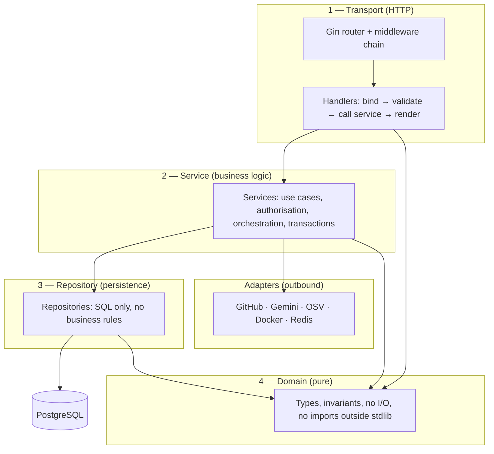
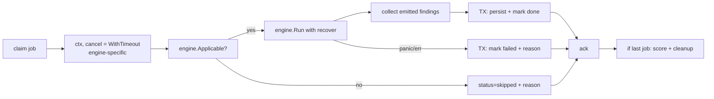

# 04 — Backend Architecture

| Field | Value |
|---|---|
| **Document** | Backend Architecture |
| **Project** | GuardPipe |
| **Version** | 1.0 |
| **Status** | Draft |
| **Applies to** | Go 1.23+, Gin, PostgreSQL 16, Redis 7 |
| **Authors** | GuardPipe Team |
| **Last updated** | 2026-07-29 |

### Revision history

| Version | Date | Author | Change |
|---|---|---|---|
| 1.0 | 2026-07-29 | Team | Initial backend architecture |

> This document describes **how the Go backend is structured**. It is descriptive, not a scaffolding script — no folders are created by this document. Sprint 0 creates the structure described here.

---

## 1. Technology baseline

| Concern | Choice | Note |
|---|---|---|
| Language | Go 1.23+ | Mandated |
| HTTP framework | **Gin** | [ADR-0002](17-adr/0002-go-and-gin.md) |
| Database driver | `pgx/v5` (via `database/sql` or native pool) | Best-in-class Postgres driver |
| Query approach | **`sqlc`-generated typed queries** for the 80% case; hand-written `pgx` for dynamic filters | No ORM — see §5.3 |
| Migrations | `pressly/goose` | [ADR-0009](17-adr/0009-goose-migrations.md) |
| Redis client | `redis/go-redis/v9` | Queue + cache |
| Config | `caarlos0/env` or `kelseyhightower/envconfig` | Struct-tag based, fail-fast |
| Logging | `log/slog` (stdlib) + JSON handler | No third-party logger |
| Validation | `go-playground/validator/v10` | Gin-integrated |
| JWT | `golang-jwt/jwt/v5` | |
| Password hashing | `golang.org/x/crypto/argon2` | Argon2id |
| Testing | `stretchr/testify` + `testcontainers-go` | |
| Docker control | `docker/docker/client` (official SDK) | Sandbox lifecycle |
| Git | `go-git/go-git/v5`, falling back to the `git` binary for large clones | |
| YAML | `goccy/go-yaml` or `sigs.k8s.io/yaml` | K8s manifest parsing |
| Concurrency | `golang.org/x/sync/errgroup`, `semaphore` | Bounded fan-out |

**Dependency policy:** every new third-party dependency requires a one-line justification in the PR description. We are a supply-chain security product; adding dependencies carelessly is off-brand and also a real risk.

---

## 2. Layered architecture



### 2.1 Layer rules — non-negotiable

| Layer | May do | May **not** do |
|---|---|---|
| **Transport** | Bind and validate input, map errors to HTTP, set status codes | Contain business rules, touch the database, call adapters |
| **Service** | Business rules, authorisation checks, transaction boundaries, call repositories and adapters | Know about `*gin.Context`, HTTP status codes, or JSON tags |
| **Repository** | Execute SQL, map rows to domain types | Contain business rules, call other repositories' services, start goroutines |
| **Domain** | Define types and pure invariants | Import anything outside the standard library |
| **Adapter** | Speak to one external system, translate its errors to `platform/errors` | Contain business rules |

**The `*gin.Context` test:** if a service function signature mentions Gin, it is in the wrong layer. Services take `context.Context` and typed inputs, and return typed outputs and errors.

---

## 3. Package organisation (conceptual)

Described here so everyone builds the same shape. Sprint 0 creates it.

```
cmd/guardpipe/                  main() — flags, config, wiring, start, graceful shutdown

internal/
  domain/                       Finding, Severity, Scan, ScanJob, Engine, Location, Rule
                                — imported by everyone, imports nobody

  platform/
    config/                     typed env config, validated at boot
    logger/                     slog setup, redaction hook
    errors/                     typed app errors + HTTP mapping
    crypto/                     AES-256-GCM for stored credentials, Argon2id
    validate/                   shared validators (URL, target host, semver)
    id/                         UUIDv4, fingerprint hashing

  store/
    migrations/                 goose .sql files, sequentially numbered
    repo/                       one repository type per aggregate
    tx/                         transaction helper

  transport/http/
    router.go                   route table — the whole API in one readable file
    middleware/                 requestid · logger · recovery · auth · rbac · cors · ratelimit · errors
    dto/                        request/response structs (never leak domain types)
    handler/                    one file per module

  modules/
    identity/                   service + repo + rbac
    project/                    service + repo + credential encryption
    orchestrator/               scan lifecycle · queue · worker pool · engine registry · cleanup
    scoring/                    severity normalisation · score formula · gate verdict
    reporting/                  finding query · triage · fingerprint correlation · export

  engines/
    docreview/
    codescan/                   rules/ · lang/ (per-language parsers) · taint/
    depscan/                    parsers/ (per ecosystem) · secrets/
    containerscan/              dockerfile/ · image/ · pkgdb/
    k8sscan/                    rules/ · rbac/ · psa/
    cicdscan/                   rules/ · aireview/
    pentest/                    phases/ · normalise/

  adapters/
    gemini/                     LLMProvider implementation
    osv/                        advisory client + cache
    github/                     REST client + clone
    dockerx/                    Docker SDK wrapper
    sandbox/                    container lifecycle + limits + artifact extraction
    queue/                      Redis queue implementation

  scripts/pentest/              the bash suite, embedded via go:embed

pkg/                            (empty — nothing here is meant for external import)
```

**Why `internal/`:** it makes the dependency rule from [03 §6.2](03-architecture-overview.md#62-the-dependency-rule) *structurally enforced* by the compiler for anything outside the module, and gives us a clear signal that nothing here is a public API.

---

## 4. HTTP layer

### 4.1 Middleware chain — order matters

```
RequestID → Recovery → StructuredLogger → CORS → SecurityHeaders
          → RateLimit → Auth(JWT) → RBAC → ErrorMapper → handler
```

| Middleware | Responsibility |
|---|---|
| `RequestID` | Generate/propagate `X-Request-ID`; inject into context and every log line |
| `Recovery` | Catch panics → log with stack → 500 problem-details. **Must be early** so it wraps everything downstream |
| `StructuredLogger` | Method, path, status, duration, request ID, user ID. Never logs bodies |
| `CORS` | Allowlist from config; credentials allowed only for the configured origin |
| `SecurityHeaders` | HSTS, CSP, `X-Content-Type-Options`, `X-Frame-Options`, `Referrer-Policy` |
| `RateLimit` | Redis token bucket; strict on `/auth/*` (5/min/IP), generous elsewhere (100/min/user) |
| `Auth` | Verify JWT, load claims into context. Public routes opt out explicitly |
| `RBAC` | Enforce role on the route. Ownership checks happen in the **service**, not here |
| `ErrorMapper` | Convert `platform/errors` into RFC 9457 responses. The only place HTTP error bodies are built |

### 4.2 Handler shape

Every handler is four steps and nothing else:

```go
func (h *ScanHandler) Create(c *gin.Context) {
    var req dto.CreateScanRequest
    if err := c.ShouldBindJSON(&req); err != nil {
        c.Error(errors.Validation("invalid request body", err)); return   // 1. bind + validate
    }
    projectID, err := uuid.Parse(c.Param("projectID"))
    if err != nil {
        c.Error(errors.Validation("invalid project id", err)); return
    }

    scan, err := h.svc.CreateScan(c.Request.Context(), authz.From(c), projectID, req.ToInput()) // 2. call service
    if err != nil {
        c.Error(err); return                                              // 3. delegate error mapping
    }

    c.JSON(http.StatusAccepted, dto.FromScan(scan))                       // 4. render DTO
}
```

**Rules**
- Handlers never call repositories.
- Handlers never build error JSON — they call `c.Error(err)` and let `ErrorMapper` decide.
- Domain types never appear in responses; always a DTO. This is what stops an internal field rename from breaking the frontend.

### 4.3 Error taxonomy and HTTP mapping

```go
// package platform/errors
type Kind int
const (
    KindValidation Kind = iota // 400
    KindUnauthorized           // 401
    KindForbidden              // 403
    KindNotFound               // 404
    KindConflict               // 409
    KindRateLimited            // 429
    KindExternal               // 502
    KindTimeout                // 504
    KindInternal               // 500
)
type Error struct {
    Kind    Kind
    Code    string // machine-readable: "scan.already_running"
    Message string // safe to show a user
    Detail  string // logged only, never returned
    Err     error  // wrapped cause
}
```

| Kind | Status | Returned to client | Logged |
|---|---|---|---|
| Validation | 400 | message + field errors | debug |
| Unauthorized | 401 | generic message | info |
| Forbidden | 403 | generic message | warn |
| NotFound | 404 | generic message | debug |
| Conflict | 409 | message | info |
| RateLimited | 429 | message + `Retry-After` | warn |
| External | 502 | "upstream service unavailable" | error + detail |
| Timeout | 504 | message | warn |
| Internal | 500 | "an unexpected error occurred" **only** | error + stack |

**Authorisation leak rule:** a resource the user is not entitled to see returns **404, not 403** — 403 confirms existence (FR-IAM-008).

### 4.4 Response envelope

Success responses return the resource directly (no wrapper). Collections return:

```json
{ "data": [ … ], "pagination": { "page": 1, "page_size": 25, "total": 137, "total_pages": 6 } }
```

Errors follow RFC 9457. Full contract in [07 — API Specification](07-api-specification.md).

---

## 5. Persistence

### 5.1 Repository pattern

One repository per aggregate root, interface defined by the **consuming service** (Go idiom: interfaces live with the consumer, not the implementation).

```go
// internal/modules/orchestrator — the consumer defines what it needs
type ScanRepository interface {
    Create(ctx context.Context, s *domain.Scan) error
    Get(ctx context.Context, id uuid.UUID) (*domain.Scan, error)
    ListByProject(ctx context.Context, projectID uuid.UUID, p domain.Page) ([]domain.Scan, int, error)
    UpdateStatus(ctx context.Context, id uuid.UUID, st domain.ScanStatus) error
}
```

This lets each engine owner write tests against a fake without waiting for the SQL to exist — critical in week 1.

### 5.2 Transactions

```go
err := tx.WithTx(ctx, db, func(q store.Queries) error {
    if err := q.InsertFindings(ctx, findings); err != nil { return err }
    if err := q.CompleteJob(ctx, jobID); err != nil { return err }
    return q.RecalculateScanAggregate(ctx, scanID)
})
```

**Rules**
- One transaction per job completion.
- **Never** hold a transaction open across an HTTP call to Gemini/OSV/GitHub. Fetch first, then transact.
- Default isolation: `READ COMMITTED`. Use `SELECT … FOR UPDATE` for job claiming.

### 5.3 Why no ORM

GORM would save typing and cost us predictability. We have hot paths (bulk finding inserts, filtered finding queries with 6 optional predicates) where generated SQL matters, and a team that must be able to read exactly what hits the database. `sqlc` gives compile-time-checked, hand-written SQL with generated Go types — the best of both. Dynamic filter queries are built with a small, parameterised query builder; **string concatenation into SQL is forbidden** and is itself a `codescan` rule we must not trip (NFR-SEC-003).

### 5.4 Bulk insert

Findings arrive in the hundreds. Use `pgx.CopyFrom` for batches over 100 rows, `INSERT … ON CONFLICT (fingerprint, scan_id) DO NOTHING` otherwise. This makes re-runs idempotent (NFR-REL-002).

---

## 6. Job queue and worker pool

### 6.1 Design

Redis list-based queue with a reliable-handoff pattern. Deliberately simple — no external job framework.

```
LPUSH  guardpipe:queue:jobs            <job_id>        # enqueue
BRPOPLPUSH guardpipe:queue:jobs \
           guardpipe:queue:processing 5                # claim (atomic, blocking)
LREM   guardpipe:queue:processing 1    <job_id>        # ack on completion
```

A **reaper** goroutine scans `processing` every 60 s; entries whose job row has `claimed_at` older than the engine timeout are requeued. This gives at-least-once delivery, which combined with fingerprint-based idempotent inserts is sufficient.

**Redis is losable.** Job state of record is the `scan_jobs` table. If Redis is flushed, a recovery sweep re-enqueues all `queued`/`running` jobs at startup.

### 6.2 Worker pool

```go
type Pool struct {
    size     int              // GUARDPIPE_WORKER_COUNT, default 4
    queue    Queue
    registry map[domain.EngineID]domain.Engine
    sem      *semaphore.Weighted // caps concurrent sandbox containers separately
}
```

Per-job lifecycle:



### 6.3 Timeouts

| Engine | Default timeout |
|---|---|
| `docreview` | 5 min |
| `codescan` | 5 min |
| `depscan` | 3 min |
| `containerscan` | 8 min |
| `k8sscan` | 2 min |
| `cicdscan` | 3 min |
| `pentest` | 15 min |

Every timeout is a config value. `context.WithTimeout` is the mechanism; every engine **must** check `ctx.Err()` in its loops. A rule loop that ignores cancellation is a review-blocking defect.

### 6.4 Panic containment

Every worker wraps engine execution:

```go
defer func() {
    if r := recover(); r != nil {
        log.Error("engine panicked", "engine", id, "panic", r, "stack", debug.Stack())
        result.Err = errors.Internal("engine panicked").WithDetail(fmt.Sprint(r))
    }
}()
```

A panic in one engine must never take down the process (NFR-REL-001). This is the single most important reliability guarantee in a system running 7 independently-authored analyzers.

---

## 7. Sandbox execution contract

Used by `pentest` (always) and `containerscan` (for image extraction). Owned by Member 6.

### 7.1 Interface

```go
type Sandbox interface {
    Run(ctx context.Context, spec RunSpec) (RunResult, error)
}

type RunSpec struct {
    Image       string            // pinned by digest
    Cmd         []string
    Env         map[string]string // never contains GuardPipe secrets
    WorkspaceRO string            // host path mounted read-only, optional
    Network     NetworkMode       // None | TargetOnly(ip, ports)
    Timeout     time.Duration
    MemoryMB    int64             // default 512
    CPUs        float64           // default 1.0
    PidsLimit   int64             // default 128
}

type RunResult struct {
    ExitCode   int
    Stdout     []byte // structured JSONL expected
    Stderr     []byte // transcript / diagnostics
    TimedOut   bool
    DurationMs int64
}
```

### 7.2 Enforced container settings

| Setting | Value | Reason |
|---|---|---|
| `--network` | `none`, or a restricted network permitting only the pinned target IP | Prevents exfiltration and lateral movement |
| `--read-only` | true, with a small `tmpfs` at `/tmp` | No persistence, no tampering |
| `--user` | `nobody` (non-root) | Least privilege |
| `--cap-drop` | `ALL` | No capabilities needed for our workloads |
| `--security-opt` | `no-new-privileges` | Blocks setuid escalation |
| `--memory` / `--cpus` / `--pids-limit` | capped | Resource-exhaustion defence |
| Docker socket | **never mounted into the sandbox** | Would be a trivial escape |
| Env | only task inputs | GuardPipe secrets never enter the sandbox |
| Removal | `force remove` in a `defer`, plus an orphan sweep at startup | No leaked containers after a crash |

### 7.3 Contract with scripts

- Scripts write **JSON Lines findings to stdout**, human transcript to stderr.
- Exit code 0 = ran successfully (findings may or may not exist); non-zero = the run itself failed.
- Anything unparseable on stdout is discarded, not guessed at.
- Concurrency across all sandboxes is capped by a semaphore (`GUARDPIPE_SANDBOX_MAX`, default 2).

---

## 8. Configuration

Environment variables only, parsed once, validated at boot, immutable afterwards.

```go
type Config struct {
    Env            string `env:"GUARDPIPE_ENV" envDefault:"development"`
    Role           string `env:"GUARDPIPE_ROLE" envDefault:"all"` // all|api|worker
    HTTPPort       int    `env:"GUARDPIPE_HTTP_PORT" envDefault:"8080"`
    DatabaseURL    string `env:"GUARDPIPE_DATABASE_URL,required"`
    RedisURL       string `env:"GUARDPIPE_REDIS_URL,required"`
    JWTSecret      string `env:"GUARDPIPE_JWT_SECRET,required"`
    EncryptionKey  string `env:"GUARDPIPE_ENCRYPTION_KEY,required"` // 32 bytes, base64
    GeminiAPIKey   string `env:"GUARDPIPE_GEMINI_API_KEY"`
    WorkerCount    int    `env:"GUARDPIPE_WORKER_COUNT" envDefault:"4"`
    // …full table in 13 — DevOps
}
```

**Fail-fast:** a missing required variable, a JWT secret under 32 bytes, or an encryption key of the wrong length aborts startup with a clear message. A misconfigured security product must not start "mostly working".

---

## 9. Logging

```go
slog.InfoContext(ctx, "scan completed",
    "scan_id", scan.ID, "project_id", scan.ProjectID,
    "duration_ms", elapsed.Milliseconds(),
    "findings", len(findings), "risk_score", score)
```

| Field | Present on |
|---|---|
| `request_id` | every HTTP-originated line |
| `scan_id`, `job_id`, `engine` | every scan-related line |
| `user_id` | every authenticated line |
| `error`, `error_code` | error lines |

**Redaction** is a `slog` handler wrapper applied globally: any value matching known secret patterns (`ghp_`, `AKIA`, `-----BEGIN`, `sk-`, JWT shape, high-entropy strings ≥ 32 chars) is replaced with `[REDACTED]` before the line is written. Applied once, centrally — never left to individual call sites (NFR-SEC-005).

Levels: `debug` (dev only) · `info` (lifecycle) · `warn` (recoverable/degraded) · `error` (failed operation). We do not use `fatal` outside `main`.

---

## 10. Health and lifecycle

| Endpoint | Auth | Checks | Semantics |
|---|---|---|---|
| `GET /healthz` | none | process alive | liveness — restart if failing |
| `GET /readyz` | none | Postgres ping, Redis ping, migrations applied | readiness — do not send traffic |
| `GET /version` | none | build version, commit SHA, build time | diagnostics |

### Graceful shutdown

```
SIGTERM → stop accepting new HTTP connections
        → stop claiming new jobs
        → cancel in-flight job contexts (they persist partial state)
        → force-remove sandbox containers
        → delete workspace directories
        → close DB and Redis pools
        → exit (hard deadline: 30s)
```

---

## 11. Authentication and authorisation

### Token model

| Token | Lifetime | Storage | Contents |
|---|---|---|---|
| Access | 15 min | memory in the SPA | `sub`, `org_id`, `role`, `exp`, `iat`, `jti` |
| Refresh | 7 days | `httpOnly`, `Secure`, `SameSite=Strict` cookie | opaque, hashed server-side, single-use |

Refresh rotates on every use; reuse of a consumed refresh token invalidates the whole token family (theft detection).

### Authorisation — two layers

1. **Route level (middleware):** does this role have access to this endpoint class?
2. **Resource level (service):** does this user's organisation own this specific object?

Layer 2 is mandatory and cannot be skipped because layer 1 passed. Every service method that takes an ID also takes the actor:

```go
func (s *ScanService) Get(ctx context.Context, actor domain.Actor, id uuid.UUID) (*domain.Scan, error) {
    scan, err := s.repo.Get(ctx, id)
    if err != nil { return nil, err }
    if scan.OrgID != actor.OrgID {
        return nil, errors.NotFound("scan not found") // deliberately 404
    }
    return scan, nil
}
```

---

## 12. Performance practices

| Practice | Applied where |
|---|---|
| Connection pooling (max 25, idle 5, lifetime 30 min) | pgx pool |
| `pgx.CopyFrom` for bulk finding inserts | orchestrator persistence |
| Covering indexes on `(scan_id, severity)`, `(project_id, created_at DESC)`, `(fingerprint)` | see [06 — Database](06-database-design.md) |
| Advisory cache in Redis, 24 h TTL | `depscan`, `containerscan` |
| AI response cache keyed by content hash | `ai` |
| Bounded `errgroup` fan-out over files | `codescan`, `k8sscan` |
| Streaming file reads with a size cap (skip files > 2 MB) | all file-reading engines |
| Compiled regex cached at package init, never in a loop | all rule engines |
| `sync.Pool` for parser buffers | `codescan` |

**Rule:** no premature optimisation, but no obviously quadratic algorithms over file sets either. If a rule is O(files × rules × lines), say so in the PR.

---

## 13. Testing hooks in the design

The architecture is shaped to make testing cheap — see [15 — Testing Strategy](15-testing-strategy.md).

| Design choice | Testing benefit |
|---|---|
| Engines return findings instead of writing them | Engine tests need no database at all |
| Consumer-defined repository interfaces | Services test against fakes |
| `LLMProvider` port | AI-dependent code tests against a deterministic stub |
| `Sandbox` interface | Pentest normalisation tests use recorded fixtures |
| Pure `domain` package | Invariants unit-test with zero setup |
| `testcontainers-go` | Repository tests run against real PostgreSQL, not a mock |

---

## 14. Anti-patterns — explicitly banned

| Banned | Why | Do instead |
|---|---|---|
| `panic()` in library code | Kills the process | return an error |
| Global mutable state / package-level `var db *sql.DB` | Untestable, racy | constructor injection |
| `interface{}` / `any` in domain types | Loses type safety | concrete types or generics |
| Business logic in handlers | Untestable without HTTP | push into the service |
| String-concatenated SQL | It is literally what we scan for | parameterised queries |
| Ignoring `ctx` in loops | Un-cancellable jobs | check `ctx.Err()` |
| `time.Sleep` for synchronisation | Flaky | channels, `sync`, contexts |
| Bare goroutines with no lifetime owner | Leaks | `errgroup` tied to a context |
| Logging secrets or full request bodies | Data leak | structured fields + redaction |
| Another module's tables | Breaks the boundary | call its service |
