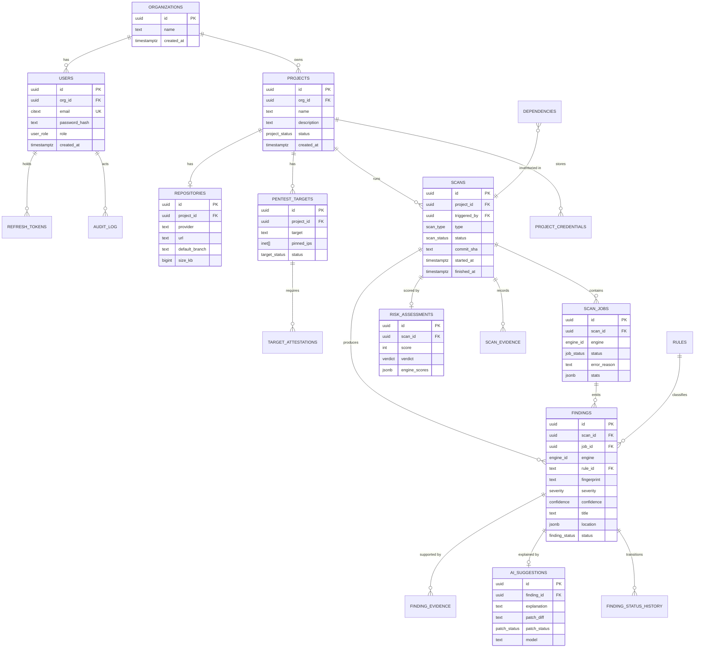

# 06 — Database Design

| Field | Value |
|---|---|
| **Document** | Database Design |
| **Project** | GuardPipe |
| **Version** | 1.0 |
| **Status** | Draft |
| **Engine** | PostgreSQL 16 · Redis 7 |
| **Authors** | GuardPipe Team |
| **Last updated** | 2026-07-29 |

### Revision history

| Version | Date | Author | Change |
|---|---|---|---|
| 1.0 | 2026-07-29 | Team | Initial schema design |

> **Change control:** this is a shared contract across all six developers. Any schema change requires **two approvals** and follows the protocol in §12.

---

## 1. Design principles

| # | Principle | Rationale |
|---|---|---|
| 1 | **UUIDv4 primary keys everywhere** | No sequence contention, IDs safe to expose in URLs, no enumeration |
| 2 | **`created_at` / `updated_at` on every table**, `TIMESTAMPTZ`, UTC | Auditability; `updated_at` maintained by trigger, never by application code |
| 3 | **Module-prefixed table naming** where ambiguity exists | Six developers, one schema — clarity beats brevity |
| 4 | **Native enums for closed sets**, `TEXT` + `CHECK` for evolving sets | Type safety where the set is stable; migration-free additions where it is not |
| 5 | **`JSONB` only for genuinely variable data** | Metadata, evidence payloads, engine stats. Never for anything filtered or joined on |
| 6 | **Foreign keys with explicit `ON DELETE`** | Referential integrity enforced by the database, not by hope |
| 7 | **Findings are append-only apart from triage fields** | An immutable evidence record is what makes the report defensible (DR-003) |
| 8 | **Index for the queries we actually run**, documented per index | Indexes are not free; each one names its query |
| 9 | **No business logic in the database** | No stored procedures. One `updated_at` trigger and nothing else |
| 10 | **Nothing persistent in Redis** | Redis is losable by design (NFR-REL-003) |

---

## 2. Entity relationship diagram



---

## 3. Enumerated types

Defined once, in the first migration.

```sql
CREATE TYPE user_role        AS ENUM ('admin', 'member', 'viewer');
CREATE TYPE project_status   AS ENUM ('active', 'archived');
CREATE TYPE target_status    AS ENUM ('awaiting_attestation', 'attested', 'blocked', 'revoked');
CREATE TYPE scan_type        AS ENUM ('full_supply_chain', 'partial', 'pentest_only');
CREATE TYPE scan_status      AS ENUM ('queued', 'running', 'completed', 'failed', 'cancelled');
CREATE TYPE job_status       AS ENUM ('queued', 'running', 'succeeded', 'failed', 'skipped', 'cancelled');
CREATE TYPE engine_id        AS ENUM ('docreview', 'codescan', 'depscan', 'containerscan',
                                      'k8sscan', 'cicdscan', 'pentest');
CREATE TYPE severity         AS ENUM ('critical', 'high', 'medium', 'low', 'informational');
CREATE TYPE confidence       AS ENUM ('high', 'medium', 'low');
CREATE TYPE finding_status   AS ENUM ('open', 'acknowledged', 'suppressed', 'fixed', 'false_positive');
CREATE TYPE finding_source   AS ENUM ('rule', 'ai');
CREATE TYPE verdict          AS ENUM ('pass', 'warn', 'block');
CREATE TYPE patch_status     AS ENUM ('verified', 'unverified', 'not_applicable');
```

**Ordering note:** `severity` is declared worst-first so `ORDER BY severity` sorts critical → informational naturally, with no `CASE` expression. This is deliberate — the findings list sorts by severity on every page load.

---

## 4. Table specifications

### 4.1 `organizations`
Single-organisation model for this release; the table exists so multi-tenancy is a data change, not a schema rewrite.

| Column | Type | Constraints | Notes |
|---|---|---|---|
| `id` | `UUID` | PK, default `gen_random_uuid()` | |
| `name` | `TEXT` | NOT NULL | |
| `created_at` | `TIMESTAMPTZ` | NOT NULL, default `now()` | |
| `updated_at` | `TIMESTAMPTZ` | NOT NULL, default `now()` | trigger-maintained |

### 4.2 `users`

| Column | Type | Constraints | Notes |
|---|---|---|---|
| `id` | `UUID` | PK | |
| `org_id` | `UUID` | FK → `organizations(id)` ON DELETE CASCADE, NOT NULL | |
| `email` | `CITEXT` | UNIQUE, NOT NULL | case-insensitive; requires the `citext` extension |
| `display_name` | `TEXT` | NOT NULL | |
| `password_hash` | `TEXT` | NOT NULL | Argon2id encoded string — **never** a plaintext or reversible value |
| `role` | `user_role` | NOT NULL, default `'member'` | |
| `last_login_at` | `TIMESTAMPTZ` | NULL | |
| `failed_login_count` | `INT` | NOT NULL, default 0 | |
| `locked_until` | `TIMESTAMPTZ` | NULL | set after repeated failures |
| `created_at` / `updated_at` | `TIMESTAMPTZ` | NOT NULL | |

**Indexes**
| Index | Query it serves |
|---|---|
| `users_email_key` (unique, implicit) | login by email |
| `idx_users_org` on `(org_id)` | list organisation members |

### 4.3 `refresh_tokens`

| Column | Type | Constraints | Notes |
|---|---|---|---|
| `id` | `UUID` | PK | |
| `user_id` | `UUID` | FK → `users(id)` ON DELETE CASCADE | |
| `token_hash` | `TEXT` | UNIQUE, NOT NULL | SHA-256 of the token; the token itself is never stored |
| `family_id` | `UUID` | NOT NULL | rotation lineage — reuse detection invalidates the whole family |
| `expires_at` | `TIMESTAMPTZ` | NOT NULL | |
| `consumed_at` | `TIMESTAMPTZ` | NULL | non-null = already used; presenting it again is theft evidence |
| `revoked_at` | `TIMESTAMPTZ` | NULL | |
| `user_agent` / `ip` | `TEXT` / `INET` | NULL | forensics |

**Indexes:** `(token_hash)` unique for lookup; `(user_id)`; `(family_id)`; partial index `WHERE revoked_at IS NULL AND consumed_at IS NULL` for the active-token query.

### 4.4 `projects`

| Column | Type | Constraints |
|---|---|---|
| `id` | `UUID` | PK |
| `org_id` | `UUID` | FK → `organizations(id)` ON DELETE CASCADE |
| `name` | `TEXT` | NOT NULL |
| `description` | `TEXT` | NULL |
| `status` | `project_status` | NOT NULL, default `'active'` |
| `created_by` | `UUID` | FK → `users(id)` ON DELETE SET NULL |
| `created_at` / `updated_at` | `TIMESTAMPTZ` | NOT NULL |

**Constraint:** `UNIQUE (org_id, name)` — no two projects with the same name in one organisation.
**Index:** `idx_projects_org_status` on `(org_id, status, created_at DESC)` — the project list query.

### 4.5 `repositories`

| Column | Type | Constraints | Notes |
|---|---|---|---|
| `id` | `UUID` | PK | |
| `project_id` | `UUID` | FK → `projects(id)` ON DELETE CASCADE, UNIQUE | one repository per project in this release |
| `provider` | `TEXT` | NOT NULL, CHECK IN (`'github'`) | extensible without a type migration |
| `url` | `TEXT` | NOT NULL | normalised HTTPS form |
| `owner` / `name` | `TEXT` | NOT NULL | parsed from the URL |
| `default_branch` | `TEXT` | NOT NULL, default `'main'` | |
| `is_private` | `BOOLEAN` | NOT NULL, default false | |
| `size_kb` | `BIGINT` | NULL | from the GitHub API; used for the pre-clone size guard |
| `last_validated_at` | `TIMESTAMPTZ` | NULL | |

### 4.6 `project_credentials`

Separate from `repositories` so credential rows can carry stricter access control and a distinct audit trail.

| Column | Type | Constraints | Notes |
|---|---|---|---|
| `id` | `UUID` | PK | |
| `project_id` | `UUID` | FK → `projects(id)` ON DELETE CASCADE | |
| `kind` | `TEXT` | NOT NULL, CHECK IN (`'github_pat'`) | |
| `ciphertext` | `BYTEA` | NOT NULL | AES-256-GCM |
| `nonce` | `BYTEA` | NOT NULL | 12 bytes, unique per row |
| `hint` | `TEXT` | NOT NULL | masked display value, e.g. `ghp_••••3f9a` |
| `created_by` | `UUID` | FK → `users(id)` | |
| `created_at` / `updated_at` | `TIMESTAMPTZ` | NOT NULL | added per this document's own §"Conventions to follow everywhere"; `PUT .../credential`'s response (07-api-specification.md §3) returns `updated_at`, and "rotate" overwriting the row (not inserting a new one) means nothing else here could supply it |

**Constraint:** `UNIQUE (project_id, kind)`.
**Rule:** no query in the codebase may `SELECT ciphertext` outside `project`'s credential repository. This is a review checklist item.

### 4.7 `pentest_targets`

| Column | Type | Constraints | Notes |
|---|---|---|---|
| `id` | `UUID` | PK | |
| `project_id` | `UUID` | FK → `projects(id)` ON DELETE CASCADE | |
| `target` | `TEXT` | NOT NULL | hostname or URL as entered |
| `normalized_host` | `TEXT` | NOT NULL | |
| `pinned_ips` | `INET[]` | NOT NULL | resolved at validation; re-checked at execution (FR-PEN-002) |
| `status` | `target_status` | NOT NULL, default `'awaiting_attestation'` | |
| `last_resolved_at` | `TIMESTAMPTZ` | NOT NULL | |

**Constraint:** `UNIQUE (project_id, normalized_host)`.

### 4.8 `target_attestations`
Append-only legal record. Never updated, never deleted.

| Column | Type | Constraints |
|---|---|---|
| `id` | `UUID` | PK |
| `target_id` | `UUID` | FK → `pentest_targets(id)` ON DELETE CASCADE |
| `user_id` | `UUID` | FK → `users(id)` ON DELETE RESTRICT |
| `attestation_text_version` | `TEXT` | NOT NULL — which wording the user agreed to |
| `accepted_at` | `TIMESTAMPTZ` | NOT NULL, default `now()` |
| `source_ip` | `INET` | NOT NULL |

**`ON DELETE RESTRICT` on `user_id` is intentional:** a user who attested to a pentest cannot be deleted out of the record.

### 4.9 `scans`

| Column | Type | Constraints | Notes |
|---|---|---|---|
| `id` | `UUID` | PK | |
| `project_id` | `UUID` | FK → `projects(id)` ON DELETE CASCADE | |
| `triggered_by` | `UUID` | FK → `users(id)` ON DELETE SET NULL | |
| `type` | `scan_type` | NOT NULL | |
| `status` | `scan_status` | NOT NULL, default `'queued'` | |
| `requested_engines` | `engine_id[]` | NOT NULL | what the user asked for |
| `commit_sha` | `TEXT` | NULL | resolved at clone; makes the scan reproducible |
| `branch` | `TEXT` | NULL | |
| `cancel_requested` | `BOOLEAN` | NOT NULL, default false | polled by workers (FR-ORC-008) |
| `error_reason` | `TEXT` | NULL | only for whole-scan failure |
| `queued_at` / `started_at` / `finished_at` | `TIMESTAMPTZ` | | |
| `finding_counts` | `JSONB` | NOT NULL, default `'{}'` | denormalised `{critical:n, high:n, …}` for fast list rendering |

**Indexes**
| Index | Query it serves |
|---|---|
| `idx_scans_project_created` on `(project_id, created_at DESC)` | scan history list |
| `idx_scans_status` on `(status)` WHERE `status IN ('queued','running')` | recovery sweep at startup |

**On `finding_counts` denormalisation:** the scan list shows severity badges for dozens of scans. Aggregating `findings` per row would be N+1 counting. The column is written once, in the same transaction that finalises the scan — it cannot drift.

### 4.10 `scan_jobs`

| Column | Type | Constraints |
|---|---|---|
| `id` | `UUID` | PK |
| `scan_id` | `UUID` | FK → `scans(id)` ON DELETE CASCADE |
| `engine` | `engine_id` | NOT NULL |
| `status` | `job_status` | NOT NULL, default `'queued'` |
| `attempt` | `INT` | NOT NULL, default 0 |
| `claimed_at` | `TIMESTAMPTZ` | NULL — reaper compares against this |
| `started_at` / `finished_at` | `TIMESTAMPTZ` | NULL |
| `error_reason` | `TEXT` | NULL — `timeout`, `panic`, `ai_unavailable`, … |
| `skip_reason` | `TEXT` | NULL — `no_target_artifacts`, `docker_unavailable`, … |
| `stats` | `JSONB` | NOT NULL, default `'{}'` — `files_scanned`, `rules_evaluated`, `duration_ms` |

**Constraint:** `UNIQUE (scan_id, engine)` — one job per engine per scan.
**Index:** `idx_jobs_status_claimed` on `(status, claimed_at)` WHERE `status = 'running'` — the reaper query.

### 4.11 `findings` — the central table

| Column | Type | Constraints | Notes |
|---|---|---|---|
| `id` | `UUID` | PK | |
| `scan_id` | `UUID` | FK → `scans(id)` ON DELETE CASCADE, NOT NULL | |
| `job_id` | `UUID` | FK → `scan_jobs(id)` ON DELETE CASCADE, NOT NULL | |
| `project_id` | `UUID` | FK → `projects(id)` ON DELETE CASCADE, NOT NULL | **denormalised** — enables cross-scan queries without a join |
| `engine` | `engine_id` | NOT NULL | |
| `rule_id` | `TEXT` | FK → `rules(id)` ON DELETE RESTRICT, NOT NULL | |
| `source` | `finding_source` | NOT NULL, default `'rule'` | distinguishes AI-only findings |
| `fingerprint` | `TEXT` | NOT NULL | SHA-256 hex; cross-scan identity (DR-006) |
| `title` | `TEXT` | NOT NULL | |
| `description` | `TEXT` | NOT NULL | |
| `severity` | `severity` | NOT NULL | |
| `confidence` | `confidence` | NOT NULL, default `'medium'` | |
| `cwe` | `TEXT[]` | NOT NULL, default `'{}'` | |
| `cve` | `TEXT[]` | NOT NULL, default `'{}'` | |
| `owasp` | `TEXT[]` | NOT NULL, default `'{}'` | |
| `cvss_score` | `NUMERIC(3,1)` | NULL, CHECK 0.0–10.0 | |
| `cvss_vector` | `TEXT` | NULL | |
| `location` | `JSONB` | NOT NULL | discriminated union — see §5 |
| `remediation` | `TEXT` | NOT NULL | deterministic guidance from the rule |
| `status` | `finding_status` | NOT NULL, default `'open'` | **the only mutable field group** |
| `status_reason` | `TEXT` | NULL | required ≥ 20 chars when suppressing |
| `status_changed_by` | `UUID` | FK → `users(id)` ON DELETE SET NULL | |
| `status_changed_at` | `TIMESTAMPTZ` | NULL | |
| `metadata` | `JSONB` | NOT NULL, default `'{}'` | engine-specific extras |
| `search_vector` | `TSVECTOR` | GENERATED ALWAYS AS (`to_tsvector('english', title \|\| ' ' \|\| description)`) STORED | full-text search |
| `created_at` / `updated_at` | `TIMESTAMPTZ` | NOT NULL | |

**Constraint:** `UNIQUE (scan_id, fingerprint)` — makes re-runs idempotent (NFR-REL-002); `ON CONFLICT DO NOTHING` on bulk insert.

**Indexes**
| Index | Query it serves |
|---|---|
| `idx_findings_scan_severity` on `(scan_id, severity, created_at)` | the findings list, default sort |
| `idx_findings_project_fingerprint` on `(project_id, fingerprint)` | cross-scan correlation (FR-RPT-006) |
| `idx_findings_scan_engine` on `(scan_id, engine)` | per-engine filter and sub-score |
| `idx_findings_status` on `(scan_id, status)` WHERE `status = 'open'` | open-findings count, the hottest aggregate |
| `idx_findings_cve` GIN on `(cve)` | "which projects are affected by CVE-X" |
| `idx_findings_search` GIN on `(search_vector)` | free-text search |

**Immutability rule (DR-003):** application code may only `UPDATE` `status`, `status_reason`, `status_changed_by`, `status_changed_at`, and `updated_at`. Every other column is write-once. Enforced by code review and by a repository API that exposes no general update method.

### 4.12 `finding_evidence`

| Column | Type | Notes |
|---|---|---|
| `id` | `UUID` PK | |
| `finding_id` | `UUID` FK → `findings(id)` ON DELETE CASCADE | |
| `kind` | `TEXT` CHECK IN (`'code_snippet'`,`'command_output'`,`'http_response'`,`'manifest_excerpt'`,`'layer_reference'`) | |
| `content` | `TEXT` NOT NULL | **secret values redacted before storage** |
| `content_redacted` | `BOOLEAN` NOT NULL default false | |
| `line_start` / `line_end` | `INT` NULL | |
| `ordinal` | `INT` NOT NULL default 0 | display order |

**Redaction rule:** a finding that detects a hardcoded API key must store the *location and shape* of the secret, never the secret itself. Storing it would make our own database the highest-value target in the deployment.

### 4.13 `ai_suggestions`

| Column | Type | Notes |
|---|---|---|
| `id` | `UUID` PK | |
| `finding_id` | `UUID` FK → `findings(id)` ON DELETE CASCADE, UNIQUE | one suggestion per finding |
| `explanation` | `TEXT` NULL | plain-language explanation (FR-AI-002) |
| `patch_diff` | `TEXT` NULL | unified diff (FR-AI-003) |
| `patch_status` | `patch_status` NOT NULL default `'unverified'` | `verified` = dry-run applied cleanly (FR-AI-004) |
| `model` | `TEXT` NOT NULL | e.g. `gemini-2.5-flash` |
| `prompt_version` | `TEXT` NOT NULL | reproducibility — which prompt produced this |
| `input_hash` | `TEXT` NOT NULL | cache key (FR-AI-008) |
| `tokens_in` / `tokens_out` | `INT` | budget accounting |
| `generated_at` | `TIMESTAMPTZ` NOT NULL | |

**Index:** `idx_ai_input_hash` on `(input_hash)` — the cache lookup, which is what keeps us inside the free tier.

### 4.14 `finding_status_history`
Append-only triage audit.

| Column | Type |
|---|---|
| `id` | `UUID` PK |
| `finding_id` | `UUID` FK → `findings(id)` ON DELETE CASCADE |
| `from_status` / `to_status` | `finding_status` |
| `reason` | `TEXT` |
| `changed_by` | `UUID` FK → `users(id)` ON DELETE SET NULL |
| `changed_at` | `TIMESTAMPTZ` NOT NULL default `now()` |

### 4.15 `rules`
Rule catalogue, seeded from code at startup. Gives referential integrity on `findings.rule_id` and lets the UI render rule documentation without hardcoding it.

| Column | Type | Notes |
|---|---|---|
| `id` | `TEXT` PK | e.g. `codescan.injection.sql-string-concat` |
| `engine` | `engine_id` NOT NULL | |
| `category` | `TEXT` NOT NULL | |
| `title` / `description` / `remediation` | `TEXT` NOT NULL | |
| `default_severity` | `severity` NOT NULL | |
| `cwe` / `owasp` / `references` | `TEXT[]` | |
| `tier` | `TEXT` CHECK IN (`'core'`,`'stretch'`) | |
| `enabled` | `BOOLEAN` NOT NULL default true | lets an operator disable a noisy rule without a deploy |

**`ON DELETE RESTRICT` from `findings`:** a rule that has produced findings cannot be deleted, only disabled. Rule IDs are permanent (§2.2 of [05](05-module-specifications.md)).

### 4.16 `dependencies`
The SBOM-adjacent inventory from `depscan`. Separate from `findings` because a dependency is an *asset*, not an *issue*.

| Column | Type |
|---|---|
| `id` | `UUID` PK |
| `scan_id` | `UUID` FK → `scans(id)` ON DELETE CASCADE |
| `ecosystem` | `TEXT` NOT NULL (`npm`,`pypi`,`go`,`maven`,`composer`) |
| `name` / `version` | `TEXT` NOT NULL |
| `is_direct` | `BOOLEAN` NOT NULL |
| `manifest_path` | `TEXT` NOT NULL |
| `declared_range` | `TEXT` NULL |
| `license` | `TEXT` NULL |

**Constraint:** `UNIQUE (scan_id, ecosystem, name, version, manifest_path)`.
**Index:** `idx_deps_lookup` on `(ecosystem, name, version)` — "which projects use this package".

### 4.17 `risk_assessments`

| Column | Type | Notes |
|---|---|---|
| `id` | `UUID` PK | |
| `scan_id` | `UUID` FK → `scans(id)` ON DELETE CASCADE, UNIQUE | |
| `score` | `INT` NOT NULL CHECK 0–100 | |
| `verdict` | `verdict` NOT NULL | |
| `engine_scores` | `JSONB` NOT NULL | `{"codescan": 62, "k8sscan": 40, …}` |
| `breakdown` | `JSONB` NOT NULL | ordered contributions for the UI |
| `previous_score` | `INT` NULL | for the delta (FR-SCR-008) |
| `is_partial` | `BOOLEAN` NOT NULL default false | true if any engine failed |
| `formula_version` | `TEXT` NOT NULL | so historical scores remain interpretable when the formula changes |
| `computed_at` | `TIMESTAMPTZ` NOT NULL | |

### 4.18 `scan_evidence`
Scan-level artifacts — chiefly the pentest command transcript (FR-PEN-011).

| Column | Type |
|---|---|
| `id` | `UUID` PK |
| `scan_id` | `UUID` FK → `scans(id)` ON DELETE CASCADE |
| `kind` | `TEXT` CHECK IN (`'pentest_transcript'`,`'sbom'`,`'image_manifest'`) |
| `content` | `TEXT` NOT NULL (redacted) |
| `size_bytes` | `BIGINT` NOT NULL |

### 4.19 `audit_log`
Append-only. No `UPDATE`, no `DELETE` — enforced by only ever exposing an insert method (DR-007).

| Column | Type | Notes |
|---|---|---|
| `id` | `BIGSERIAL` PK | sequential — ordering is the point here |
| `org_id` | `UUID` NULL | |
| `actor_id` | `UUID` NULL | null for system actions |
| `action` | `TEXT` NOT NULL | `auth.login`, `scan.started`, `finding.suppressed`, `target.attested` |
| `resource_type` / `resource_id` | `TEXT` / `UUID` | |
| `detail` | `JSONB` NOT NULL default `'{}'` | |
| `ip` | `INET` NULL |
| `created_at` | `TIMESTAMPTZ` NOT NULL default `now()` |

**Index:** `idx_audit_org_created` on `(org_id, created_at DESC)`.

---

## 5. The `location` JSONB contract

One column serves five kinds of location because the engines find issues in fundamentally different places. The discriminator is `type`, and the frontend switches on it to render the right component.

```jsonc
// file location — codescan, depscan, cicdscan, docreview
{ "type": "file", "path": "src/db/user.go", "line_start": 42, "line_end": 44, "column": 17 }

// container image — containerscan
{ "type": "image", "image": "myapp:1.2.3", "layer_digest": "sha256:ab12…",
  "layer_index": 4, "path": "/usr/lib/libssl.so.1.1" }

// kubernetes resource — k8sscan
{ "type": "k8s", "file": "deploy/api.yaml", "kind": "Deployment", "name": "api",
  "namespace": "prod",
  "field_path": "spec.template.spec.containers[0].securityContext.privileged" }

// network service — pentest
{ "type": "network", "host": "example.com", "ip": "203.0.113.10",
  "port": 443, "protocol": "tcp", "service": "https", "url": "https://example.com/admin" }

// dependency — depscan
{ "type": "dependency", "ecosystem": "npm", "package": "lodash",
  "version": "4.17.15", "manifest_path": "package.json" }
```

**Why JSONB and not five nullable column groups:** five location shapes across seven engines would mean ~18 mostly-null columns on the hottest table in the system. We never filter on location fields (`file_path` prefix filtering is served by a functional index on `location->>'path'`), so the flexibility is free.

**Functional index for path filtering:**
```sql
CREATE INDEX idx_findings_file_path
  ON findings ((location->>'path'))
  WHERE location->>'type' = 'file';
```

---

## 6. Fingerprint specification

The fingerprint is what makes a finding trackable across scans. Getting it wrong is the difference between "this issue has been open 12 days" and "47 brand-new findings appeared because someone added a blank line".

```
fingerprint = SHA256( rule_id ‖ "\x00" ‖ normalized_location ‖ "\x00" ‖ normalized_evidence )
```

| Location type | `normalized_location` | Deliberately excluded |
|---|---|---|
| file | `path` + enclosing function/class name if determinable | **line numbers** — they shift on every edit above |
| image | `layer_digest` + `path` | image tag (mutable) |
| k8s | `kind` + `name` + `namespace` + `field_path` | file path (manifests get moved) |
| network | `host` + `port` + check identifier | IP address (can change) |
| dependency | `ecosystem` + `package` + advisory ID | version (the point is to track the advisory) |

`normalized_evidence` is the matched construct with whitespace collapsed, string literals replaced by `<str>`, and numeric literals replaced by `<num>` — so reformatting does not create a new finding, but changing the actual code does.

---

## 7. Redis key design

Redis holds no system of record. Every key has a TTL or is a queue that is rebuilt from PostgreSQL on startup.

| Key pattern | Type | TTL | Purpose |
|---|---|---|---|
| `gp:queue:jobs` | LIST | — | pending job IDs |
| `gp:queue:processing` | LIST | — | claimed jobs; reaper source |
| `gp:cancel:{scan_id}` | STRING | 1 h | cancellation flag, polled by workers |
| `gp:progress:{scan_id}` | HASH | 1 h | live per-engine progress for the polling endpoint |
| `gp:cache:osv:{eco}:{pkg}:{ver}` | STRING (JSON) | 24 h | advisory cache (FR-DEP-005) |
| `gp:cache:ai:{sha256}` | STRING (JSON) | 7 d | AI response cache (FR-AI-008) |
| `gp:budget:{scan_id}` | STRING (int) | 24 h | remaining AI token budget (FR-AI-009) |
| `gp:ratelimit:{scope}:{id}` | STRING (int) | window | token bucket counters |
| `gp:lock:{resource}` | STRING | 30 s | short-lived advisory locks (SET NX PX) |

**Namespace rule:** every key starts `gp:`. A shared Redis with another application must not be able to collide with us, and `FLUSHDB` during development must be obviously scoped.

---

## 8. Index summary and justification

| Table | Index | Type | Justification |
|---|---|---|---|
| `users` | `(email)` | unique btree | login |
| `projects` | `(org_id, status, created_at DESC)` | btree | project list |
| `scans` | `(project_id, created_at DESC)` | btree | scan history |
| `scans` | `(status)` partial | btree | startup recovery sweep |
| `scan_jobs` | `(scan_id, engine)` | unique btree | job lookup, one per engine |
| `scan_jobs` | `(status, claimed_at)` partial | btree | reaper |
| `findings` | `(scan_id, severity, created_at)` | btree | **the** findings list query |
| `findings` | `(scan_id, fingerprint)` | unique btree | idempotent insert |
| `findings` | `(project_id, fingerprint)` | btree | cross-scan correlation |
| `findings` | `(scan_id, engine)` | btree | engine filter and sub-score |
| `findings` | `(scan_id, status)` partial `WHERE status='open'` | btree | open count |
| `findings` | `(cve)` | GIN | CVE lookup across projects |
| `findings` | `(search_vector)` | GIN | free-text search |
| `findings` | `((location->>'path'))` partial | btree | file-path filter |
| `ai_suggestions` | `(input_hash)` | btree | cache hit |
| `dependencies` | `(ecosystem, name, version)` | btree | package impact query |
| `audit_log` | `(org_id, created_at DESC)` | btree | audit view |

**17 indexes.** Each names the query it exists for. An index without a named query does not get merged.

---

## 9. Data volume estimates

| Table | Rows per scan | After 100 scans | Note |
|---|---|---|---|
| `scans` | 1 | 100 | trivial |
| `scan_jobs` | 7 | 700 | trivial |
| `findings` | 50–2,000 | 5k–200k | the only table that grows meaningfully |
| `finding_evidence` | 1–3 per finding | 15k–600k | largest by bytes |
| `dependencies` | 50–2,000 | 5k–200k | |
| `ai_suggestions` | ≤ 200 | ≤ 20k | budget-capped |

At demo scale this is comfortably inside a single unpartitioned PostgreSQL instance. Partitioning `findings` by `created_at` is documented as the growth path (DR-005) but is **not implemented** — doing it now would be speculative complexity.

---

## 10. Retention

| Data | Retention | Mechanism |
|---|---|---|
| Findings and evidence | 180 days (configurable) | scheduled cleanup job, Stretch |
| Audit log | Indefinite | never deleted |
| Refresh tokens | Deleted 30 days after expiry | cleanup job |
| Redis cache | TTL-managed | automatic |
| Workspace checkouts | Deleted at scan end; orphan sweep at startup | orchestrator |

---

## 11. Migrations

Tool: **goose** ([ADR-0009](17-adr/0009-goose-migrations.md)). Files: `internal/store/migrations/NNNNN_description.sql`, sequentially numbered, each with `-- +goose Up` and `-- +goose Down`.

| Rule | Detail |
|---|---|
| Forward-only in practice | `Down` must exist and be tested, but production rollback is by forward fix |
| One logical change per migration | Not "sprint 2 changes" |
| Never edit a merged migration | Even if unreleased — someone has already run it locally |
| Additive first | Add nullable column → backfill → add constraint, as three migrations, when the table has data |
| Applied at startup | The app runs pending migrations before serving; `/readyz` fails until complete |
| Reviewed by two people | Schema is shared (see §12) |

**Planned migration sequence for Sprint 0–1**

| # | Migration |
|---|---|
| 00001 | extensions (`pgcrypto`, `citext`), enum types |
| 00002 | `organizations`, `users`, `refresh_tokens` |
| 00003 | `projects`, `repositories`, `project_credentials` |
| 00004 | `pentest_targets`, `target_attestations` |
| 00005 | `scans`, `scan_jobs` |
| 00006 | `rules` |
| 00007 | `findings`, `finding_evidence`, `finding_status_history` |
| 00008 | `ai_suggestions` |
| 00009 | `dependencies`, `risk_assessments`, `scan_evidence` |
| 00010 | `audit_log` |
| 00011 | indexes |
| 00012 | `updated_at` trigger function + triggers |

---

## 12. Schema change protocol

> **This is the highest-collision-risk area of the project.** One schema, six developers, three weeks. Follow this exactly.

1. **Announce first.** Post the intended change in the team channel *before* writing the migration. Someone may already be doing it.
2. **Open a schema-only PR.** Migration + updated `06-database-design.md` + regenerated `sqlc` types. No feature code in the same PR.
3. **Two approvals required**, one of which must be Member 1 (schema owner).
4. **Claim your migration number** by opening the PR early. Two PRs with `00013_` will conflict at merge — which is the point: a merge conflict is far cheaper than two conflicting migrations both applying.
5. **Rebase before merge.** If someone else's migration merged first, renumber yours.
6. **Never edit a merged migration.** Add a new one.
7. **Additive changes only during Sprint 2+.** Dropping a column mid-sprint breaks someone's branch.
8. **Update this document in the same PR.** A schema change that does not update §4 is incomplete and should be blocked in review.

---

## 13. Seed data

| Seed | Purpose |
|---|---|
| `organizations` — one default organisation | Single-tenant model needs a row |
| `users` — one `admin` (credentials from env, development only) | First login |
| `rules` — all rules, synced from the code registry at every startup | Referential integrity for `findings.rule_id`; upsert by ID so new rules appear automatically |
| Demo project + vulnerable fixture repository reference | Demo-day setup with no manual clicking |

The rule sync is an **upsert, not a truncate-and-insert** — truncating would violate the `ON DELETE RESTRICT` from `findings` and destroy history.
