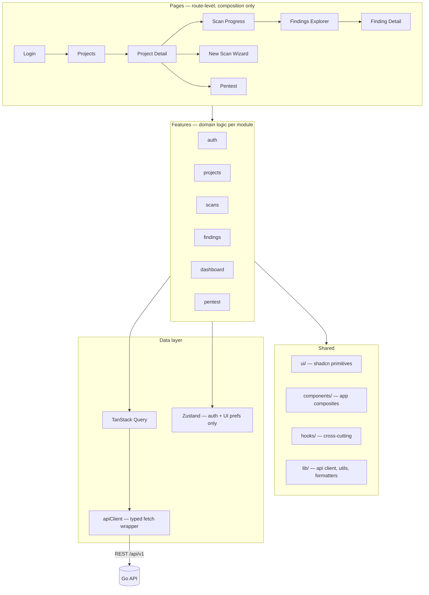

# 08 — Frontend Architecture

| Field | Value |
|---|---|
| **Document** | Frontend Architecture |
| **Project** | GuardPipe |
| **Version** | 1.0 |
| **Status** | Draft |
| **Stack** | React 19 · TypeScript · Vite · Tailwind CSS · shadcn/ui · TanStack Query · Recharts |
| **Owner** | Member 5 |
| **Last updated** | 2026-07-29 |

### Revision history

| Version | Date | Author | Change |
|---|---|---|---|
| 1.0 | 2026-07-29 | Team | Initial frontend architecture |

---

## 1. Stack and rationale

| Concern | Choice | Why this one |
|---|---|---|
| Framework | **React 19** | Team familiarity; largest component ecosystem |
| Language | **TypeScript (strict)** | The API has 39 endpoints and ~13 enums — types are how the frontend stays correct while the backend moves |
| Build | **Vite 6** | Instant HMR; the alternative costs minutes per day for three weeks |
| Routing | **React Router 7** (declarative) | SPA routing; no SSR needed ([ADR-0006](17-adr/0006-react-vite-spa.md)) |
| Styling | **Tailwind CSS 4** | No CSS file naming debates across six people; design tokens map 1:1 to Tailwind theme values |
| Components | **shadcn/ui** (Radix primitives) | Accessible by construction, copied into the repo (not a dependency), fully restyleable |
| Server state | **TanStack Query 5** | Caching, polling, invalidation, retries — all the things scan polling needs, already solved |
| Client state | **Zustand** (auth/UI only) | ~40 lines vs Redux boilerplate; almost all state here is server state |
| Forms | **React Hook Form + Zod** | Zod schemas double as runtime API response validation |
| Charts | **Recharts** | Declarative, React-native, adequate for six chart types |
| Icons | **lucide-react** | Consistent, tree-shakeable |
| Tables | **TanStack Table** + **TanStack Virtual** | 1,000-row findings list must not lag (NFR-PERF-005) |
| Code/diff display | **Shiki** (syntax) + **react-diff-viewer-continued** (patches) | The AI patch diff is a headline feature; it must look right |
| Testing | **Vitest + React Testing Library + Playwright** | See [15 — Testing](15-testing-strategy.md) |

**The one rule about dependencies:** we are a supply-chain security product. Every added package is a package we would flag in someone else's project. New dependencies need a one-line justification in the PR.

---

## 2. Architecture overview



### Layer responsibilities

| Layer | Contains | Must not |
|---|---|---|
| **Pages** | Route composition, layout, page-level loading/error boundaries | Contain business logic or direct API calls |
| **Features** | Domain hooks, feature components, feature-local types | Import another feature's internals |
| **Shared UI** | Design-system primitives, generic composites | Know about GuardPipe domain concepts |
| **Data** | API client, query hooks, cache config | Contain rendering |

**Feature isolation mirrors the backend's module rule** ([03 §6.2](03-architecture-overview.md#62-the-dependency-rule)): `features/findings` may not import from `features/scans/internal`. Cross-feature sharing goes through `shared/`.

---

## 3. Directory organisation (conceptual)

```
src/
  main.tsx                     entry: providers, router
  App.tsx                      shell + route table

  pages/                       one file per route, thin
  features/
    auth/        api.ts · hooks.ts · components/ · schemas.ts
    projects/
    scans/
    findings/
    dashboard/
    pentest/
  components/
    ui/                        shadcn primitives (Button, Dialog, …)
    layout/                    AppShell, Sidebar, TopBar
    data/                      DataTable, EmptyState, ErrorState, LoadingState
    domain/                    SeverityBadge, RiskGauge, EngineIcon,
                               SupplyChainPipeline, PatchDiff, CodeBlock
  hooks/                       useDebounce, useLocalStorage, useInterval
  lib/
    api/       client.ts · endpoints.ts · types.ts · errors.ts
    query/     queryClient.ts · keys.ts
    utils/     cn.ts · format.ts · severity.ts
  stores/      authStore.ts · uiStore.ts
  types/       api.d.ts (generated from OpenAPI)
  styles/      globals.css (Tailwind + design tokens)
```

---

## 4. Data layer

### 4.1 API client

A single typed `fetch` wrapper. Every request in the app goes through it — there is no second way to call the backend.

```ts
class ApiError extends Error {
  constructor(
    public status: number,
    public code: string,          // the contract — switch on this
    public detail: string,        // safe to show a user
    public requestId: string,
    public fieldErrors?: FieldError[],
  ) { super(detail); }
}

async function request<T>(path: string, init?: RequestInit): Promise<T> {
  const res = await fetch(`${BASE}${path}`, {
    ...init,
    credentials: 'include',                      // refresh cookie
    headers: { 'Content-Type': 'application/json', ...authHeader(), ...init?.headers },
  });

  if (res.status === 401 && !isRefreshRequest(path)) {
    await refreshOnce();                         // single-flight, see §4.2
    return request<T>(path, init);               // retry exactly once
  }
  if (!res.ok) throw await toApiError(res);
  return res.status === 204 ? (undefined as T) : res.json();
}
```

**Rules**
- Components never call `fetch`. Ever.
- Errors are always `ApiError`; components branch on `error.code`, never on message text ([07 §11](07-api-specification.md#11-frontendbackend-contract-rules)).
- `requestId` is surfaced in the error UI so a user can quote it in a bug report.

### 4.2 Token refresh — single-flight

Ten queries firing at once with an expired token must produce **one** refresh call, not ten.

```ts
let refreshPromise: Promise<void> | null = null;

function refreshOnce(): Promise<void> {
  refreshPromise ??= doRefresh().finally(() => { refreshPromise = null; });
  return refreshPromise;
}
```

If refresh fails, the auth store clears and the router redirects to `/login` with a `?returnTo=` parameter.

**The access token lives in memory (Zustand), never in `localStorage`.** A security product storing a bearer token where any XSS can read it would be indefensible — and it is exactly what `codescan` would flag.

### 4.3 Query keys

Hierarchical and centralised, so invalidation is precise rather than a blunt `invalidateQueries()`.

```ts
export const qk = {
  auth:      { me: () => ['auth','me'] as const },
  projects:  {
    all:     () => ['projects'] as const,
    list:    (f: ProjectFilters) => [...qk.projects.all(), 'list', f] as const,
    detail:  (id: string)        => [...qk.projects.all(), 'detail', id] as const,
    dashboard:(id: string)       => [...qk.projects.all(), 'dashboard', id] as const,
    trend:   (id: string)        => [...qk.projects.all(), 'trend', id] as const,
  },
  scans:     {
    all:     () => ['scans'] as const,
    byProject:(pid: string)      => [...qk.scans.all(), 'project', pid] as const,
    detail:  (id: string)        => [...qk.scans.all(), 'detail', id] as const,
    progress:(id: string)        => [...qk.scans.all(), 'progress', id] as const,
  },
  findings:  {
    all:     () => ['findings'] as const,
    list:    (scanId: string, f: FindingFilters) => [...qk.findings.all(), scanId, f] as const,
    detail:  (id: string)        => [...qk.findings.all(), 'detail', id] as const,
  },
} as const;
```

### 4.4 Cache policy

| Data | `staleTime` | `refetchInterval` | Reasoning |
|---|---|---|---|
| Current user | ∞ | — | Changes only on login/logout |
| Project list | 30 s | — | Low churn |
| Project dashboard | 15 s | — | Refreshed on scan completion |
| Scan detail (terminal status) | ∞ | — | **Immutable once completed** |
| Scan detail (running) | 0 | 2 s | Live |
| Scan progress | 0 | 2 s while running, stop on terminal | FR-UI-002 |
| Findings list | 60 s | — | Immutable within a scan |
| Finding detail | 60 s | — | Only `status` mutates |
| Rules catalogue | ∞ | — | Static per deployment |

**The polling hook stops itself.** A forgotten interval hammering the API for hours is the classic version of this bug:

```ts
export function useScanProgress(scanId: string) {
  return useQuery({
    queryKey: qk.scans.progress(scanId),
    queryFn: () => api.scans.progress(scanId),
    refetchInterval: (q) => isTerminal(q.state.data?.status) ? false : 2000,
    refetchIntervalInBackground: false,   // no polling on a hidden tab
  });
}
```

### 4.5 Mutations and invalidation

```ts
export function useUpdateFindingStatus(scanId: string) {
  const qc = useQueryClient();
  return useMutation({
    mutationFn: ({ id, status, reason }: UpdateStatusInput) =>
      api.findings.updateStatus(id, { status, reason }),
    onMutate: async (vars) => {                     // optimistic
      await qc.cancelQueries({ queryKey: qk.findings.detail(vars.id) });
      const prev = qc.getQueryData(qk.findings.detail(vars.id));
      qc.setQueryData(qk.findings.detail(vars.id), (o) => ({ ...o, status: vars.status }));
      return { prev };
    },
    onError: (_e, vars, ctx) =>                     // roll back
      qc.setQueryData(qk.findings.detail(vars.id), ctx?.prev),
    onSettled: () => {                              // score changed → refresh dependents
      qc.invalidateQueries({ queryKey: qk.findings.all() });
      qc.invalidateQueries({ queryKey: qk.scans.detail(scanId) });
    },
  });
}
```

Triage is the one place optimistic updates are worth it — a user triaging 30 findings should not wait for a round trip each time. Everything else uses plain invalidation.

### 4.6 Runtime response validation

Zod schemas validate API responses **in development and test only** (stripped in production for performance). This catches backend/frontend contract drift the moment it happens, instead of as a blank screen three days later — genuinely valuable when both sides are being written simultaneously by different people.

---

## 5. Routing

```
/                                           public — Landing page
/blog                                       public — Blog index
/blog/:slug                                 public — Blog post
/guides                                     public — Guides index
/guides/:slug                               public — Guide detail
/login                                      public
/register                                   public
/projects                                   Projects list (redirect target after login)
/projects/:projectId                        Project dashboard
/projects/:projectId/scans                  Scan history
/projects/:projectId/scans/new              New Scan wizard
/projects/:projectId/targets                Pentest targets
/scans/:scanId                              Scan detail (progress or results)
/scans/:scanId/findings                     Findings explorer
/scans/:scanId/findings/:findingId          Finding detail (also a modal from the list)
/rules                                      Rules catalogue
/settings                                   Account settings
*                                           404
```

Protected routes sit under a `<RequireAuth>` layout that redirects to `/login?returnTo=<path>` when unauthenticated. `/`, `/blog*`, and `/guides*` sit outside that layout entirely — they render the public site shell (own nav/footer, no sidebar) and are reachable whether or not the visitor is signed in; see [09 §5.9](09-ui-ux-design-system.md#59-screens-1317--public-site-landing-blog-guides). An authenticated user hitting `/` still sees the marketing Landing page, not an auto-redirect — the app itself lives at `/projects` and up.

**Filter state lives in the URL**, not component state:
`/scans/7d3f/findings?severity=critical,high&engine=codescan&status=open&page=2`
This makes filtered views shareable — which matters enormously in practice, because "look at this finding" becomes a link instead of a screenshot.

---

## 6. Component taxonomy

| Tier | Definition | Examples | Knows about the domain? |
|---|---|---|---|
| **Primitives** (`ui/`) | shadcn/Radix, unstyled behaviour + our tokens | `Button`, `Dialog`, `Select`, `Tabs`, `Tooltip`, `Badge` | No |
| **Composites** (`components/data/`) | Generic patterns | `DataTable`, `EmptyState`, `ErrorState`, `LoadingState`, `Pagination` | No |
| **Domain** (`components/domain/`) | GuardPipe concepts, still presentational | `SeverityBadge`, `RiskGauge`, `EngineIcon`, `SupplyChainPipeline`, `PatchDiff`, `CodeBlock`, `CvssChip`, `StatusPill` | Yes, but no data fetching |
| **Feature** (`features/*/components/`) | Wired to data | `FindingsTable`, `ScanProgressPanel`, `NewScanWizard`, `TriageDialog` | Yes, fetches |
| **Pages** (`pages/`) | Route composition | `FindingsExplorerPage` | Composition only |

**Rule:** domain components take props, never call hooks that fetch. This keeps them usable in Storybook, in tests, and in the design review — and it is what makes the UI testable without a running backend.

### Key domain components

**`SeverityBadge`** — used in ~12 places. Encodes the accessibility requirement once:
```tsx
<SeverityBadge severity="critical" />
// renders: colour + icon + text label
// never colour alone (FR-UI-008 / WCAG 1.4.1)
```

**`SupplyChainPipeline`** — the signature visual (FR-UI-004). Seven stages, each coloured by worst severity, each clickable to filter findings by that engine. Renders directly from `supply_chain_stages` in the dashboard response — the backend owns stage order.

**`PatchDiff`** — renders `ai_suggestion.patch_diff` as a side-by-side or unified diff with syntax highlighting, a copy button, a download button, and a persistent "AI-generated — verify before applying" banner (FR-AI-012).

**`RiskGauge`** — 0–100 arc with the verdict band. Shows the delta arrow against the previous scan.

---

## 7. State management

| State | Where | Why |
|---|---|---|
| Server data | TanStack Query | It is a cache of someone else's data, not our state |
| Auth (token, user) | Zustand | Needed synchronously by the API client, outside React |
| UI preferences (theme, sidebar, table density) | Zustand + `localStorage` | Persists, non-sensitive |
| Filters, pagination, sort | **URL search params** | Shareable, back-button-correct |
| Form state | React Hook Form | Local by definition |
| Modal open/closed | Local `useState` | Local by definition |

**Global client state is ~30 lines total.** If a feature reaches for Zustand, the first question in review is "why is this not server state or URL state?"

---

## 8. Forms and validation

Zod schema → `zodResolver` → React Hook Form. The schema is the single definition of validity, and it mirrors the backend's rules so the user gets immediate feedback without a round trip.

```ts
export const newScanSchema = z.object({
  type: z.enum(['full_supply_chain', 'partial', 'pentest_only']),
  engines: z.array(engineIdSchema).min(1, 'Select at least one engine'),
  branch: z.string().min(1).max(255).default('main'),
  target_id: z.string().uuid().optional(),
}).refine(
  (v) => v.type !== 'pentest_only' || !!v.target_id,
  { message: 'A pentest requires an attested target', path: ['target_id'] },
);
```

**Server-side field errors** from the RFC 9457 `errors[]` array are mapped back onto form fields via `setError`, so backend validation surfaces in the same place as client validation. Client validation is a convenience; the server is the authority.

---

## 9. Loading, empty, and error states

Every data view has four distinct renders (FR-UI-006). This is not optional polish — a scan takes minutes, so most of the time a user spends in this app is spent in a non-success state.

| State | Treatment |
|---|---|
| **Loading** | Skeleton matching the final layout's shape — not a spinner. No layout shift on arrival |
| **Empty** | Icon + one-line explanation + the primary action ("No scans yet" → *Run your first scan*) |
| **Error** | Plain-language message + Retry + the `request_id` in small text |
| **Partial** | Scan completed but an engine failed → results shown with a persistent banner naming the failed engine and reason |

**The partial state is the one people forget.** [07 §5](07-api-specification.md#5-scans) guarantees a `completed` scan can contain `failed` and `skipped` jobs, and the UI must never silently present partial results as complete.

Error boundaries: one at the app root (full-page fallback) and one per route (keeps the shell and navigation alive).

---

## 10. Performance

| Technique | Applied to | Requirement |
|---|---|---|
| Route-level code splitting (`React.lazy`) | every page | NFR-PERF-004 |
| Row virtualisation (TanStack Virtual) | findings table | NFR-PERF-005 |
| `staleTime` tuning | all queries | fewer refetches |
| `refetchIntervalInBackground: false` | polling | no work on hidden tabs |
| Debounced search (300 ms) | findings free-text | fewer requests |
| `React.memo` on row components | findings table rows | avoid 1,000 re-renders per keystroke |
| Lazy-load Shiki and the diff viewer | finding detail only | these are heavy; the list does not need them |
| Manual `vendor` chunk split | build config | react / charts / syntax in separate chunks |

**Budgets:** initial JS ≤ 250 KB gzipped · FCP ≤ 1.5 s · TTI ≤ 3 s · findings table interaction ≤ 100 ms. Measured with Lighthouse in CI (Stretch) and manually before the demo.

---

## 11. Accessibility (WCAG 2.1 AA — FR-UI-008)

| Requirement | Implementation |
|---|---|
| Contrast ≥ 4.5:1 body, ≥ 3:1 large text and UI | Verified per token pair in [09 — Design System](09-ui-ux-design-system.md) |
| **Severity never by colour alone** | `SeverityBadge` = colour + icon + text, always |
| Full keyboard operation | Radix primitives handle focus trapping and roving tabindex |
| Visible focus | 2 px ring, 2 px offset, never `outline: none` |
| Semantic landmarks | `header`/`nav`/`main`/`aside` |
| Live regions | Scan progress uses `aria-live="polite"`; errors use `role="alert"` |
| Accessible names | Every icon-only button has `aria-label` |
| Reduced motion | `prefers-reduced-motion` disables transitions |
| Data tables | Real `<table>` with `<th scope>` — not a grid of divs |
| Charts | Every chart has an adjacent accessible data table or `aria-label` summary |

**Colour-blindness matters specifically here.** A security dashboard that distinguishes critical from medium purely by red-vs-amber fails ~8% of male users. Icons and text labels are the fix, and they are baked into the shared component rather than left to each call site.

---

## 12. Responsiveness

| Breakpoint | Width | Layout |
|---|---|---|
| `lg` and up | ≥ 1280 px | **Primary target** (FR-UI-007). Sidebar + content + optional detail pane |
| `md` | 768–1279 px | Collapsible sidebar; findings table drops the CWE and age columns |
| `sm` | < 768 px | Best-effort: cards instead of tables, stacked layout. Not a design target |

This is a desktop analysis tool. We commit to 1280 px+, keep 768 px functional, and explicitly do not optimise for phones — stated so nobody spends a day on it.

---

## 13. Theming

CSS custom properties defined in `globals.css`, consumed through the Tailwind theme. Dark mode via a `.dark` class on `<html>` (Stretch, FR-UI-009). Tokens are specified in [09 — Design System §2](09-ui-ux-design-system.md).

**Rule: no hardcoded colours in components.** `bg-red-500` in a component is a review rejection; `bg-severity-critical` is correct. This is what makes a theme change a one-file edit instead of a two-day grep.

---

## 14. Anti-patterns — explicitly banned

| Banned | Why | Instead |
|---|---|---|
| `fetch` inside a component | Untestable, uncacheable | a hook in `features/*/api.ts` |
| Access token in `localStorage` | XSS-exfiltratable; we would flag it in a scan | memory (Zustand) |
| `any` in API types | Defeats the reason we chose TypeScript | generated types or `unknown` + narrowing |
| Hardcoded hex colours | Breaks theming and contrast guarantees | design tokens |
| `useEffect` for data fetching | Race conditions, no cache, no retry | TanStack Query |
| Filter state in `useState` | Unshareable, breaks the back button | URL search params |
| Severity conveyed by colour alone | WCAG failure | `SeverityBadge` |
| Business logic in pages | Untestable | features layer |
| `dangerouslySetInnerHTML` | We literally scan for it | render text, or sanitise explicitly with a documented reason |
| Polling without a stop condition | Hammers the API forever | `refetchInterval` returning `false` on terminal status |

The `dangerouslySetInnerHTML` entry is not a joke: `codescan.injection.xss-react-html` is one of our own Core rules. GuardPipe's own frontend must pass GuardPipe's own scan — that is both an integrity matter and a very good demo moment.
