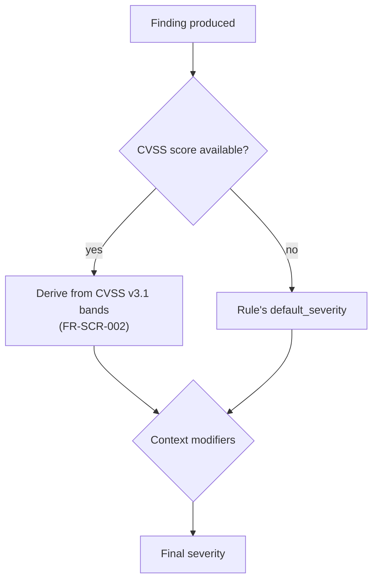
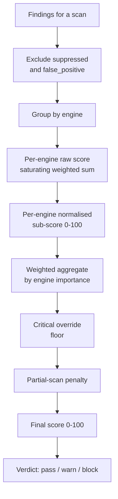

# 11 — Risk Scoring and Severity

| Field | Value |
|---|---|
| **Document** | Risk Scoring and Severity Model |
| **Project** | GuardPipe |
| **Version** | 1.0 |
| **Status** | Draft |
| **Formula version** | 1.0 |
| **Owner** | Member 1 |
| **Last updated** | 2026-07-29 |

### Revision history

| Version | Date | Author | Change |
|---|---|---|---|
| 1.0 | 2026-07-29 | Team | Initial scoring model |

---

## 1. What the score is for

The GuardPipe Risk Score answers one question: **can this software safely reach production?**

It is a single number, 0–100, where **higher is worse**. It exists because a list of 53 findings does not answer that question and a manager will not read it.

### Design requirements

| # | Requirement | Consequence |
|---|---|---|
| 1 | **Deterministic** (FR-SCR-006) | No randomness, no clock, no AI input. Same findings → same score, always |
| 2 | **Explainable** | Every point is attributable to specific findings; the UI shows the breakdown |
| 3 | **Monotonic** | Adding a finding never lowers the score; fixing one never raises it |
| 4 | **Saturating** | 200 low-severity findings must not outrank one critical |
| 5 | **Stable** | Small changes produce small movements; the trend line must be readable |
| 6 | **Reproducible** | Recomputable from stored findings at any time |
| 7 | **Versioned** | `formula_version` stored per assessment, so historical scores stay interpretable |

Requirement 4 is what most naive implementations get wrong. A linear sum lets a codebase with a thousand style warnings score worse than one with a hardcoded root password.

---

## 2. Severity assignment

### 2.1 Where severity comes from



**Severity is never assigned by AI** (§13 of [10 — AI Integration](10-ai-integration.md)).

### 2.2 CVSS bands (FIRST standard, unmodified)

| CVSS v3.1 | Severity |
|---|---|
| 9.0 – 10.0 | `critical` |
| 7.0 – 8.9 | `high` |
| 4.0 – 6.9 | `medium` |
| 0.1 – 3.9 | `low` |
| 0.0 | `informational` |

We use the published bands rather than inventing our own, so a CVE's severity in GuardPipe matches its severity everywhere else. Disagreeing with the standard would just make our output harder to trust.

### 2.3 Context modifiers

Applied after the base severity, in this order. Each moves severity at most one level, and the total adjustment is clamped to ±1.

| Modifier | Effect | Rationale |
|---|---|---|
| Finding is in a test file (`*_test.go`, `test/`, `spec/`) | **−1 level**, tagged `in_test_code` | A hardcoded credential in a test fixture is real but far less urgent |
| Finding is in an example/docs directory | **−1 level** | Same reasoning |
| Vulnerable dependency with **no fix available** | **+1 level** | You cannot patch your way out; it needs a different decision |
| Secret found in git history, not just working tree | **stays `critical`** | Never downgraded — it is already exposed |
| Rule confidence is `low` | **−1 level** | Reduces the cost of an uncertain detection |
| Finding is `informational` | never modified | Floor |
| Finding is `critical` from a secret rule | never modified | Ceiling — a live credential is a live credential |

**Ordering rule:** modifiers are applied deterministically in table order, then clamped. This makes the outcome reproducible and testable rather than dependent on evaluation order.

---

## 3. The scoring formula

### 3.1 Overview



### 3.2 Step 1 — Severity weights

| Severity | Weight `w` |
|---|---|
| `critical` | 40 |
| `high` | 15 |
| `medium` | 4 |
| `low` | 1 |
| `informational` | 0 |

`informational` contributes **zero** to the score. It is shown, counted, and never scored — otherwise documentation spelling errors would move a production-readiness verdict, which would be absurd.

The gaps are deliberate: one critical (40) outweighs two highs (30); one high (15) outweighs three mediums (12). The ordering of concern is preserved by construction.

### 3.3 Step 2 — Saturating per-engine raw score

A plain sum fails requirement 4. Instead each severity class saturates independently:

```
raw(engine) = Σ over severities  w(s) × saturate(count(s), k(s))

saturate(n, k) = k × (1 − e^(−n / k))
```

| Severity | Saturation constant `k` |
|---|---|
| `critical` | 2 |
| `high` | 5 |
| `medium` | 15 |
| `low` | 40 |

**What this does:** the first finding of a class counts almost fully; the tenth counts very little. Concretely, for `critical` (k=2):

| Count | `saturate(n, 2)` | Contribution (× 40) |
|---|---|---|
| 1 | 0.79 | 31.5 |
| 2 | 1.27 | 50.7 |
| 3 | 1.55 | 62.1 |
| 5 | 1.84 | 73.5 |
| 10 | 1.99 | 79.7 |
| 50 | 2.00 | 80.0 |

The message is right: *one* critical is already an emergency; ten criticals is worse but not five times worse — you were already not shipping.

### 3.4 Step 3 — Normalise to a 0–100 sub-score

```
subscore(engine) = min(100, round(100 × raw(engine) / R_max))
```

where `R_max = 120` — the raw value at which an engine is considered maximally bad (≈ 2 saturated criticals plus 5 saturated highs). Calibrated against the vulnerable fixture repository so that a deliberately terrible project scores near 100 and a clean one scores 0.

### 3.5 Step 4 — Engine weights

Not all stages carry equal production risk.

| Engine | Weight | Reasoning |
|---|---|---|
| `codescan` | 0.22 | Your own code, your own bugs, directly exploitable |
| `depscan` | 0.20 | The most common real-world breach vector |
| `k8sscan` | 0.18 | Misconfiguration here is cluster-wide compromise |
| `cicdscan` | 0.16 | Pipeline compromise means everything downstream is compromised |
| `containerscan` | 0.14 | Real, but usually needs another weakness to exploit |
| `pentest` | 0.08 | Confirms exposure; overlaps other engines, so it is not double-counted heavily |
| `docreview` | 0.02 | Design-quality signal, not a runtime risk |

Weights sum to 1.00.

**Renormalisation.** If an engine did not run (skipped, failed, or not requested), its weight is redistributed proportionally across the engines that did. A project with no Kubernetes manifests is not penalised for having none — and equally, it does not get a free 0.18 of "safe" it did not earn.

```
score_weighted = Σ (weight(e) / Σ weight(ran)) × subscore(e)    for e in engines that ran
```

### 3.6 Step 5 — Critical override floor

A weighted average can dilute a single catastrophic finding. It should not.

| Condition | Floor |
|---|---|
| Any `critical` finding exists | score ≥ **70** |
| ≥ 3 `critical` findings | score ≥ **85** |
| A live credential secret (`*.secrets.*` rule at `critical`) | score ≥ **90** |

```
score = max(score_weighted, floor)
```

**Justification:** a hardcoded production AWS key in an otherwise immaculate repository must not produce a "pass". The floor encodes the thing every security engineer knows and no average captures: some findings are disqualifying on their own.

### 3.7 Step 6 — Partial-scan handling

If any engine `failed` (as opposed to `skipped`):

- `is_partial = true` on the assessment
- The verdict may not be `pass` — it is capped at `warn` at best
- The UI shows the partial banner naming the failed engines

We never say "safe to ship" on the basis of an incomplete analysis. An unknown is not a zero.

### 3.8 Step 7 — Verdict

| Score | Verdict | Meaning |
|---|---|---|
| 0 – 29 | `pass` | No blocking issues found |
| 30 – 69 | `warn` | Ship with awareness; issues need scheduling |
| 70 – 100 | `block` | Do not ship |

Thresholds are configurable (`GUARDPIPE_GATE_WARN`, `GUARDPIPE_GATE_BLOCK`) because different teams have different tolerances. The defaults are deliberately strict: the `block` threshold coincides with the critical floor, so **any critical finding blocks**.

---

## 4. Worked example

Scan `7d3f…` of *Payments API*.

### Findings after excluding suppressed

| Engine | Critical | High | Medium | Low | Info |
|---|---|---|---|---|---|
| `codescan` | 1 | 4 | 9 | 4 | 2 |
| `depscan` | 1 | 3 | 5 | 2 | 3 |
| `k8sscan` | 0 | 2 | 6 | 6 | 1 |
| `cicdscan` | 0 | 0 | 1 | 2 | 1 |
| `containerscan` | — skipped (no Dockerfile) — | | | | |
| `docreview` | — failed (AI unavailable) — | | | | |
| `pentest` | — not requested — | | | | |

### Per-engine raw scores

**`codescan`**
```
critical: 40 × 2×(1−e^(−1/2))  = 40 × 0.7869 = 31.48
high:     15 × 5×(1−e^(−4/5))  = 15 × 2.7534 = 41.30
medium:    4 × 15×(1−e^(−9/15))= 4  × 6.7663 = 27.07
low:       1 × 40×(1−e^(−4/40))= 1  × 3.8064 =  3.81
info:      0                                  =  0.00
raw = 103.66  →  subscore = min(100, 100 × 103.66 / 120) = 86
```

**`depscan`**
```
critical: 40 × 0.7869 = 31.48
high:     15 × 5×(1−e^(−3/5)) = 15 × 2.2559 = 33.84
medium:    4 × 15×(1−e^(−5/15))= 4 × 4.2827 = 17.13
low:       1 × 40×(1−e^(−2/40))= 1 × 1.9506 =  1.95
raw = 84.40  →  subscore = 70
```

**`k8sscan`**
```
critical:  0
high:     15 × 5×(1−e^(−2/5)) = 15 × 1.6484 = 24.73
medium:    4 × 15×(1−e^(−6/15))= 4 × 4.9451 = 19.78
low:       1 × 40×(1−e^(−6/40))= 1 × 5.5654 =  5.57
raw = 50.08  →  subscore = 42
```

**`cicdscan`**
```
medium:    4 × 15×(1−e^(−1/15))= 4 × 0.9672 =  3.87
low:       1 × 40×(1−e^(−2/40))= 1 × 1.9506 =  1.95
raw = 5.82  →  subscore = 5
```

### Weighted aggregate

Engines that ran: `codescan` (0.22), `depscan` (0.20), `k8sscan` (0.18), `cicdscan` (0.16).
Sum of weights = 0.76 → renormalise by dividing by 0.76.

```
score_weighted = (0.22×86 + 0.20×70 + 0.18×42 + 0.16×5) / 0.76
               = (18.92 + 14.00 + 7.56 + 0.80) / 0.76
               = 41.28 / 0.76
               = 54.3  →  54
```

### Apply floor and partial handling

- 2 criticals exist (< 3) → floor = **70**
- `score = max(54, 70) = 70`
- `docreview` failed → `is_partial = true`, verdict capped at `warn`… but 70 is already `block`, and the cap only prevents `pass`.

### Result

```json
{
  "score": 70,
  "verdict": "block",
  "is_partial": true,
  "formula_version": "1.0",
  "engine_scores": { "codescan": 86, "depscan": 70, "k8sscan": 42, "cicdscan": 5 },
  "breakdown": [
    { "reason": "critical_floor_applied", "detail": "2 critical findings set a minimum score of 70", "impact": 16 },
    { "reason": "engine_contribution", "engine": "codescan", "impact": 24.9 },
    { "reason": "engine_contribution", "engine": "depscan", "impact": 18.4 },
    { "reason": "engine_contribution", "engine": "k8sscan", "impact": 9.9 },
    { "reason": "engine_contribution", "engine": "cicdscan", "impact": 1.1 },
    { "reason": "partial_scan", "detail": "docreview failed — verdict cannot be pass", "impact": 0 }
  ]
}
```

The breakdown is what the UI renders under the gauge. A user can see *exactly* why the number is what it is — which is the difference between a score people act on and a score people ignore.

---

## 5. Suppression and the score

| Status | Counted in score? | Visible in list? |
|---|---|---|
| `open` | **yes** | yes |
| `acknowledged` | **yes** | yes — acknowledging is not fixing |
| `suppressed` | no | yes, dimmed |
| `false_positive` | no | yes, dimmed |
| `fixed` | no | in history only |

`acknowledged` deliberately still counts. Acknowledging a risk does not remove it — a system where clicking a button lowers your risk score is a system that teaches people to click buttons.

Suppression requires ≥ 20 characters of justification, records who and when, and is fully visible in the report (FR-RPT-005). It is an auditable decision, not a delete button.

---

## 6. Score delta and trend

`previous_score` is the score of the most recent prior `completed` scan **of the same project**. Delta is displayed with direction:

| Delta | Display |
|---|---|
| Negative | `▼ 6` in `--success` — improving |
| Positive | `▲ 6` in `--danger` — regressing |
| Zero | `—` neutral |
| No previous scan | delta `null`, not rendered |

The trend chart (FR-UI-005) plots score over the last 20 scans with `pass`/`warn`/`block` bands as the background. This is the artefact a manager actually looks at, and it is why requirement 5 (stability) matters — a jumpy score produces an unreadable line.

---

## 7. Formula versioning

`formula_version` is stored on every `risk_assessments` row.

| Rule | Detail |
|---|---|
| Any change to weights, constants, floors, or thresholds bumps the version | |
| Historical assessments are **never recomputed** | A score in the past means what it meant then |
| The UI shows a marker on the trend chart where the formula version changed | Otherwise the trend line lies |
| Version bumps require two approvals | It changes the meaning of every future number |

---

## 8. Calibration

The constants (`w`, `k`, `R_max`, weights, floors) are calibrated against a fixture set, not chosen by intuition:

| Fixture | Expected score | Expected verdict |
|---|---|---|
| `fixture-clean` — a well-secured reference project | 0 – 10 | `pass` |
| `fixture-typical` — realistic project, some issues | 30 – 55 | `warn` |
| `fixture-vulnerable` — deliberately terrible | 85 – 100 | `block` |
| `fixture-one-secret` — otherwise clean, one hardcoded key | ≥ 90 | `block` |
| `fixture-noisy` — 200 low-severity findings, nothing serious | ≤ 35 | `warn` |

The last two are the calibration tests that matter. `fixture-one-secret` proves the floor works; `fixture-noisy` proves saturation works. Both are automated tests in CI — if a constant is changed and these break, the change is wrong.

---

## 9. Implementation notes

```go
type Scorer struct {
    weights   map[Severity]float64
    saturation map[Severity]float64
    engineWeights map[EngineID]float64
    rMax      float64
    floors    []Floor
    thresholds Thresholds
    version   string
}

func (s *Scorer) Compute(findings []Finding, jobs []ScanJob) RiskAssessment
```

| Requirement | Implementation |
|---|---|
| Pure function | No I/O, no clock, no randomness — trivially unit-testable |
| Deterministic | Findings sorted by ID before processing; float operations in fixed order |
| Configurable | All constants injected via config, defaults in code |
| Explainable | Every step appends to `breakdown` as it goes; the explanation is not reconstructed afterwards |
| Fast | O(n) over findings; a 2,000-finding scan scores in well under a millisecond |

**Rounding:** `math.Round` at the final step only. Intermediate values stay float64. Rounding per-engine and then aggregating would introduce drift that makes the breakdown fail to sum to the score — a small thing that badly undermines trust in the number.

---

## 10. Known limitations

Stated plainly, because a scoring model that hides its assumptions is worse than no model.

| Limitation | Impact | Mitigation |
|---|---|---|
| No reachability analysis | A vulnerable dependency that is never called scores the same as one in a hot path | Documented; reachability is future work |
| No exploitability weighting (EPSS/KEV) | A theoretically-scored CVE and an actively-exploited one score alike | EPSS integration is a named future enhancement |
| No asset criticality | A prototype and a payment system are scored identically | Per-project criticality multiplier is future work |
| Engine weights are judgement, not measurement | Reasonable people would pick different numbers | Weights are configurable and the rationale is documented |
| Detection gaps become score gaps | What we do not detect cannot be scored | Detection coverage is reported alongside the score |

The last one is the most important and the most often ignored: **a low score means "we found little", not "there is little".** The UI states scan coverage next to the score for exactly this reason.
