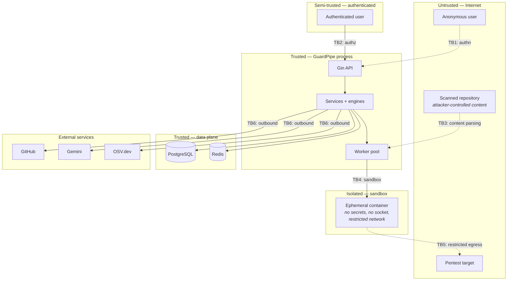

# 12 — Security and Threat Model

| Field | Value |
|---|---|
| **Document** | Security Design and Threat Model |
| **Project** | GuardPipe |
| **Version** | 1.0 |
| **Status** | Draft |
| **Method** | STRIDE · OWASP ASVS 4.0 |
| **Owner** | Member 6 (with all) |
| **Last updated** | 2026-07-29 |

### Revision history

| Version | Date | Author | Change |
|---|---|---|---|
| 1.0 | 2026-07-29 | Team | Initial threat model |

---

## 1. Why this document exists

GuardPipe is a security product that, by design, **ingests hostile input and executes analysis on it**. It clones arbitrary repositories, parses attacker-controlled files, sends untrusted content to an LLM, launches containers, and makes network requests to user-specified targets.

A security tool that is itself insecure is worse than no tool: it concentrates sensitive material — source code, credentials, vulnerability inventories — into one high-value target, while its users believe they are safer.

So this document does what we would demand of any project we scanned: enumerate the threats, state the controls, and be honest about the residual risk.

---

## 2. Assets and trust boundaries

### 2.1 Assets, ranked by what an attacker would want

| # | Asset | Why it is valuable | Impact if compromised |
|---|---|---|---|
| 1 | **Stored GitHub PATs** | Direct write access to users' repositories | Critical — supply-chain compromise of the customer |
| 2 | **Vulnerability inventory** | A map of exactly where every user is exploitable | Critical — a targeting list |
| 3 | **Cloned source code** | Users' proprietary code, transiently on disk | High |
| 4 | **The GuardPipe host** | Docker socket access = host control | Critical |
| 5 | **User credentials / sessions** | Account takeover | High |
| 6 | **Gemini API key** | Quota theft, cost | Medium |
| 7 | **Audit and attestation records** | Legal defensibility of pentests | Medium |

Asset 2 deserves emphasis. Most people think of a scanner's database as low-value output. It is the opposite: a complete, current list of every unpatched vulnerability across every connected project is more useful to an attacker than any single exploit.

### 2.2 Trust boundaries



| ID | Boundary | Primary risk |
|---|---|---|
| **TB1** | Internet → API (unauthenticated) | Auth bypass, enumeration, DoS |
| **TB2** | Authenticated user → resources | Broken object-level authorisation |
| **TB3** | Repository content → analysis code | Parser exploits, zip bombs, path traversal, prompt injection |
| **TB4** | Application → sandbox | Container escape, resource exhaustion |
| **TB5** | Sandbox → target network | SSRF, unauthorised testing, lateral movement |
| **TB6** | Application → external APIs | Credential leakage, data exfiltration to third parties |

---

## 3. STRIDE analysis

### 3.1 Spoofing

| # | Threat | Boundary | Likelihood | Impact | Controls |
|---|---|---|---|---|---|
| S1 | Credential stuffing against `/auth/login` | TB1 | High | High | Argon2id; 5/min/IP rate limit; account lock after repeated failures; identical error for unknown user and wrong password (no enumeration) |
| S2 | Stolen JWT replayed | TB1 | Medium | High | 15-minute access token; token held in memory not `localStorage`; `jti` claim |
| S3 | Refresh token theft | TB1 | Medium | High | `HttpOnly`+`Secure`+`SameSite=Strict` cookie; single-use rotation; **family invalidation on reuse detection** |
| S4 | Forged GitHub webhook | TB1 | Medium | Medium | HMAC-SHA256 signature verification, constant-time compare (Stretch, with the webhook feature) |
| S5 | DNS rebinding — target resolves benignly at validation, internally at execution | TB5 | Low | **Critical** | IPs pinned at validation; **re-resolved and compared immediately before execution**; abort on mismatch (FR-PEN-002) |

S5 is subtle and worth stating: validating a hostname and then connecting by hostname later is a classic bypass. We validate, pin the resolved IP, and connect to the pinned IP.

### 3.2 Tampering

| # | Threat | Boundary | Likelihood | Impact | Controls |
|---|---|---|---|---|---|
| T1 | SQL injection in GuardPipe's own queries | TB2 | Low | Critical | Parameterised queries exclusively; `sqlc` typed queries; string-concatenated SQL is a review-blocking defect (NFR-SEC-003) |
| T2 | Path traversal via crafted repository paths — `../../etc/passwd` in a manifest or archive | TB3 | **Medium** | High | All paths canonicalised and verified to remain inside the workspace root before any read; symlinks escaping the root removed at checkout |
| T3 | Zip/tar bomb in a container image layer | TB3 | Medium | Medium | Layer count cap (100), decompressed size cap (2 GB), per-file size cap; extraction inside the sandbox with a memory limit |
| T4 | Malicious repository content modifies findings | TB3 | Low | High | Engines are read-only over the workspace; findings are constructed by our code from parsed data, never echoed raw into control fields |
| T5 | Tampering with stored findings to hide risk | TB2 | Low | High | Findings immutable except triage fields; all status changes written to `finding_status_history` and `audit_log` |
| T6 | Suppressing findings to fake a passing score | TB2 | Medium | Medium | Suppression requires justification, records actor and time, appears in reports, and is visible in the UI — it cannot be done silently |

### 3.3 Repudiation

| # | Threat | Likelihood | Impact | Controls |
|---|---|---|---|---|
| R1 | User denies authorising a penetration test | Medium | **Critical (legal)** | Attestation record: user, target, wording version, timestamp, source IP; `ON DELETE RESTRICT` on the user reference so the record survives account deletion |
| R2 | User denies suppressing a critical finding | Medium | Medium | Append-only `finding_status_history` with actor and reason |
| R3 | Denial of who started a scan | Low | Low | `scans.triggered_by` + `audit_log` |

R1 is the highest-consequence non-technical risk in the product. Running a port scan against a host you do not own is a criminal offence in many jurisdictions, including under Bangladesh's Digital Security Act and equivalents elsewhere. The attestation is not a checkbox for show — it is the evidence that the user, not the tool, chose the target.

### 3.4 Information disclosure

| # | Threat | Boundary | Likelihood | Impact | Controls |
|---|---|---|---|---|---|
| I1 | Stored PAT retrieved via the API | TB2 | Low | **Critical** | Never returned by any endpoint; only a masked hint; no `SELECT ciphertext` outside the credential repository |
| I2 | PAT read from a database dump | — | Medium | Critical | AES-256-GCM at rest, key from environment, never stored with the data |
| I3 | Secrets written to logs | — | **Medium** | High | Central `slog` redaction handler; request bodies never logged; AI prompt content never logged (NFR-SEC-005) |
| I4 | Detected secret values stored in evidence | — | **High** if unaddressed | Critical | Evidence stores location and shape, **never the secret value**; `content_redacted` flag |
| I5 | Cross-tenant data access | TB2 | Medium | Critical | Organisation ownership checked in the **service layer** on every resource access, not only in the router |
| I6 | Resource existence leaked via 403 vs 404 | TB2 | Medium | Low | 404 for anything not owned (FR-IAM-008) |
| I7 | Source code sent to a third party (Gemini) | TB6 | **Certain by design** | Medium | Disclosed in the UI at project creation; `GUARDPIPE_AI_ENABLED=false` supported; only minimal necessary context sent, never whole repositories |
| I8 | Verbose errors leaking internals | TB1 | Medium | Medium | Internal detail logged, never returned; generic 500 body |
| I9 | Timing side channel in login | TB1 | Low | Low | Argon2id verification always executed, even for unknown users |

I7 is stated as "certain by design" deliberately. We do send user code to Google. Pretending otherwise, or burying it, would make GuardPipe an instance of the exact problem it exists to detect.

### 3.5 Denial of service

| # | Threat | Boundary | Likelihood | Impact | Controls |
|---|---|---|---|---|---|
| D1 | Enormous repository exhausts disk | TB3 | Medium | Medium | 500 MB cap enforced **during** clone; disk-space check before starting |
| D2 | Catastrophic regex backtracking on crafted input | TB3 | **Medium** | Medium | Per-file 5 s deadline; regexes reviewed for nested quantifiers; Go's RE2 engine is not backtracking, which eliminates the classic class outright |
| D3 | Scan-request flood | TB1 | Medium | Medium | 10 scans/hour/user; bounded worker pool; queue depth cap |
| D4 | Fork bomb / resource exhaustion inside the sandbox | TB4 | Low | Medium | `--pids-limit=128`, memory and CPU caps, hard timeout |
| D5 | Our pentest DoSing the target | TB5 | **Medium** | High | 10 req/s cap enforced in the scripts *and* at the sandbox level; no fuzzing, no brute force (FR-PEN-010) |
| D6 | Deep-nesting YAML/JSON parser exhaustion | TB3 | Medium | Low | Depth limits, document size caps, streaming parsers |

D5 is a threat *we* pose to someone else. A tool that accidentally takes down the target it was asked to assess is a serious professional failure, so the rate cap is enforced in two independent places.

### 3.6 Elevation of privilege

| # | Threat | Boundary | Likelihood | Impact | Controls |
|---|---|---|---|---|---|
| E1 | `viewer` performs `member`/`admin` actions | TB2 | Low | High | Role check in middleware **and** ownership check in the service |
| E2 | Container escape from the sandbox | TB4 | Low | **Critical** | Non-root, `cap-drop=ALL`, `no-new-privileges`, read-only rootfs, no Docker socket, resource limits |
| E3 | **Docker socket mount grants the app host-equivalent privilege** | TB4 | — | **Critical** | See §4 — this is our largest accepted risk |
| E4 | Command injection when invoking `git` or Docker | TB3 | Medium | Critical | No shell invocation anywhere; `exec.Command` with an explicit argument slice; no user input in argument position without validation |
| E5 | Prompt injection alters analysis outcomes | TB3 | **High** (attempts), Low (success) | Medium | Five-layer defence in [10 §5](10-ai-integration.md#5-prompt-injection-defence-fr-ai-010); crucially, **AI cannot change severity, score, or verdict** |
| E6 | SSRF via a user-supplied URL reaching internal services | TB5/TB6 | **Medium** | Critical | Address validation + IP pinning; RFC 1918, loopback, link-local and `169.254.169.254` blocked by default |

E4 deserves a note: we never build a shell command string. `git clone` is invoked as `exec.Command("git", "clone", "--depth", "1", url, dir)` — an argument vector, not a shell line. This makes the entire class structurally impossible rather than defended against.

---

## 4. The Docker socket — our largest accepted risk

**What it is.** GuardPipe mounts `/var/run/docker.sock` so it can create sandbox containers and inspect images. Anything that can talk to the Docker socket can start a privileged container mounting the host filesystem. **Socket access is effectively root on the host.**

**Why we accept it.** Container inspection and sandboxed script execution are core to two engines. The alternatives — a rootless Docker daemon, a dedicated sandbox microservice with a narrow API, gVisor/Kata runtimes — each cost days we do not have, and the deployment target is a local development machine or a demo laptop, not a shared production host.

**What it means concretely.** An RCE in GuardPipe's own code escalates to host compromise. There is no mitigation that changes this while the socket is mounted directly.

**Compensating controls**

| Control | Effect |
|---|---|
| Sandbox containers never receive the socket | A compromised *sandbox* cannot reach Docker |
| Docker SDK used with an explicit allowlist of operations | No arbitrary API passthrough |
| No user input reaches container configuration unvalidated | Image references and commands are constructed by our code |
| Deployment scope is local/demo only | Blast radius is one developer machine |

**Production remediation (documented, not implemented):** run Docker rootless, or move sandbox execution behind a dedicated daemon exposing only `run(spec) → result` over a Unix socket with no image-management API, or adopt a userspace kernel runtime.

We state this rather than hide it. Every real security product has a privileged component; the difference between a trustworthy one and an untrustworthy one is whether it tells you.

---

## 5. Penetration testing — rules of engagement

The `pentest` module is the only part of GuardPipe that actively touches systems outside itself. It is governed by hard, in-product rules.

### 5.1 Authorisation

| Control | Detail |
|---|---|
| Attestation required | Explicit acceptance naming the target, before the first scan (FR-PEN-001, NFR-CMP-001) |
| Recorded | User, target, wording version, timestamp, source IP — append-only |
| Enforced at execution | Job refuses to start on a non-`attested` target; returns `409 target.not_attested` |
| Revocable | A target can be revoked; existing findings are retained, new scans blocked |

### 5.2 Target restrictions

Blocked by default and rejected at registration and again at execution:

`10.0.0.0/8` · `172.16.0.0/12` · `192.168.0.0/16` · `127.0.0.0/8` · `::1` · `169.254.0.0/16` (**including `169.254.169.254`, the cloud metadata endpoint**) · `fc00::/7` · `0.0.0.0` · any address resolving to the GuardPipe host itself.

`GUARDPIPE_ALLOW_PRIVATE_TARGETS=true` exists for legitimate internal testing. It is off by default, and turning it on is a deliberate, logged act.

### 5.3 Prohibited activity — enforced in code, not policy

| Prohibited | Enforcement |
|---|---|
| Exploitation of discovered vulnerabilities | Scripts contain no exploit payloads |
| Brute force, credential stuffing, password spraying | No credential lists shipped; no auth endpoints targeted |
| Denial of service, volumetric fuzzing | Rate cap in scripts + sandbox network shaping |
| Data-modifying requests (`PUT`/`POST`/`DELETE` beyond method discovery) | Method allowlist in the HTTP client |
| Requests above 10 req/s | Enforced in two independent layers |
| Targets outside the pinned validated IPs | Sandbox network permits only the pinned IP |

**Default credential handling:** we detect that a default-credential login page exists. We never attempt the credentials. The distinction between "this system appears to use default credentials" and "I logged in with them" is the distinction between assessment and intrusion.

### 5.4 Evidence

Every command, exit code, and output is recorded as a timestamped transcript attached to the scan (FR-PEN-011). This is what makes the result defensible, and it is what a real engagement would require.

---

## 6. Secure development requirements

GuardPipe must pass GuardPipe. These are the standards our own code is held to — and they are all rules our own engines check for.

| Area | Requirement | Our own rule that would catch a violation |
|---|---|---|
| SQL | Parameterised queries only | `codescan.injection.sql-string-concat` |
| Commands | `exec.Command` with an argument slice, never a shell string | `codescan.injection.command` |
| Secrets | Environment only; never in source, never in logs | `codescan.secrets.*` |
| Crypto | Argon2id, AES-256-GCM, `crypto/rand` | `codescan.crypto.*` |
| TLS | Verification always on | `codescan.tls.verify-disabled` |
| Frontend | No `dangerouslySetInnerHTML`; token in memory | `codescan.injection.xss-react-html` |
| Dependencies | Scanned in CI; HIGH/CRITICAL fails the build (NFR-SEC-009) | `depscan.vuln.known-cve` |
| Containers | Non-root, pinned base images, multi-stage | `containerscan.dockerfile.*` |
| CI | Actions pinned to SHA, explicit `permissions:` | `cicdscan.supply-chain.unpinned-action` |

**CI runs GuardPipe against GuardPipe.** A regression in our own security posture fails our own build. It is also, not incidentally, the most persuasive thing we can show in the demo.

---

## 7. Security controls summary

### 7.1 Authentication and session

| Control | Specification |
|---|---|
| Password hashing | Argon2id — 64 MB, 3 iterations, parallelism 2 |
| Password policy | ≥ 12 characters, common-password rejection |
| Access token | JWT HS256, 15 min, in-memory only |
| Refresh token | Opaque 32 bytes, SHA-256 stored, single-use, rotating, family invalidation |
| Cookie flags | `HttpOnly`, `Secure`, `SameSite=Strict` |
| Rate limits | 5/min/IP auth, 100/min/user general |
| Lockout | Progressive delay after repeated failures |

### 7.2 Input validation

| Input | Validation |
|---|---|
| All API bodies | Struct binding + `validator` tags; unknown fields rejected |
| UUIDs | Parsed, never string-concatenated into queries |
| Repository URLs | HTTPS only, allowlisted host, no credentials embedded in the URL |
| Pentest targets | §5.2 address validation |
| File paths from repositories | Canonicalised, containment-checked against the workspace root |
| YAML/JSON from repositories | Depth, size, and document-count limits |
| Pagination | `page_size` clamped to 100 |

### 7.3 Output encoding

| Output | Encoding |
|---|---|
| API responses | `encoding/json` — no manual string building |
| Evidence snippets | Stored as text, rendered as text by the frontend, never as HTML |
| Log fields | Structured, redacted, never interpolated |
| Error messages | Fixed templates; user input never echoed into an error string |

### 7.4 HTTP security headers (NFR-SEC-004)

```
Strict-Transport-Security: max-age=31536000; includeSubDomains
Content-Security-Policy: default-src 'self'; script-src 'self'; style-src 'self' 'unsafe-inline';
                         img-src 'self' data:; connect-src 'self'; frame-ancestors 'none';
                         base-uri 'self'; form-action 'self'
X-Content-Type-Options: nosniff
X-Frame-Options: DENY
Referrer-Policy: strict-origin-when-cross-origin
Permissions-Policy: geolocation=(), camera=(), microphone=()
```

`style-src 'unsafe-inline'` is required by Tailwind's runtime style injection and is a known, accepted weakening. It is recorded here rather than left as an unexplained gap.

---

## 8. Incident response (project scale)

| Scenario | Response |
|---|---|
| Secret committed to the repository | Rotate immediately; rewrite history if not yet pushed; assume compromised regardless |
| Gemini API key leaked | Revoke in Google Cloud Console; regenerate; audit usage |
| Dependency CVE found in our own build | CI already fails; patch or pin; document if unpatchable |
| Sandbox escape suspected | Stop the application; inspect Docker for orphan containers; rebuild the environment |
| Unauthorised pentest reported | Preserve the attestation record and transcript; disable the target; report to the instructor |

---

## 9. Residual risks — accepted and stated

| # | Risk | Why accepted | Would-be fix |
|---|---|---|---|
| 1 | Docker socket = host-equivalent privilege | Core functionality; local/demo deployment only | Rootless Docker or a dedicated sandbox daemon |
| 2 | Prompt injection cannot be fully prevented | No known technique achieves it | Blast radius contained: AI cannot affect severity, score, or verdict |
| 3 | Source code is sent to Google | Required for the AI features | Disclosed in-product; disable switch provided |
| 4 | No secret scanning of full git history by default | Performance | Optional deep-history mode (Stretch) |
| 5 | Single-organisation model, no true multi-tenancy | Out of scope | Row-level security if it ever becomes multi-tenant |
| 6 | HTTP in the local Compose deployment | Local only | TLS termination is required for any non-local deployment |
| 7 | JWT secret is a single symmetric key | Adequate at this scale | Asymmetric signing with rotation |

---

## 10. Security review checklist

Applied to every PR, in the PR template ([14 — GitHub Workflow](14-github-workflow.md)):

- [ ] No secrets, tokens, or keys in code, tests, fixtures, or comments
- [ ] All SQL parameterised — no string concatenation
- [ ] All user input validated at the boundary
- [ ] Authorisation checked in the **service layer**, not only the router
- [ ] Errors do not leak internal detail to the client
- [ ] Nothing sensitive added to logs
- [ ] New external calls have timeouts and bounded retries
- [ ] New file-path handling is canonicalised and containment-checked
- [ ] New dependencies justified in the PR description
- [ ] New sandbox usage keeps the limits from [04 §7.2](04-backend-architecture.md#72-enforced-container-settings)
- [ ] Anything touching `pentest` re-verifies attestation and target validation
