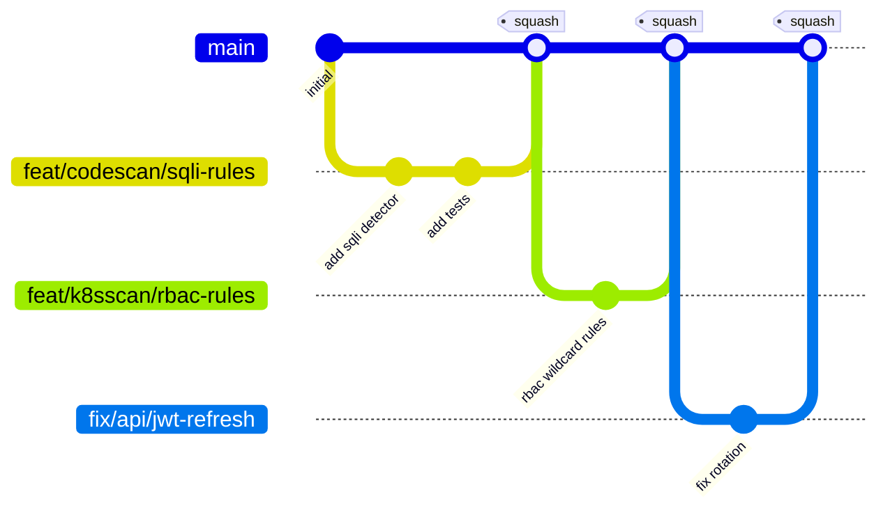

# 14 — GitHub Workflow

| Field | Value |
|---|---|
| **Document** | GitHub Workflow and Collaboration Process |
| **Project** | GuardPipe |
| **Version** | 1.0 |
| **Status** | Draft |
| **Repository** | `github.com/Ruhanyat-994/GuardPipe` |
| **Contributors** | 6 |
| **Owner** | Member 1 (Team Lead) |
| **Last updated** | 2026-07-29 |

### Revision history

| Version | Date | Author | Change |
|---|---|---|---|
| 1.0 | 2026-07-29 | Team | Initial workflow definition |

> **Read this before your first commit.** Six people, one repository, three weeks. Process is what stops the last week from becoming merge-conflict archaeology.

---

## 1. Branching model — GitHub Flow



### 1.1 Why GitHub Flow and not Git Flow

| | Git Flow | GitHub Flow (chosen) |
|---|---|---|
| Long-lived branches | `main` + `develop` + `release/*` | `main` only |
| Merges before integration | many | one |
| Integration pain | discovered at release | discovered immediately |
| Suits release trains | yes | no |
| Suits a 3-week project with one deadline | **no** | **yes** |

We ship once. A `develop` branch would add a merge step, a second place for CI to run, and a class of "it works on develop" bugs — all cost, no benefit. **`develop` is deliberately omitted.**

### 1.2 Branch types

| Prefix | Purpose | Example |
|---|---|---|
| `feat/` | New capability | `feat/codescan/sqli-detector` |
| `fix/` | Bug fix | `fix/api/jwt-refresh-rotation` |
| `docs/` | Documentation only | `docs/architecture-baseline` |
| `chore/` | Tooling, config, dependencies | `chore/ci/pin-action-shas` |
| `refactor/` | No behaviour change | `refactor/orchestrator/extract-registry` |
| `test/` | Tests only | `test/k8sscan/rbac-fixtures` |
| `schema/` | **Database migrations — always alone** | `schema/add-ai-suggestions-table` |

**Naming:** `<type>/<module>/<short-kebab-description>` — the module segment makes it instantly obvious who owns the branch and whether it will collide with yours.

`schema/` exists as its own type because migrations are the one change that can break everyone else's branch at once. Isolating them makes the risk visible in the branch name.

### 1.3 Branch rules

| Rule | Detail |
|---|---|
| Always branch from up-to-date `main` | `git switch main && git pull && git switch -c feat/...` |
| One branch = one issue = one PR | Keeps reviews small and revertible |
| Branch lifetime ≤ 3 days | Longer means it will conflict. Split the work |
| Rebase on `main` before opening the PR | You resolve your conflicts, not the reviewer |
| Never force-push a branch someone else is reviewing | Force-push your own unreviewed branch freely |
| Delete after merge | Automatic in repository settings |
| Never commit directly to `main` | Enforced by branch protection |

---

## 2. Module ownership

Every module has one accountable owner. Ownership means *responsible for it working on demo day* — not exclusive write access. Anyone may fix anything; the owner reviews.

| # | Member | Role | Owns |
|---|---|---|---|
| 1 | *[Name]* | Team Lead / Backend | `identity`, `project`, `orchestrator`, `scoring`, `store`, **database schema**, releases |
| 2 | *[Name]* | Backend — Code Security | `codescan`, `depscan`, `advisory` |
| 3 | *[Name]* | Backend — Infra Security | `containerscan`, `k8sscan` |
| 4 | *[Name]* | Backend — AI & Pipeline | `ai`, `docreview`, `cicdscan` |
| 5 | *[Name]* | Frontend Lead | `frontend/`, `reporting` API surface |
| 6 | *[Name]* | DevOps / QA / Design | `sandbox`, `pentest`, Docker, CI, Figma, test strategy |

### 2.1 CODEOWNERS

To be created at `.github/CODEOWNERS` in Sprint 0. Reproduced here as the authoritative mapping:

```
# GuardPipe — code ownership
# Owners are auto-requested as reviewers on matching paths.

*                                   @member1

/internal/modules/identity/         @member1
/internal/modules/project/          @member1
/internal/modules/orchestrator/     @member1
/internal/modules/scoring/          @member1
/internal/store/                    @member1
/internal/store/migrations/         @member1 @member2      # schema: two reviewers

/internal/engines/codescan/         @member2
/internal/engines/depscan/          @member2
/internal/adapters/osv/             @member2

/internal/engines/containerscan/    @member3
/internal/engines/k8sscan/          @member3

/internal/engines/docreview/        @member4
/internal/engines/cicdscan/         @member4
/internal/adapters/gemini/          @member4 @member1      # AI: two reviewers

/internal/engines/pentest/          @member6 @member1      # pentest: two reviewers
/internal/adapters/sandbox/         @member6 @member1      # sandbox: two reviewers

/frontend/                          @member5
/internal/modules/reporting/        @member5 @member1

/deploy/                            @member6
/.github/                           @member6 @member1
/Makefile                           @member6

/documentation/                     @member1
/documentation/02-srs.md            @member1 @member5      # SRS: two reviewers
/documentation/06-database-design.md @member1 @member2     # schema doc: two reviewers
/documentation/07-api-specification.md @member1 @member5   # API contract: two reviewers
```

The double-owner paths are the high-blast-radius ones: schema, AI, sandbox, pentest, and the shared contracts. Everything else needs one reviewer.

---

## 3. Commit conventions

**Conventional Commits 1.0.0**, with the scope set to the module name.

```
<type>(<scope>): <subject>

<body — what and why, not how>

<footer — issue refs, breaking changes, co-authors>
```

### Types

| Type | Use |
|---|---|
| `feat` | New capability |
| `fix` | Bug fix |
| `docs` | Documentation only |
| `test` | Tests only |
| `refactor` | No behaviour change |
| `perf` | Performance |
| `chore` | Build, tooling, dependencies |
| `ci` | CI configuration |
| `style` | Formatting only |

### Rules

| Rule | Detail |
|---|---|
| Subject in imperative mood | "add rule", not "added rule" or "adds rule" |
| Subject ≤ 72 characters, no trailing period | |
| Scope = module name | `codescan`, `k8sscan`, `api`, `frontend`, `ci`, `schema` |
| Body explains **why** | The diff already shows what |
| Reference the issue | `Closes #42` |
| `BREAKING CHANGE:` footer for contract changes | API or schema |

### Examples

| ✅ Good | ❌ Bad |
|---|---|
| `feat(codescan): add SQL injection detection for Go and Python` | `added sqli` |
| `fix(orchestrator): prevent workspace leak when clone fails` | `bug fix` |
| `docs(srs): add FR-CICD-004 for script injection detection` | `update docs` |
| `refactor(scoring): extract saturation into a pure function` | `cleanup` |
| `chore(deps): bump go-git to 5.12.0 for CVE-2025-1234` | `updates` |

Full example:
```
feat(k8sscan): add RBAC privilege escalation detection

Detects roles granting create on pods, escalate/bind on roles, and
impersonate — the three most common paths from a namespaced role to
cluster-admin. Uses the resource graph built during manifest parsing.

Closes #47
```

---

## 4. Pull requests

### 4.1 Rules

| Rule | Value | Why |
|---|---|---|
| Size | ≤ 400 changed lines | Review quality collapses above this |
| Approvals | **1** (2 for schema, AI, sandbox, pentest, SRS, API spec) | Blast radius |
| CI | Must be green | No exceptions, no "I'll fix it after" |
| Self-approval | Not allowed | |
| Merge method | **Squash** | One commit per PR on `main`; linear history |
| Draft PRs | Encouraged early | Signals what you are working on before the conflict happens |
| Stale PRs | Ping after 24 h, escalate after 48 h | |

### 4.2 PR template

To be created at `.github/pull_request_template.md`:

```markdown
## What
<!-- One or two sentences. -->

## Why
<!-- Link the issue. What problem does this solve? -->
Closes #

## How
<!-- Notable design decisions. Anything a reviewer would otherwise have to reverse-engineer. -->

## Type
- [ ] feat  - [ ] fix  - [ ] docs  - [ ] test  - [ ] refactor  - [ ] chore

## Checklist
- [ ] Follows the module boundary rule (no cross-module internal imports)
- [ ] Tests added or updated
- [ ] `make lint` and `make test` pass locally
- [ ] Documentation updated if behaviour or a contract changed
- [ ] No secrets, tokens, or keys added anywhere
- [ ] New dependencies justified below

## Security checklist (from documentation/12 §10)
- [ ] All SQL parameterised
- [ ] All user input validated at the boundary
- [ ] Authorisation checked in the service layer, not only the router
- [ ] Errors leak no internal detail
- [ ] Nothing sensitive added to logs
- [ ] New external calls have timeouts

## Schema changes
- [ ] None
- [ ] Migration included, numbered sequentially, `documentation/06` updated,
      two approvals requested

## New dependencies
<!-- name — why it is needed — why not stdlib. Delete if none. -->

## Screenshots
<!-- Required for any UI change. -->
```

### 4.3 Review etiquette

Prefix every comment so its weight is unambiguous:

| Prefix | Meaning | Blocks merge? |
|---|---|---|
| `blocking:` | Must change | **yes** |
| `suggestion:` | Would improve; author decides | no |
| `nit:` | Trivial (style, naming) | no |
| `question:` | I do not understand this | no |
| `praise:` | This is good | no |

| Reviewer expectation | Author expectation |
|---|---|
| Respond within 24 h | Respond to every comment |
| Review the diff, not the person | Push fixes as new commits (squashed on merge) |
| Explain *why* something is blocking | Do not force-push mid-review |
| Approve when good enough, not when perfect | Re-request review after changes |
| Pull the branch and run it for anything non-trivial | Say "done" or "disagree, because…" — never silence |

`praise:` is on the list intentionally. Three weeks of pure criticism corrodes a team; noting good work costs seconds.

---

## 5. Branch protection on `main`

To be configured by the repository owner in Sprint 0:

- [x] Require a pull request before merging
- [x] Require 1 approval (CODEOWNERS raises it to 2 on sensitive paths)
- [x] Dismiss stale approvals when new commits are pushed
- [x] Require review from Code Owners
- [x] Require status checks to pass: `lint-backend`, `lint-frontend`, `test-backend`, `test-frontend`, `build`, `dependency-scan`
- [x] Require branches to be up to date before merging
- [x] Require conversation resolution before merging
- [x] Require linear history
- [x] Block force pushes
- [x] Block deletions
- [ ] Include administrators — **off**, so the Team Lead can unblock a genuine emergency

The last one is a deliberate trade. With four weeks and no on-call rotation, a hard lock with nobody able to override is a bigger risk than the discipline it enforces. Any override must be announced in the team channel with a reason.

---

## 6. Issues and the project board

### 6.1 Labels

| Category | Labels |
|---|---|
| Module | `module:identity` `module:project` `module:orchestrator` `module:codescan` `module:depscan` `module:containerscan` `module:k8sscan` `module:cicdscan` `module:docreview` `module:pentest` `module:ai` `module:scoring` `module:frontend` `module:infra` `module:docs` |
| Type | `type:feature` `type:bug` `type:docs` `type:test` `type:chore` `type:spike` |
| Priority | `priority:p0-blocker` `priority:p1-core` `priority:p2-stretch` |
| Status | `status:blocked` `status:needs-discussion` `status:ready` |
| Special | `good-first-issue` `security` `breaking-change` |

**`priority:p1-core` and `priority:p2-stretch` map directly to the Core/Stretch tiers in [05 — Module Specifications](05-module-specifications.md).** When the schedule tightens, filter by `p2-stretch` and close them — the decision has already been made and documented, so nobody has to argue about it in week three.

### 6.2 Board columns

`Backlog` → `Ready` → `In Progress` → `In Review` → `Done`

| Column | Entry criterion | WIP limit |
|---|---|---|
| Backlog | Exists | — |
| Ready | Has acceptance criteria and an owner | — |
| In Progress | Branch created | **2 per person** |
| In Review | PR open, CI green | — |
| Done | Merged to `main` | — |

The WIP limit of 2 is the important one. A person with five open branches finishes none of them and conflicts with everyone.

### 6.3 Issue template

```markdown
## Description
<!-- What needs to be built or fixed. -->

## Requirement reference
<!-- FR-xxx / NFR-xxx from documentation/02-srs.md -->

## Acceptance criteria
- [ ]
- [ ]

## Module
<!-- Which module. Adds the label. -->

## Notes
<!-- Design hints, links, gotchas. -->
```

**Every feature issue must reference a requirement ID.** This is what keeps the traceability matrix in [16 — Project Plan](16-project-plan.md) closable, and it is the cheapest possible way to notice that something is being built which nobody asked for.

---

## 7. Daily and weekly rhythm

| Cadence | Ritual | Duration |
|---|---|---|
| Daily | Async standup in the team channel: done / doing / blocked | 5 min |
| Daily | Review any PR assigned to you | 20 min |
| Twice weekly | Live sync — integration issues, decisions, board grooming | 30 min |
| Weekly | Sprint review: demo working software, groom the backlog, re-tier Core/Stretch | 45 min |

**Blockers are raised the same day, not at the next sync.** In a four-week project, a two-day silent block is 5% of the schedule.

---

## 8. Conflict resolution

### 8.1 Merge conflicts

```bash
git switch main && git pull
git switch feat/my-branch
git rebase main
# fix conflicts, then:
git rebase --continue
git push --force-with-lease
```

`--force-with-lease`, never `--force`. It refuses to overwrite work you have not seen — which is exactly the failure it is there to prevent.

### 8.2 The three collision hotspots

| Hotspot | Why | Protocol |
|---|---|---|
| **Migrations** | Sequential numbers collide | Announce first; `schema/` branch alone; two approvals; renumber on rebase ([06 §12](06-database-design.md#12-schema-change-protocol)) |
| **`domain` package** | Everyone imports it | Announce; keep changes additive; never rename a field mid-sprint |
| **Engine registry / router** | Every new engine and endpoint touches one file | One line each, appended alphabetically — conflicts resolve trivially |

### 8.3 Technical disagreements

1. Discuss in the PR thread.
2. If unresolved in 24 h, escalate to the module owner.
3. If still unresolved, the Team Lead decides and **records it as an ADR**.
4. Disagree and commit — then move on.

The ADR requirement matters: a decision that was argued about is exactly the decision that gets re-argued in two weeks unless it is written down.

---

## 9. Releases

| Aspect | Rule |
|---|---|
| Versioning | Semantic Versioning 2.0.0 |
| Pre-1.0 | `0.x.y` during development — minor for features, patch for fixes |
| Demo release | `v1.0.0`, tagged on `main` |
| Tags | Annotated: `git tag -a v0.3.0 -m "Sprint 2: all engines operational"` |
| CHANGELOG | Generated from conventional commits |
| Release notes | What works, what is stretch, known limitations |

Planned tags:

| Tag | When | Contents |
|---|---|---|
| `v0.1.0` | End of Sprint 0 | Scaffold, CI, auth, `depscan` vertical slice |
| `v0.2.0` | End of Sprint 1 | Orchestrator, `codescan`, dashboard shell |
| `v0.3.0` | End of Sprint 2 | All seven engines |
| `v0.4.0` | Feature freeze | AI, scoring, full dashboard |
| `v1.0.0` | Demo day | Complete |

---

## 10. Documentation workflow

Documentation follows the identical process — it is not a lesser artifact.

| Rule | Detail |
|---|---|
| Branch | `docs/<topic>` |
| Commit | `docs(<scope>): <what changed>` |
| Review | Same PR process; owner from the CODEOWNERS mapping |
| Version | Bump the version in the document header, add a revision-history row |
| Contracts | `02-srs.md`, `06-database-design.md`, `07-api-specification.md` need **two** approvals |
| Sync rule | A behaviour change and its documentation update ship in the **same PR** |

The sync rule is the one that decays first and matters most. Documentation that lags code by two weeks is worse than no documentation, because people trust it and are then wrong.

---

## 11. Getting started — first day checklist

```bash
git clone https://github.com/Ruhanyat-994/GuardPipe.git
cd GuardPipe
make setup
make up
make seed
```

- [ ] Read [README](README.md) → [01 Charter](01-project-charter.md) → [03 Architecture](03-architecture-overview.md) → this document
- [ ] Read your module's section in [05 — Module Specifications](05-module-specifications.md) fully
- [ ] Stack running locally, `http://localhost:5173` loads
- [ ] Pick a `good-first-issue`
- [ ] Create a branch following §1.2
- [ ] Open a draft PR early so the team can see what you are touching
- [ ] Get it reviewed and merged — **complete this loop on day one**, however small the change

That last point is the one that pays off. Six people who have each shipped one merged PR by the end of day one have already de-risked the process; six people who spend three days on setup and then all open PRs simultaneously on day four have not.

---

## 12. Quick reference

```bash
# start work
git switch main && git pull
git switch -c feat/codescan/xss-detection

# commit
git add -p
git commit -m "feat(codescan): add XSS detection for React sinks"

# stay current
git fetch origin && git rebase origin/main

# publish
git push -u origin feat/codescan/xss-detection
gh pr create --fill

# after merge
git switch main && git pull
git branch -d feat/codescan/xss-detection
```

| Situation | Command |
|---|---|
| Committed to `main` by accident | `git reset --soft HEAD~1` then branch and commit |
| Need to update a PR after review | commit and push (squashed on merge) |
| Branch badly out of date | `git rebase origin/main`, or restart from a fresh branch if the conflicts are worse than the work |
| Wrong commit message | `git commit --amend` (only before pushing) |
| Need someone else's unmerged work | `git fetch origin && git rebase origin/their-branch` — and tell them |
