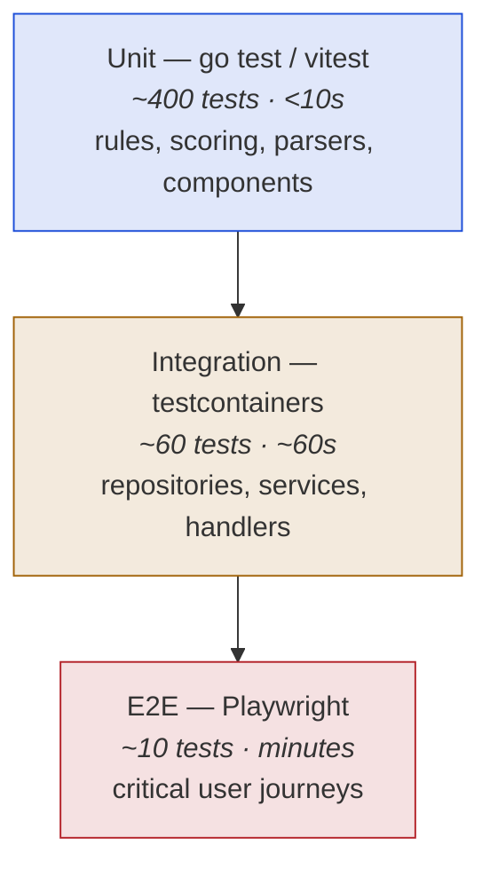

# 15 — Testing Strategy

| Field | Value |
|---|---|
| **Document** | Testing Strategy |
| **Project** | GuardPipe |
| **Version** | 1.0 |
| **Status** | Draft |
| **Owner** | Member 6 (QA) with all module owners |
| **Last updated** | 2026-07-29 |

### Revision history

| Version | Date | Author | Change |
|---|---|---|---|
| 1.0 | 2026-07-29 | Team | Initial testing strategy |

---

## 1. Testing philosophy

A vulnerability scanner has one failure mode that matters more than any other: **saying a codebase is clean when it is not.** A crash is visible. A false negative is invisible, and it is exactly the outcome the user paid us to prevent.

So the testing strategy is organised around one question: *how do we know the engines actually detect what they claim to detect?* The answer is the **golden fixture repository** (§5) — deliberately vulnerable code with known, catalogued issues, against which every rule is measured.

Everything else is normal engineering testing.

### Principles

| # | Principle |
|---|---|
| 1 | **Every rule has a true-positive test and a near-miss test.** The near-miss (must-not-fire) case is the one that catches false positives |
| 2 | **Tests are fast, deterministic, and offline.** No test in CI calls Gemini, OSV, or GitHub |
| 3 | **Test behaviour, not implementation.** A refactor should not break tests |
| 4 | **Repository tests use real PostgreSQL**, not a mock. Mocked SQL tests verify nothing |
| 5 | **A bug fix starts with a failing test** that reproduces it |
| 6 | **Detection rates are published, not hidden.** We report our own false-positive rate |

---

## 2. Test pyramid



| Level | Count | Runtime | Runs |
|---|---|---|---|
| Unit | ~400 | < 10 s | every save, every commit, CI |
| Integration | ~60 | ~60 s | pre-push, CI |
| E2E | ~10 | ~3 min | CI on PR (Stretch — added when the UI stabilises) |

---

## 3. Backend testing

### 3.1 Tooling

| Tool | Use |
|---|---|
| `testing` (stdlib) | Everything |
| `testify/require`, `testify/assert` | Assertions — `require` for preconditions, `assert` for checks |
| `testcontainers-go` | Real PostgreSQL and Redis in integration tests |
| `httptest` | Handler tests |
| `go test -race` | Always on in CI |
| `golden` files | Rule output snapshots |

**No mocking framework.** Go interfaces plus hand-written fakes are clearer and do not break on refactors. A generated mock with five expectations is harder to read than a 10-line fake.

### 3.2 Unit tests — engine rules

Table-driven, and each table has both polarities:

```go
func TestSQLInjectionRule(t *testing.T) {
    tests := []struct {
        name     string
        lang     string
        source   string
        wantFire bool
    }{
        // true positives
        {"go concat with variable", "go",
            `q := "SELECT * FROM u WHERE n = '" + name + "'"` + "\n" + `db.Query(q)`, true},
        {"python fstring", "python",
            `cur.execute(f"SELECT * FROM u WHERE n = '{name}'")`, true},
        {"js template literal", "javascript",
            "db.query(`SELECT * FROM u WHERE n = '${name}'`)", true},

        // near misses — MUST NOT fire
        {"parameterised go", "go",
            `db.Query("SELECT * FROM u WHERE n = $1", name)`, false},
        {"constant only", "go",
            `db.Query("SELECT * FROM users")`, false},
        {"concat of two literals", "go",
            `q := "SELECT * " + "FROM users"` + "\n" + `db.Query(q)`, false},
        {"string built but never executed", "go",
            `msg := "SELECT " + name` + "\n" + `log.Print(msg)`, false},
    }
    for _, tt := range tests {
        t.Run(tt.name, func(t *testing.T) {
            got := runRule(t, sqliRule, tt.lang, tt.source)
            require.Equal(t, tt.wantFire, len(got) > 0)
        })
    }
}
```

**The near-miss cases are the valuable half.** Any regex can find `"SELECT" +`. Not firing on a parameterised query, on two concatenated literals, or on a string that is never executed is what separates a usable engine from a noise generator.

Every rule owner writes these for every rule they add. It is a PR checklist item.

### 3.3 Unit tests — scoring

The scorer is a pure function, so it is exhaustively testable:

| Test | Asserts |
|---|---|
| Determinism | Same input → identical output, 1,000 iterations |
| Monotonicity | Adding a finding never decreases the score |
| Saturation | 200 lows score below 1 critical |
| Critical floor | 1 critical → score ≥ 70 |
| Secret floor | 1 critical secret → score ≥ 90 |
| Weight renormalisation | Skipped engines redistribute correctly; weights still sum to 1 |
| Suppression | Suppressed excluded, acknowledged included |
| Partial cap | Any failed engine → verdict ≠ `pass` |
| Breakdown sums | Contributions reconcile to the final score |
| Worked example | Reproduces [11 §4](11-risk-scoring-and-severity.md#4-worked-example) exactly → **70 / block** |

The last one is a documentation test as much as a code test: if the implementation and the documented example diverge, one of them is wrong and the build says so.

### 3.4 Integration tests — repositories

```go
func TestFindingRepository(t *testing.T) {
    ctx := context.Background()
    db := testdb.Start(t)   // testcontainers Postgres, migrations applied, auto-cleanup

    repo := repo.NewFindingRepository(db)
    // …
    t.Run("bulk insert is idempotent", func(t *testing.T) {
        require.NoError(t, repo.BulkInsert(ctx, findings))
        require.NoError(t, repo.BulkInsert(ctx, findings))  // same fingerprints
        got, total, err := repo.List(ctx, scanID, domain.FindingFilter{}, domain.Page{Size: 100})
        require.NoError(t, err)
        require.Equal(t, len(findings), total)   // no duplicates (NFR-REL-002)
    })
}
```

One container per test package, reused across tests, with per-test transaction rollback. Startup is ~3 s, amortised.

**Every filter combination in [07 §1.5](07-api-specification.md#15-pagination-filtering-sorting) has a test.** Filter bugs are silent — they return a plausible-looking subset, and nobody notices that `severity=critical` is dropping one row.

### 3.5 Integration tests — services and handlers

| Layer | Approach | Asserts |
|---|---|---|
| Service | Real repository (testcontainers), fake adapters | Business rules, authorisation, transaction boundaries |
| Handler | `httptest` + real service | Status codes, error mapping, DTO shape, auth middleware |

Authorisation is tested explicitly and per-endpoint — for every protected resource, a test asserts that a user from another organisation receives **404, not 403** (FR-IAM-008). This is precisely the class of bug that only appears in tests written to look for it.

### 3.6 Orchestrator tests

| Scenario | Asserts |
|---|---|
| Happy path | All engines run, findings persisted, score computed, workspace removed |
| Engine panics | Job `failed`, **scan still completes**, process alive (NFR-REL-001) |
| Engine times out | Job `failed` with `timeout`, partial findings retained |
| Engine not applicable | Job `skipped`, not `failed` |
| Cancellation | All jobs stop within 10 s, cleanup runs |
| Worker crash | Reaper requeues; idempotent insert prevents duplicates |
| Clone failure | Scan `failed`, no orphan workspace |

The panic test uses a deliberately panicking fake engine. It is the single most important reliability test in the codebase — seven engines written by four people, one process.

### 3.7 Sandbox tests

| Test | Asserts |
|---|---|
| Timeout | Container killed at the deadline, `TimedOut: true` |
| Resource limits | Memory-hungry process is killed, host unaffected |
| Network isolation | `NetworkMode: None` → no egress possible |
| Cleanup on panic | Container removed even when the caller panics |
| No secret leakage | Container environment contains no GuardPipe secrets |
| Orphan sweep | Containers left by a simulated crash are removed at startup |

Marked `-tags=docker` and skipped when Docker is unavailable, so the unit suite still runs anywhere.

---

## 4. Frontend testing

### 4.1 Tooling

| Tool | Use |
|---|---|
| Vitest | Runner |
| React Testing Library | Component tests — query by role and text, never by class name |
| MSW | API mocking at the network layer |
| Playwright | E2E (Stretch) |
| `axe-core` | Automated accessibility checks |

### 4.2 What gets tested

| Target | Priority | Approach |
|---|---|---|
| `SeverityBadge` | **P0** | Renders colour + **icon + text** for all 5 severities (FR-UI-008) |
| `RiskGauge` | P0 | Correct verdict band and delta direction per score |
| `SupplyChainPipeline` | P0 | All 5 job states render distinctly |
| `PatchDiff` | P0 | Renders a diff; **AI banner always present** (FR-AI-012) |
| `FindingsTable` | P0 | Filtering, sorting, pagination, suppressed-row styling |
| API client | P0 | 401 → single refresh → retry once; concurrent 401s → **one** refresh call |
| Query hooks | P1 | Polling stops on terminal status |
| Forms | P1 | Zod validation, server field-error mapping |
| Empty/loading/error/partial states | **P0** | Each renders for each data view |

`SeverityBadge` is P0 because it appears in a dozen places and encodes an accessibility requirement. A regression there is a WCAG failure everywhere at once.

The single-flight refresh test is P0 because the failure mode — ten simultaneous refresh calls, nine of which invalidate the token family and log the user out — is confusing, intermittent, and would eat a whole day to diagnose during demo prep.

### 4.3 Accessibility tests

Every page component runs through `axe`:

```ts
it('has no accessibility violations', async () => {
  const { container } = render(<FindingsExplorerPage />, { wrapper: Providers });
  expect(await axe(container)).toHaveNoViolations();
});
```

Automated checks catch roughly 40% of WCAG issues. The rest is the manual checklist in [09 §8](09-ui-ux-design-system.md#8-accessibility-checklist-design-side) — keyboard traversal and colour-blind verification are done by hand before the demo.

---

## 5. The golden fixture repositories

**This is the centrepiece of the strategy.** Five small repositories under `testdata/fixtures/`, each with a catalogue of exactly what should be found.

These are local, catalogued, and CI-gated — not to be confused with the two **live** demo repositories (real, standalone GitHub repos, used for manual testing and the teacher-facing demo) described in [20 — Demo Repositories](20-demo-repositories.md). Keep the two separate: fixtures here are the precise scoring instrument, the demo repos are for showing the product working end to end.

| Fixture | Contents | Purpose |
|---|---|---|
| `fixture-vulnerable` | Deliberate instances of every Core rule across 5 languages, a bad Dockerfile, insecure K8s manifests, a compromised workflow, vulnerable dependencies | **Detection rate** |
| `fixture-clean` | The same application, written securely | **False-positive rate — must produce zero findings** |
| `fixture-typical` | Realistic project with a handful of genuine issues | Calibration |
| `fixture-noisy` | 200 low-severity issues, nothing serious | Saturation calibration |
| `fixture-one-secret` | Clean except one hardcoded AWS key | Critical-floor calibration |

### Catalogue format

Each fixture carries an `EXPECTED.yaml` listing every planted issue:

```yaml
fixture: fixture-vulnerable
expected:
  - rule_id: codescan.injection.sql-string-concat
    file: src/db/users.go
    line: 42
    severity: high
  - rule_id: codescan.secrets.api-key
    file: config/aws.py
    line: 7
    severity: critical
  - rule_id: k8sscan.rbac.cluster-admin-binding
    file: deploy/rbac.yaml
    resource: ClusterRoleBinding/admin-binding
    severity: critical
  # …one entry per planted issue
```

The golden test scans the fixture and compares against the catalogue:

```go
func TestDetectionRate(t *testing.T) {
    expected := loadCatalogue(t, "testdata/fixtures/fixture-vulnerable/EXPECTED.yaml")
    actual := runAllEngines(t, "testdata/fixtures/fixture-vulnerable")

    tp, fn := match(expected, actual)
    rate := float64(len(tp)) / float64(len(expected))

    t.Logf("detection rate: %.1f%% (%d/%d)", rate*100, len(tp), len(expected))
    for _, m := range fn { t.Logf("MISSED: %s at %s", m.RuleID, m.File) }

    require.GreaterOrEqual(t, rate, 0.90, "detection rate below threshold")
}

func TestNoFalsePositives(t *testing.T) {
    actual := runAllEngines(t, "testdata/fixtures/fixture-clean")
    for _, f := range actual {
        if f.Severity != domain.Informational {
            t.Errorf("FALSE POSITIVE: %s at %v", f.RuleID, f.Location)
        }
    }
}
```

### Targets

| Metric | Target | Enforcement |
|---|---|---|
| Detection rate on `fixture-vulnerable` | ≥ 90% | CI fails below |
| False positives on `fixture-clean` | 0 non-informational | CI fails on any |
| Score on `fixture-vulnerable` | 85–100, `block` | CI fails outside |
| Score on `fixture-clean` | 0–10, `pass` | CI fails outside |

**These numbers go in the final report.** A security tool that does not publish its own detection and false-positive rates is asking to be taken on faith, and no reviewer should grant that.

Fixtures are built incrementally: **when you write a rule, you plant its fixture case in the same PR.** Retrofitting fixtures at the end never happens.

---

## 6. Test data and helpers

| Helper | Purpose |
|---|---|
| `testdb.Start(t)` | Postgres container + migrations + cleanup, one line |
| `testredis.Start(t)` | Redis container |
| `fixtures.Finding(opts…)` | Builder with sensible defaults |
| `fixtures.Scan(opts…)` | Scan with jobs |
| `stubs.LLMProvider` | Deterministic AI responses, offline |
| `stubs.Sandbox` | Returns recorded fixture output |
| `stubs.OSVClient` | Canned advisories |
| `auth.TestToken(t, role)` | Valid JWT for handler tests |

Builders with defaults, not fixture files — a test that needs one critical finding writes `fixtures.Finding(fixtures.Critical)` and does not care about the other 20 fields.

---

## 7. Coverage

| Scope | Target | Enforced |
|---|---|---|
| Overall backend | **≥ 60%** | CI (NFR-MNT-002) |
| Engine rule logic | **≥ 75%** | CI per package |
| `scoring` | **≥ 90%** | CI — it is pure and small; there is no excuse |
| `platform/crypto`, `identity` | **≥ 85%** | CI |
| Handlers | ≥ 70% | CI |
| Frontend | ≥ 50% | CI |
| Generated code, `main`, DTOs | excluded | |

Coverage is a floor, not a goal. 100% coverage of trivial getters and 0% of the taint engine would satisfy a naive gate and test nothing that matters — which is why the per-package targets exist alongside the overall one.

---

## 8. Manual testing

Some things cannot be automated in four weeks. They are checklisted instead.

### Test case template

| Field | |
|---|---|
| ID | `TC-001` |
| Requirement | `FR-ORC-001` |
| Precondition | Logged in, project with a valid repository |
| Steps | 1… 2… 3… |
| Expected | |
| Actual | |
| Status | Pass / Fail / Blocked |
| Tester / Date | |

### UAT checklist (before demo day)

**Authentication** — register · login · wrong password · expiry + silent refresh · logout · role restrictions
**Projects** — create · attach repository · private repo with PAT · **PAT never returned by any response** · archive
**Scanning** — full scan · single engine · progress updates · cancel · concurrent scans · repo with no Dockerfile → `skipped` not `failed`
**Findings** — filter each dimension · combined filters · search · pagination · sort · detail view · AI explanation and patch · copy patch · suppress with reason · suppress rejected under 20 chars · suppressed excluded from score but visible
**Pentest** — register target · private address rejected · attestation required · scan runs · transcript stored · **scan blocked without attestation**
**Dashboard** — risk gauge · pipeline · trend · partial banner when an engine fails · all empty states
**Resilience** — stop Postgres mid-scan · stop Redis · invalid Gemini key · malformed repository · 500 MB repository
**Accessibility** — full keyboard traversal · visible focus everywhere · screen reader on the findings table · deuteranopia filter
**Cross-browser** — Chrome, Firefox, Edge, Safari at 1280 px and 1920 px

The three bolded items are the ones most likely to be quietly broken and most damaging if found by an evaluator rather than by us.

---

## 9. CI enforcement

| Gate | Blocks merge |
|---|---|
| Unit tests pass | yes |
| Integration tests pass | yes |
| Race detector clean | yes |
| Coverage thresholds | yes |
| Golden detection rate ≥ 90% | yes |
| Zero false positives on `fixture-clean` | yes |
| Lint clean | yes |
| Dependency scan: no HIGH/CRITICAL | yes |
| Self-scan: no CRITICAL | yes |
| E2E | no (Stretch, informational) |

**A flaky test is a broken test.** Retries are not the fix — a test that fails 1 in 20 runs will fail during demo prep. Quarantine it, file an issue, fix or delete it within 48 hours.

---

## 10. Definition of done for a feature

- [ ] Requirement ID referenced in the issue
- [ ] Implementation follows the module boundary rule
- [ ] Unit tests: happy path + error path + **near-miss** for rules
- [ ] Integration test if it touches the database or an external system
- [ ] Fixture case added for a new rule, in the same PR
- [ ] Frontend: component test + accessibility check
- [ ] `make lint` and `make test` pass locally
- [ ] Documentation updated in the same PR if behaviour or a contract changed
- [ ] PR security checklist complete
- [ ] Reviewed and approved
- [ ] CI green
- [ ] Manually verified in a running stack — **not just green tests**

The last item is not redundant. Tests verify what we thought to check; running the thing verifies what we did not.
