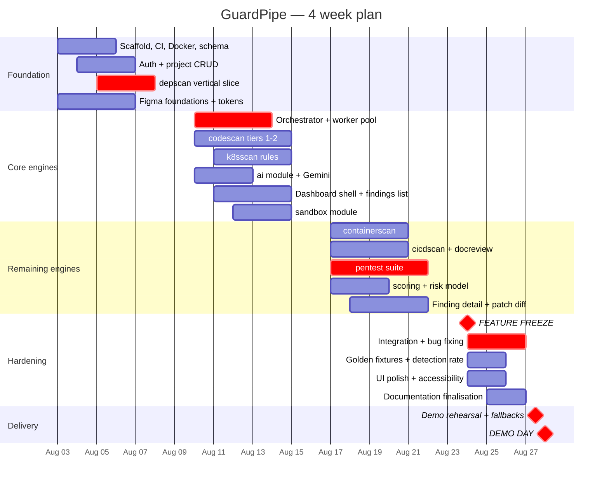
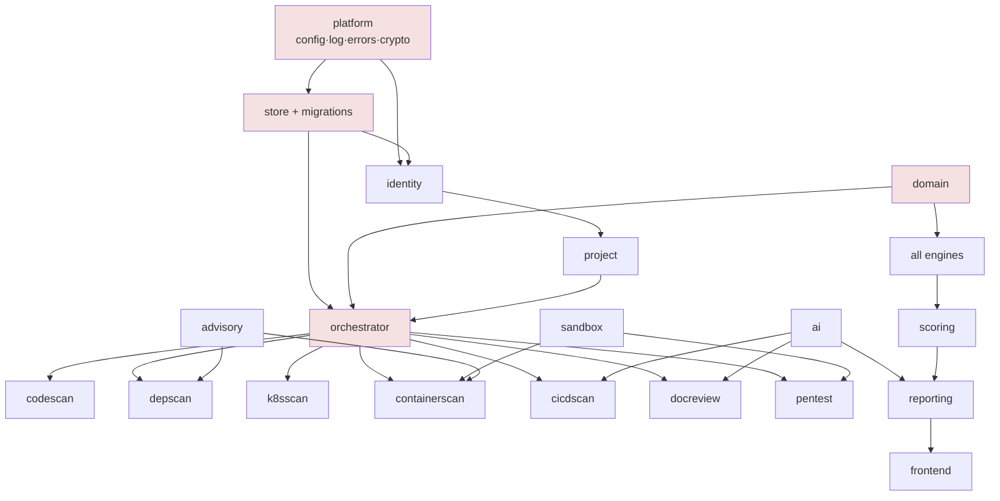

# 16 — Project Plan

| Field | Value |
|---|---|
| **Document** | Project Plan, Schedule, and Traceability |
| **Project** | GuardPipe |
| **Version** | 1.0 |
| **Status** | Draft |
| **Duration** | 4 weeks — 2026-08-03 to 2026-08-28 |
| **Team** | 6 contributors |
| **Owner** | Member 1 (Team Lead) |
| **Last updated** | 2026-07-29 |

### Revision history

| Version | Date | Author | Change |
|---|---|---|---|
| 1.0 | 2026-07-29 | Team | Initial project plan |

---

## 1. Schedule at a glance

| Sprint | Dates | Theme | Tag |
|---|---|---|---|
| **Sprint 0** | Mon 03 Aug – Fri 07 Aug | Foundation & vertical slice | `v0.1.0` |
| **Sprint 1** | Mon 10 Aug – Fri 14 Aug | Core engines & orchestration | `v0.2.0` |
| **Sprint 2** | Mon 17 Aug – Fri 21 Aug | Remaining engines, AI, dashboard | `v0.3.0` |
| **Sprint 3** | Mon 24 Aug – Wed 26 Aug | Integration, hardening, polish | `v0.4.0` |
| **Demo prep** | Thu 27 Aug | Rehearsal, fallbacks, freeze | — |
| **Demo day** | Fri 28 Aug | Presentation | `v1.0.0` |

> **🔒 FEATURE FREEZE: Monday 24 August 2026, 09:00.**
> After this moment, no new features, no new rules, no new dependencies. Bug fixes, tests, documentation, and polish only. This date is not negotiable — it exists so that the last three days are spent making things work rather than making more things.

---

## 2. Work breakdown structure

### Sprint 0 — Foundation & vertical slice (03–07 Aug)

**Goal:** everyone can run the stack, and one engine works end-to-end.

| ID | Task | Owner | Days | Depends on |
|---|---|---|---|---|
| 0.1 | Repo scaffold: `go.mod`, package structure per [04 §3](04-backend-architecture.md#3-package-organisation-conceptual), Makefile | M1 | 1 | — |
| 0.2 | Docker Compose: app, Postgres, Redis; Dockerfiles | M6 | 1 | 0.1 |
| 0.3 | CI: lint, test, build, dependency scan; branch protection; CODEOWNERS; PR template | M6 | 1 | 0.1 |
| 0.4 | Migrations 00001–00012, `sqlc` setup, `store` package | M1 | 2 | 0.1 |
| 0.5 | `platform`: config, logger + redaction, errors, crypto | M1 | 1 | 0.1 |
| 0.6 | `identity`: register, login, JWT, refresh rotation, RBAC | M1 | 2 | 0.4, 0.5 |
| 0.7 | `project`: CRUD, repository attach, credential encryption | M1 | 1 | 0.6 |
| 0.8 | `domain`: `Finding`, `Engine`, `Severity`, `Location`, fingerprint | M2 | 1 | 0.1 |
| 0.9 | **`depscan` vertical slice**: manifest parse → OSV → findings → API → UI | M2 | 3 | 0.4, 0.8 |
| 0.10 | `advisory`: OSV client + Redis cache | M2 | 1 | 0.5 |
| 0.11 | Frontend scaffold: Vite, Tailwind, shadcn, router, API client, auth flow | M5 | 3 | 0.6 |
| 0.12 | Figma page 01 Foundations — all tokens published | M6 | 2 | — |
| 0.13 | Fixture repositories skeleton + `EXPECTED.yaml` format | M6 | 1 | 0.8 |
| 0.14 | **Everyone: one merged PR by end of Tuesday** | all | — | 0.3 |

**Exit criteria**
- [ ] `make setup && make up` works from a fresh clone on all six machines
- [ ] CI green on `main`
- [ ] Login works end-to-end in the browser
- [ ] A `depscan` scan runs and its findings appear in the UI
- [ ] Design tokens published and encoded in `globals.css`
- [ ] Every member has merged at least one PR
- [ ] Tag `v0.1.0`

**Why `depscan` is the vertical slice:** it is the only engine with no hard external dependency beyond one HTTP API, it exercises the entire path (ingest → parse → normalise → persist → score → render), and it produces genuinely impressive output on day five. Proving the path early is worth more than any individual engine.

### Sprint 1 — Core engines & orchestration (10–14 Aug)

**Goal:** the orchestration machinery exists, and the two highest-value engines work.

| ID | Task | Owner | Days | Depends on |
|---|---|---|---|---|
| 1.1 | `orchestrator`: scan/job state machines, Redis queue, worker pool, reaper | M1 | 3 | 0.4, 0.8 |
| 1.2 | `vcs`: shallow clone, size guard, symlink stripping, GitHub client | M1 | 1 | 0.5 |
| 1.3 | Workspace lifecycle + cleanup + orphan sweep | M1 | 1 | 1.2 |
| 1.4 | `codescan` Tier 1: secrets, crypto, TLS rules (10 rules) | M2 | 2 | 0.8 |
| 1.5 | `codescan` Tier 2: injection sinks, Go + Python + JS (10 rules) | M2 | 3 | 1.4 |
| 1.6 | `k8sscan`: RBAC family (10 rules) | M3 | 2 | 0.8 |
| 1.7 | `k8sscan`: workload security family (15 rules) | M3 | 2 | 1.6 |
| 1.8 | `ai`: provider port, Gemini adapter, prompt registry, cache, budget | M4 | 3 | 0.5 |
| 1.9 | `sandbox`: Docker SDK wrapper, limits, cleanup, orphan sweep | M6 | 3 | 0.2 |
| 1.10 | Dashboard shell: layout, projects, project dashboard | M5 | 3 | 0.11 |
| 1.11 | Findings list: table, filters, URL state, virtualisation | M5 | 3 | 1.10 |
| 1.12 | Scan progress view + polling | M5 | 1 | 1.1 |
| 1.13 | Figma: wireframes for all 12 screens | M6 | 2 | 0.12 |

**Exit criteria**
- [ ] A full scan runs `codescan` + `depscan` + `k8sscan` concurrently and completes
- [ ] Engine failure does not fail the scan
- [ ] Cancellation works within 10 s
- [ ] AI explanation appears on at least one finding
- [ ] Findings list filters and paginates
- [ ] Tag `v0.2.0`

### Sprint 2 — Remaining engines, AI, dashboard (17–21 Aug)

**Goal:** all seven engines operational; the product is feature-complete.

| ID | Task | Owner | Days | Depends on |
|---|---|---|---|---|
| 2.1 | `containerscan` Phase A: Dockerfile lint (13 rules) | M3 | 2 | 0.8 |
| 2.2 | `containerscan` Phase B: image layers, package DB, CVE match (5 rules) | M3 | 3 | 2.1, 1.9 |
| 2.3 | `k8sscan`: network + secrets families (6 rules), PSS evaluation | M3 | 1 | 1.7 |
| 2.4 | `cicdscan`: 16 rules | M4 | 2 | 0.8 |
| 2.5 | `cicdscan`: AI semantic pass + dedup | M4 | 1 | 2.4, 1.8 |
| 2.6 | `docreview`: discovery, chunking, 13 categories | M4 | 2 | 1.8 |
| 2.7 | `pentest`: bash suite phases 1–3 | M6 | 2 | 1.9 |
| 2.8 | `pentest`: phases 4–6 + normalisation + transcript | M6 | 2 | 2.7 |
| 2.9 | `pentest`: target validation, attestation, DNS pinning | M1 | 1 | 0.7 |
| 2.10 | `scoring`: full formula, floors, verdict, breakdown | M1 | 2 | 0.8 |
| 2.11 | `reporting`: triage, cross-scan correlation, JSON export | M1+M5 | 2 | 2.10 |
| 2.12 | `codescan` Tier 3: taint tracking for Go + Python | M2 | 3 | 1.5 |
| 2.13 | `depscan`: secret sweep, hygiene rules | M2 | 1 | 0.9 |
| 2.14 | Finding detail: evidence, AI panel, patch diff | M5 | 3 | 1.11 |
| 2.15 | Risk gauge, supply-chain pipeline, trend chart | M5 | 2 | 2.10 |
| 2.16 | New Scan wizard + pentest attestation flow | M5 | 2 | 2.9 |
| 2.17 | Figma: 3 hero screens hi-fi + prototype | M6 | 2 | 1.13 |

**Exit criteria**
- [ ] All seven engines produce findings
- [ ] Risk score and verdict computed and displayed
- [ ] Finding detail shows explanation + patch diff
- [ ] Pentest runs against an attested target with a stored transcript
- [ ] Tag `v0.3.0`

### Sprint 3 — Integration & hardening (24–26 Aug) · **frozen**

| ID | Task | Owner | Days |
|---|---|---|---|
| 3.1 | Complete fixture catalogues; measure detection and false-positive rates | M6+all | 2 |
| 3.2 | Tune rules to hit ≥ 90% detection, 0 false positives on `fixture-clean` | rule owners | 2 |
| 3.3 | Calibrate scoring constants against all five fixtures | M1 | 1 |
| 3.4 | Integration bug fixing | all | 3 |
| 3.5 | Coverage to target; fill gaps | all | 2 |
| 3.6 | Accessibility pass: keyboard, contrast, colour-blind, axe | M5+M6 | 1 |
| 3.7 | Error/empty/loading/partial state review across every view | M5 | 1 |
| 3.8 | Self-scan clean; fix anything GuardPipe finds in GuardPipe | all | 1 |
| 3.9 | Finalise all 19 documents to `Approved` | M1 | 2 |
| 3.10 | Manual UAT checklist ([15 §8](15-testing-strategy.md#8-manual-testing)) | M6 | 1 |
| 3.11 | Tag `v0.4.0` | M1 | — |

### Demo preparation (27 Aug)

| Task | Owner |
|---|---|
| Fresh-clone install verification | M6 |
| Seed demo data; **pre-warm the AI cache** | M4+M6 |
| Database dump of the prepared demo state | M6 |
| Full demo rehearsal, timed, twice | all |
| Screenshot every key screen as fallback | M5 |
| Export a completed report as fallback | M5 |
| Presentation slides | M1 |
| Verify Gemini quota | M4 |
| Tag `v1.0.0` | M1 |

---

## 3. RACI matrix

**R** responsible · **A** accountable · **C** consulted · **I** informed

| Work area | M1 Lead | M2 Code | M3 Infra | M4 AI | M5 Frontend | M6 DevOps |
|---|---|---|---|---|---|---|
| Architecture decisions | **A/R** | C | C | C | C | C |
| Database schema | **A/R** | C | C | C | I | I |
| API contract | **A/R** | C | C | C | **C** | I |
| `identity`, `project`, `orchestrator` | **A/R** | I | I | I | I | I |
| `scoring` | **A/R** | C | C | I | C | I |
| `codescan`, `depscan` | C | **A/R** | I | I | I | C |
| `containerscan`, `k8sscan` | C | I | **A/R** | I | I | C |
| `cicdscan`, `docreview`, `ai` | C | I | I | **A/R** | I | I |
| `pentest` | **C** | I | I | I | I | **A/R** |
| `sandbox` | **C** | I | C | I | I | **A/R** |
| Frontend | I | I | I | I | **A/R** | C |
| Design system / Figma | C | I | I | I | **C** | **A/R** |
| CI/CD & Docker | C | I | I | I | I | **A/R** |
| Test strategy | C | C | C | C | C | **A/R** |
| Fixtures | I | **R** | **R** | **R** | I | **A** |
| Documentation | **A** | R | R | R | R | R |
| Demo & presentation | **A/R** | R | R | R | R | R |

---

## 4. Dependency graph

**Critical path (red):** `platform` → `store` → `domain` → `orchestrator` → engines → `scoring` → frontend.

Everything depends on `domain` and `platform`. Both are Sprint 0, day 1–2, owned by M1 and M2, and both are deliberately small. **If these slip, everything slips** — which is why they are first and why they are the only tasks with a named "blocked? escalate immediately" flag.

**Parallelism enablers**
- `domain` types land on day 1 → all four engine owners start immediately against interfaces
- Consumer-defined repository interfaces → services test against fakes before SQL exists
- The API contract is frozen at end of Sprint 0 → M5 builds against a mock, not against a moving backend
- `stubs.LLMProvider` → AI-dependent engines develop with no API key and no network

---

## 5. Milestones

| # | Milestone | Date | Criterion |
|---|---|---|---|
| M0 | Everyone productive | Tue 04 Aug | All six can run the stack; all six have merged a PR |
| M1 | Vertical slice | Fri 07 Aug | `depscan` works end-to-end in the browser |
| M2 | Orchestration | Wed 12 Aug | Multiple engines run concurrently in one scan |
| M3 | Half the engines | Fri 14 Aug | 3 of 7 engines operational |
| M4 | Feature complete | Fri 21 Aug | All 7 engines, scoring, dashboard |
| **M5** | **Feature freeze** | **Mon 24 Aug 09:00** | **No new features from this point** |
| M6 | Quality gates met | Wed 26 Aug | Detection ≥ 90%, 0 false positives, coverage met, CI green |
| M7 | Demo ready | Thu 27 Aug | Rehearsed twice, fallbacks prepared |
| M8 | Delivered | Fri 28 Aug | Presented |

---

## 6. Risk register

| # | Risk | L | I | Score | Mitigation | Owner | Trigger to act |
|---|---|---|---|---|---|---|---|
| R1 | Scope exceeds 4 weeks | **H** | **H** | 9 | Core/Stretch tiers pre-decided; freeze date fixed; cut order documented in [05 §16](05-module-specifications.md#16-rule-count-summary) | M1 | Sprint 1 exit criteria missed |
| R2 | Uneven Go experience blocks parallel work | M | H | 6 | Sprint 0 scaffolds every module skeleton; pairing in week 1; nobody starts from a blank file | M1 | Anyone stuck > 1 day |
| R3 | Schema conflicts between six developers | **H** | M | 6 | Change protocol + 2 approvals + `schema/` branch type + announce-first rule | M1 | Second migration conflict |
| R4 | Gemini quota exhausted | M | H | 6 | Content-hash caching; token budget; `AI_ENABLED=false` path; pre-warmed demo cache; backup key | M4 | Quota < 30% remaining |
| R5 | Integration left to the last week | M | **H** | 6 | Vertical slice in Sprint 0; concurrent multi-engine scan by M2 | M1 | Sprint 1 exit not met |
| R6 | `pentest` sandbox proves harder than estimated | M | M | 4 | Phases 1–3 are the Core minimum; 4–6 are cuttable; `sandbox` built in Sprint 1 not Sprint 2 | M6 | Phase 3 not working by 20 Aug |
| R7 | `codescan` false-positive rate too high to demo | M | M | 4 | Near-miss tests from day one; `fixture-clean` gate in CI; confidence field lets us downgrade rather than delete | M2 | Any false positive on `fixture-clean` |
| R8 | Frontend blocked on backend | M | M | 4 | API contract frozen end of Sprint 0; MSW mocks; frontend never waits | M5 | M5 idle > half a day |
| R9 | A member becomes unavailable | L | **H** | 3 | Ownership documented; no single-person knowledge; module specs detailed enough for a handover | M1 | Any absence > 2 days |
| R10 | Docker unavailable on a machine | L | M | 2 | `containerscan` Phase A and everything else work without it | M6 | Setup day |
| R11 | Demo fails live | L | **H** | 3 | Pre-warmed cache; database dump; screenshots; exported report; twice-rehearsed | all | Rehearsal failure |
| R12 | Documentation drifts from code | M | M | 4 | Same-PR sync rule; docs owned in CODEOWNERS | M1 | Any merged PR with stale docs |

**Reviewed at every weekly sprint review.** L/I on a 1–3 scale; score = L × I.

---

## 7. Requirements traceability matrix

Maps requirement → module → API → owner → test. Extracted here for the major groups; the complete matrix is maintained as issue labels on the board and must be closed before M6.

| Requirement | Module | API endpoint | Owner | Test | Sprint |
|---|---|---|---|---|---|
| FR-IAM-001..010 | `identity` | `/auth/*` | M1 | `identity_test.go`, handler tests | 0 |
| FR-PRJ-001..005 | `project` | `/projects/*` | M1 | `project_test.go` | 0 |
| FR-PRJ-006..008 | `project` | `/projects/:id/targets`, `/targets/:id/attest` | M1 | `target_validation_test.go` | 2 |
| FR-ORC-001..012 | `orchestrator` | `/projects/:id/scans`, `/scans/:id` | M1 | `orchestrator_test.go` | 1 |
| FR-DOC-001..008 | `docreview` | (via scan) | M4 | `docreview_test.go`, fixture | 2 |
| FR-CODE-001..018 | `codescan` | (via scan) | M2 | rule tests + `fixture-vulnerable` | 1–2 |
| FR-DEP-001..011 | `depscan` | (via scan) | M2 | parser tests + fixture | 0–2 |
| FR-CNT-001..012 | `containerscan` | (via scan) | M3 | dockerfile + image tests | 2 |
| FR-K8S-001..015 | `k8sscan` | (via scan) | M3 | rule tests + manifest fixtures | 1–2 |
| FR-CICD-001..011 | `cicdscan` | (via scan) | M4 | rule tests + workflow fixtures | 2 |
| FR-PEN-001..015 | `pentest` | (via scan) | M6 | phase tests + recorded fixtures | 2 |
| FR-AI-001..014 | `ai` | `/findings/:id/explain` | M4 | stub provider tests | 1 |
| FR-SCR-001..008 | `scoring` | (in scan response) | M1 | `scoring_test.go` + calibration | 2 |
| FR-RPT-001..010 | `reporting` | `/scans/:id/findings`, `/findings/*` | M1+M5 | repository + handler tests | 2 |
| FR-UI-001..009 | frontend | — | M5 | component + axe tests | 1–3 |
| NFR-PERF-001..006 | all | — | all | benchmarks, manual | 3 |
| NFR-SEC-001..009 | all | — | all | security checklist, self-scan | all |
| NFR-REL-001..006 | `orchestrator` | `/healthz`, `/readyz` | M1 | panic/timeout/cancel tests | 1 |
| NFR-MNT-001..006 | all | — | all | CI gates | all |

**Closure rule for M6:** every Core requirement has an issue, that issue is closed, and it links to at least one passing test. An unclosed row is an unmet requirement, regardless of what the demo looks like.

---

## 8. Definition of done

### Per task
See [15 §10](15-testing-strategy.md#10-definition-of-done-for-a-feature).

### Per sprint
- [ ] All committed issues closed
- [ ] CI green on `main`
- [ ] Sprint exit criteria met
- [ ] Documentation updated
- [ ] Tag pushed
- [ ] Demo of working software at the sprint review

### Per project
See [01 §10](01-project-charter.md#10-success-criteria-definition-of-done-for-the-project).

---

## 9. Demo script (10 minutes)

Rehearsed twice on 27 August. Timings are targets, not aspirations.

| # | Time | Segment | What is shown |
|---|---|---|---|
| 1 | 0:00–0:45 | **The problem** | Five disconnected tools, five formats, no answer to "can this ship?" |
| 2 | 0:45–1:30 | **The product** | Login, project list, the supply-chain pipeline visual |
| 3 | 1:30–3:00 | **Full scan** | Start a scan on the vulnerable fixture; watch seven engines run live; findings appearing in real time |
| 4 | 3:00–4:30 | **Findings** | 60+ findings; filter to `critical`; the hardcoded AWS key |
| 5 | 4:30–6:00 | **Finding detail** | Plain-language impact → exact line → deterministic fix → **AI patch diff** |
| 6 | 6:00–7:00 | **The verdict** | Risk gauge at 92, `BLOCK`, breakdown showing why; the critical floor explained in one sentence |
| 7 | 7:00–8:00 | **Depth** | `pull_request_target` CI/CD finding; `cluster-admin` RBAC finding — the two that make a security audience sit up |
| 8 | 8:00–9:00 | **Pentest** | Attestation gate, then a live pentest against our own staging target; transcript as evidence |
| 9 | 9:00–9:30 | **Self-scan** | GuardPipe scanning GuardPipe. CI passing. "We hold ourselves to our own rules" |
| 10 | 9:30–10:00 | **Honesty** | Detection rate, false-positive rate, known limitations, what is stretch. Close |

**Segment 10 is deliberate.** Presenting measured detection and false-positive rates alongside stated limitations is more convincing than claiming perfection — and it is what an experienced evaluator will be probing for anyway.

**Fallbacks, in order:** pre-warmed AI cache → restored database dump of a completed scan → exported JSON report → screenshots. Any of them keeps the presentation moving.

---

## 10. Communication plan

| Channel | Use | Cadence |
|---|---|---|
| Team chat | Async standup, blockers, quick decisions | Daily |
| GitHub Issues | All work items | Continuous |
| GitHub PRs | All code and doc review | Continuous |
| Live sync | Integration, decisions, grooming | Twice weekly, 30 min |
| Sprint review | Demo, retro, re-tiering | Weekly, 45 min |
| ADRs | Decisions with lasting consequence | As needed |
| Instructor update | Progress, risks, scope changes | Weekly |

**Escalation:** blocked → team chat the same day → module owner within 4 h → Team Lead within 24 h. Nobody stays blocked overnight in a four-week project.

---

## 11. Post-project

Recorded so the work has a life beyond the grade:

| Item | Note |
|---|---|
| Retrospective | What the process got right and wrong; written up in the repository |
| Open-source release | MIT-licensed, with detection rates and limitations published honestly |
| Stretch backlog | Everything tagged `priority:p2-stretch` that did not ship |
| Future roadmap | Runtime detection, SBOM signing, compliance engine, EPSS/KEV weighting, reachability analysis — see [01 §5.3](01-project-charter.md#53-future-product-vision-documented-not-built) |
