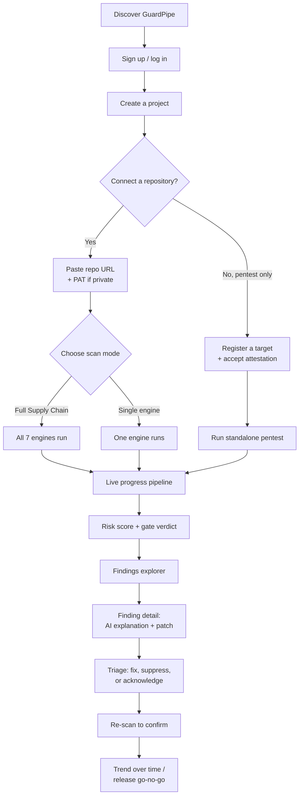

# 19 — Client Journey, Product Usage & Pricing Model

| Field | Value |
|---|---|
| **Document** | Client Journey, Product Usage & Pricing Model |
| **Project** | GuardPipe |
| **Version** | 1.3 |
| **Status** | Draft |
| **Authors** | GuardPipe Team |
| **Last updated** | 2026-08-23 |

### Revision history

| Version | Date | Author | Change |
|---|---|---|---|
| 1.0 | 2026-07-30 | Team | Initial client-facing journey and pricing model |
| 1.1 | 2026-08-22 | Team | Added §13.5–13.7: CLI as a fourth channel (incl. device-authorization browser-handoff login, à la `gh auth login`/`claude login`), per-engine tier gating, org-vs-solo account model. Still conceptual/not implemented — see the boundary restated in §13 and the roadmap entry added to `BUILD_GUIDE.md` Phase 15+ |
| 1.2 | 2026-08-23 | Team | Pentest target restrictions reworded: any public, non-blocked-range target is now accepted by default (a client doesn't need an administrator to pre-allowlist their domain before registering it); GuardPipe instead maintains a denylist for specific hosts it refuses regardless of attestation. Matches `02-srs.md` rev 1.4's FR-PRJ-007 |
| 1.3 | 2026-08-23 | Team | §12's webhook/scheduled-scan Stretch line now points at the full "Live / continuous scanning" design (scan-profile replay, debounce, per-org abuse quotas, worker/queue scaling) added to `BUILD_GUIDE.md` Phase 15+ — still a post-graduation roadmap item, not scoped for this semester |

---

## 1. Why this document exists

Documents 03–13 describe GuardPipe from a **builder's** point of view — modules, layers, the database, the API. This document describes the same product from the **customer's** point of view: what a client sees, clicks, and pays for, from the moment they hear about GuardPipe to the moment they trust its verdict enough to gate a release on it.

Nothing here introduces new backend behaviour. Every flow described is already specified by a functional requirement in [02 — SRS](02-srs.md) or a use case in its §6 — this document just re-tells that story front-to-back, in the order a client actually experiences it, and adds the one thing the SRS deliberately does not cover: **pricing**.

> **On pricing:** [01 — Project Charter](01-project-charter.md) §5.2 explicitly places "multi-tenant SaaS billing" **out of scope** for this semester's build, and no billing code exists or will exist in this project. §13 below is a **conceptual monetisation model** for course presentation purposes only — it explains how GuardPipe *would* be commercialised as a product, not a feature being implemented.

---

## 2. Who is buying this, and why

Recap from [01 — Project Charter](01-project-charter.md) §6, reframed as buyers rather than stakeholders:

| Persona | What they're trying to answer | What they touch first |
|---|---|---|
| **Developer** | "What exactly is wrong, and how do I fix it?" | Finding detail view, AI patch diff |
| **DevSecOps Engineer** | "Is this release safe across every stage of the chain, not just the one tool I already run?" | Full supply-chain scan, findings explorer |
| **Engineering Manager** | "Can we ship, yes or no, and is the trend improving?" | Risk gauge, gate verdict, trend chart |

The product's one-sentence pitch, unchanged from the charter: **"Can this software safely reach production?"**

---

## 3. The journey, end to end

Every node in this diagram is a section below.

---

## 4. Step 1 — Sign up and log in

- A client registers with an email and password (`FR-IAM-001..003`). GitHub OAuth login is a documented **Stretch** goal (`FR-IAM-010`) — if the schedule allows it, a client can also sign in with their GitHub identity, but this is not required for the product to function.
- Passwords are hashed with Argon2id; sessions are a short-lived JWT access token plus a longer-lived refresh token, refreshed silently in the background.
- **This login is for the GuardPipe account itself** — it is a separate concept from the GitHub credentials used to *scan* a repository (§6). A client can have a GuardPipe account and never grant it any GitHub access at all, if they only ever run standalone pentests (§9).

---

## 5. Step 2 — Create a project

A **project** is the client's container for "one thing we scan repeatedly" — typically one application or one repository (`FR-PRJ-001..002`). Creating one asks for:

- A name and description
- Optionally, a repository URL right away (it can also be added later)

A project can be archived but its full scan history is retained (`FR-PRJ-008`) — this is what powers the trend view in §12.

---

## 6. Step 3 — Connecting a repository: the access mechanism

This is the question with the most options, so it gets its own comparison.

### 6.1 The three ways to hand over a repository

| Mechanism | How it works | Pros | Cons | Chosen? |
|---|---|---|---|---|
| **Repository URL + GitHub Personal Access Token (PAT)** | Client pastes the HTTPS clone URL; if the repo is private, they also paste a PAT with `repo` (read-only) scope | Works today with zero registration overhead; no GitHub App to publish or maintain; the client controls exactly what scope they grant and can revoke it any time from their own GitHub settings; trivial to explain in a demo | The client has to know how to generate a PAT; a leaked PAT is a real credential, so it must be handled with care | **Yes — this is what is built** |
| **GitHub OAuth App / GitHub App installation** | Client clicks "Install GuardPipe on GitHub," approves an installation, GuardPipe receives short-lived installation tokens instead of a long-lived PAT | More polished onboarding; tokens are scoped per-installation and auto-expire; no client-managed secret at all | Requires registering and maintaining a GitHub App/OAuth App, a callback/webhook endpoint, and installation-lifecycle handling — real infrastructure a 4-week, zero-budget student project has no room for | Not this semester — documented future upgrade path |
| **Plain, unauthenticated `git clone`** | Only works for public repositories | Simplest possible thing; needs nothing from the client | Cannot touch a single private repository, which rules out most real client codebases | Public-repo fallback only |

**Why PAT is the right call for this product, at this stage:** GuardPipe already reads a repository's most sensitive material (secrets, dependency manifests, CI workflows) — access control has to exist regardless of transport, so the marginal safety gain of a GitHub App over a PAT is small, while the marginal engineering cost (App registration, webhook infra, installation token refresh) is large relative to the schedule. The PAT path is also what a client can test in thirty seconds without waiting on anyone to approve a GitHub App listing. GitHub App support is recorded as the natural next step once the product moves toward a real multi-tenant SaaS (see §13.3).

### 6.2 What actually happens when a client connects a repo

1. Client pastes the URL. System normalises it and checks it's reachable (`FR-PRJ-005`).
2. If the repo is private, the client also pastes a PAT. GuardPipe:
   - Encrypts it at rest with AES-256-GCM (`FR-PRJ-003`, `NFR-SEC-001`)
   - Stores only a masked hint for display, e.g. `ghp_••••3f9a` — **the real token is never returned by any API response, ever** (`FR-PRJ-004`)
3. GitHub API rate limits mean an unauthenticated client is capped at 60 requests/hour; a PAT raises that to 5,000/hour — the system requires a PAT once a repository crosses a configured size threshold, so large-repo clients hit this naturally rather than being surprised by a rate-limit failure mid-scan.
4. At scan time, the repository is **shallow-cloned** (`--depth 1`, history not needed) into a throwaway directory, capped at 500 MB by default (`FR-ORC-011..012`), and that directory — along with any sandbox containers used during the scan — is deleted the moment the scan reaches a terminal state, success or failure (`FR-ORC-010`, `NFR-SEC-007`). Nothing about the client's code is retained after the scan except the findings themselves.

---

## 7. Step 4 — Choosing what to scan

A client is never forced into an all-or-nothing scan. Three modes, all reachable from the same "New Scan" action:

| Mode | What runs | When a client picks this |
|---|---|---|
| **Full Supply Chain Scan** | All seven engines — `docreview`, `codescan`, `depscan`, `containerscan`, `k8sscan`, `cicdscan`, `pentest` — against the same project | Release-gate decisions; "is this safe to ship" (`FR-ORC-001`) |
| **Single-engine scan** | Exactly one engine, e.g. only `codescan`, or only `k8sscan` | A developer just changed application code and only wants a fast SAST pass, not a full 5-minute run (`FR-ORC-002`) |
| **Standalone pentest** | Only `pentest`, against a registered network target — no project or repository required at all (`FR-PEN-013`) | A DevSecOps engineer wants to probe a running service directly, independent of any codebase |

Engines that don't apply to a given repository (no Dockerfile, no Kubernetes manifests) are marked **`skipped`**, not `failed` — a client is never penalised in the score for infrastructure they don't have (`FR-ORC-005`, Applicable-check in the `Engine` interface).

---

## 8. Step 5 — Watching the scan run

Once started, a scan is not a black box:

- One `scan` record with one `scan_job` per selected engine is created immediately; the UI shows the *SupplyChainPipeline* — a row of engine cards moving through `queued → running → succeeded / failed / skipped` (`FR-ORC-003`, `FR-ORC-007`)
- Independent engines run concurrently, so a full scan doesn't take 7× as long as one engine
- The client can cancel at any point; running jobs stop within 10 seconds and everything is cleaned up (`FR-ORC-008`)
- If one engine crashes or times out, **the rest of the scan keeps going** — the client sees that one engine failed with a reason, not that the whole scan is unusable (`FR-ORC-006`, `FR-ORC-009`)
- If the AI provider (Gemini) is unreachable or over quota, the scan still completes — findings simply arrive without an AI explanation/patch attached yet, backfilled later if possible (`FR-AI-013`)

---

## 9. The standalone pentest path (its own gate)

Because a pentest touches a live system the client may not fully control, it has an extra, mandatory step the other engines don't: **an explicit authorisation attestation**. A client must register the target and affirmatively confirm they're authorised to test it before the scan button is even enabled (`FR-PRJ-006`). GuardPipe additionally blocks targets that resolve to private, loopback, link-local, or cloud-metadata addresses, and refuses any host on an operator-maintained denylist (`FR-PRJ-007`) — this protects both the client and GuardPipe from an accidental (or malicious) attempt to point the scanner at infrastructure it has no business touching. Any other public target a client registers and attests to is accepted without an administrator needing to pre-approve the domain first.

---

## 10. Step 6 — Reading the verdict

When a scan completes, the client lands on the results view, top-down:

1. **Risk gauge** — a single 0–100 score with a gate verdict (`pass` / `warn` / `block`), computed by `scoring` from every engine's contribution (see [11 — Risk Scoring](11-risk-scoring-and-severity.md) for the formula). This is the answer to the Manager persona's question in one glance.
2. **Per-engine breakdown** — which of the seven engines contributed how much, and which were skipped or failed (a failed engine caps the verdict below `pass` — a partial scan is never silently reported as clean).
3. **Findings explorer** — every finding, filterable by engine, severity, status, CWE, CVE, and file path, with free-text search (`FR-RPT-001`).

---

## 11. Step 7 — Acting on a finding

Opening any single finding gives the client, in order:

1. **What it is**, in plain language, with its CWE/CVE/CVSS/OWASP references and exact location (file:line, image layer, Kubernetes resource, or host:port — whichever applies)
2. **A deterministic remediation string** — this exists for *every* rule regardless of AI availability (`FR-AI-011`)
3. **An AI-generated explanation and a suggested patch as a diff**, clearly banner-labelled as AI-generated so a client never mistakes a suggestion for a guarantee (`FR-AI-012`)
4. **Triage actions**: mark fixed, acknowledge, or suppress with a required reason (a one-word suppression is rejected — the reason has to be substantive) (`FR-RPT-004..006`)

Suppressed findings are excluded from the score but stay visible in the explorer — nothing simply disappears.

---

## 12. Step 8 — Closing the loop

- The client fixes what they choose to fix, then **re-scans**. Because every finding has a stable fingerprint, a fixed issue disappears from the open list and a genuinely new issue is distinguishable from a moved line number (§7.1 of [03 — Architecture Overview](03-architecture-overview.md)).
- Full scan history is retained per project (`FR-PRJ-008`), so the dashboard can show a **trend** — is the risk score improving release over release, which is exactly the evidence an Engineering Manager needs for a go/no-go call (`UC-08`).
- **Stretch, not required for this semester:** a GitHub webhook can auto-trigger a scan on push or pull request, and scans can be scheduled to run on a recurring basis (`FR-ORC-013..014`) — both are natural once the product needs to run unattended rather than on a client's explicit click. Full design (replaying the client's own last-used scan configuration rather than a fresh default, debounce, per-org abuse quotas, worker/queue scaling once triggers are externally driven) is the "Live / continuous scanning" entry in `BUILD_GUIDE.md`'s Phase 15+ — a post-graduation roadmap item, not scoped for this semester.

---

## 13. Pricing model (conceptual — not implemented)

> Restating the boundary: this section documents a **business-model concept** for a course presentation. It does **not** correspond to any billing code, subscription table, or payment integration in the repository, and none will be built this semester — see [01 — Project Charter](01-project-charter.md) §5.2 and §5.3.

### 13.1 Why a tiered model makes sense here

The product already has a natural fault line between "what a solo developer needs to check their own code" and "what an organisation needs to gate a release and prove compliance." A three-tier model maps cleanly onto that, and onto the Core/Stretch/Future-vision tiers the team has already defined for the build itself.

### 13.2 Proposed tiers

| | **Free** | **Pro** | **Enterprise** |
|---|---|---|---|
| **Who it's for** | Individual developer, side project, evaluation | A team shipping regularly | An organisation with compliance/governance needs |
| Projects | 1 | Unlimited | Unlimited |
| Full supply-chain scans | 5 / month | Unlimited | Unlimited |
| Single-engine scans | Unlimited | Unlimited | Unlimited |
| Engines available | All 7 | All 7 | All 7 |
| AI explanations | Included | Included | Included |
| AI-generated patches | Rate-limited | Unlimited (fair-use) | Unlimited, priority queue |
| Pentest | Not included | Included | Included, custom rate limits |
| Scan history / trend | 30 days | Full history | Full history + audit export |
| Scheduled / webhook-triggered scans | — | Included | Included |
| SSO / org hierarchy / multi-tenant admin | — | — | Included |
| Compliance reports (SOC 2 / ISO 27001 / NIST evidence) | — | — | Included |
| Self-hosted / on-prem deployment | — | — | Included |
| Support | Community | Standard | Dedicated, SLA-backed |

### 13.3 How this maps onto what's already documented

The Enterprise column is not invented from nothing — every row in it is already named as **explicitly out of scope for this semester** in [01 — Project Charter](01-project-charter.md) §5.2–5.3: SBOM signing, compliance report generation, multi-tenant SaaS billing/SSO/org hierarchy, GitHub App-based repository access (§6.1 above), and live Kubernetes cluster connection. That is a convenient property for a course presentation: the pricing model isn't a guess about what an Enterprise tier *might* need, it's a direct relabeling of the team's own "future work" list into "what you'd pay more to get."

### 13.4 What would actually need to be built to charge money

Being explicit about this is more convincing to an instructor than the pricing table alone: a billing integration (e.g. Stripe), a subscription/entitlement model in the database, per-tier rate-limit enforcement in the API layer, and a plan-management UI. None of this exists, none of it is planned for this semester, and the architecture (stateless app, external state, modular monolith) doesn't foreclose adding it later — which is the same design property already claimed for the Kubernetes migration path in [03 — Architecture Overview](03-architecture-overview.md) §9.

### 13.5 A fourth channel: the CLI

Everything above assumes the web app is the only door in. The post-graduation plan adds a `guardpipe` CLI (`guardpipe login`, `guardpipe scan .`, `guardpipe findings list`, `guardpipe scan --engine codescan`) as a second, developer-facing channel onto the *same* API and the *same* entitlement checks — it is not a separate product with separate limits. A CLI scan run counts against the calling account's normal monthly quota exactly like a web-triggered one; there is no "CLI tier."

This is the lowest-effort item in this whole roadmap because `cmd/guardpipe` already is a single binary with a subcommand dispatcher (`healthcheck`, `aiprobe`) — a `scan`/`login`/`findings` subcommand group is the same pattern, thin HTTP calls against `07-api-specification.md`'s existing endpoints. No new backend logic beyond the login handshake below; see the corresponding entry in `BUILD_GUIDE.md` Phase 15+ for the full command list.

**Authentication — browser handoff, not a password prompt.** `guardpipe login` never asks for a password on the command line. It follows the same device-authorization pattern developers already know from `gh auth login` and Claude Code's own `claude login`: the CLI requests a short device code from the API, opens the user's default browser to a GuardPipe confirmation page pre-filled with that code, the user approves the CLI's access using whatever session they already have in the browser (or logs in there if they don't), and the CLI — which has been quietly polling in the background — picks up a token the moment approval lands. Nothing about this is a new login system: it's the existing `identity` login/JWT flow (§4 above), just triggered from a browser tab the CLI opened rather than a form the CLI can't render. The account settings page would gain a "CLI/device sessions" list alongside browser sessions, so a lost laptop's CLI credential can be revoked independently of revoking every browser session.

**Why a developer would want it:** it's what makes "gate my release" mean `guardpipe scan --gate` as one line in a CI job someone else's pipeline calls, instead of requiring a human to click through the web UI before every merge — closes the loop the webhook/scheduled-scan Stretch goal (§12 above, `FR-ORC-013..014`) already gestures at.

### 13.6 Per-engine tier gating (replacing the flat "All 7" row)

§13.2's table gives every tier all seven engines, which was accurate for a course presentation but not for a real pricing wall — a paying customer expects the free tier to be a genuine taste, not the full product. A more deliberate per-engine mapping:

| Engine | Free | Pro | Enterprise |
|---|---|---|---|
| `codescan` (SAST via SonarQube) | Included | Included | Included |
| `depscan` (dependency/OSV) | Included | Included | Included |
| `docreview` (AI design-doc review) | 1 doc / month | Unlimited | Unlimited |
| `containerscan` (Trivy) | — | Included | Included |
| `k8sscan` (Helm/manifest policy) | — | Included | Included |
| `cicdscan` | — | Included | Included |
| `pentest` (live-target probing) | — | Included | Included, custom rate limits |

The logic: `codescan`/`depscan` are the cheapest to run and the best hook for a free account to see real value fast, so they stay free without a scan-count cap on the engine itself (the existing "5 full scans/month" cap in §13.2 still applies at the *scan* level). Everything that touches infrastructure the client controls (`containerscan`, `k8sscan`, `cicdscan`) or a live external target (`pentest`) is gated to paid tiers — those are also the engines with the highest operating cost (sandbox containers, Trivy/Helm invocations, network probing), so the gate lines up with actual marginal cost, not an arbitrary split.

Enforcement point, if this is ever built: the same `entitlement.Check(ctx, orgID, capability)` seam named in `BUILD_GUIDE.md` Phase 15+, called from `transport/http` before a scan job is created — never inside `Engine.Applicable`/`Engine.Run`, which stay tier-agnostic exactly like they're already actor-agnostic (`03-architecture-overview.md`'s Engine interface, §7 above).

### 13.7 Organisation vs. solo accounts

§2's personas (Developer, DevSecOps Engineer, Engineering Manager) already imply two different buyers, but today's data model doesn't distinguish them: `CLAUDE.md`'s "Multi-tenancy" section is explicit that registration creates one organisation per account with **no invite flow**, so an organisation can never gain a second member. That's fine for the graded build (one account = one isolated org is the actual security property being tested) but it's too narrow for "an organisation buys this."

The conceptual distinction for the post-graduation product:

| | **Personal account** | **Organisation account** |
|---|---|---|
| Membership | Exactly one user, always | Multiple users under one billing entity, via an invite flow that doesn't exist yet |
| Roles | N/A — one user, full access to their own org | Owner / Admin / Member, reusing the RBAC types `modules/identity` already defines for a *single* user's role, extended to be per-membership rather than per-user |
| Billing | Individual card, Free/Pro tiers from §13.2 | Seat-based or usage-based, Enterprise tier + custom contracts |
| Projects/scans | Scoped to the one org, as today | Scoped to the org, visible to every member per their role |

The important point for anyone reading this later: this is a **schema and identity-module change** (a membership table between `users` and `organizations`, invite tokens, per-membership roles), not a UI skin on the existing model — it would go through the normal two-approval `schema/` branch process (`14-github-workflow.md`) exactly like any other change to `02-srs.md`/`06-database-design.md`, and is explicitly **not** something to build by quietly relaxing the current one-org-per-user isolation. See `CLAUDE.md`'s standing warning about not reintroducing a shared/default organisation — an invite flow is the correct way to let a second person into an org; a `GetSole()`-style shortcut is the incident that already happened once.

---

## 14. Summary — the client's whole story in one table

| Stage | Client action | What GuardPipe does | Reference |
|---|---|---|---|
| 1 | Sign up / log in | Issues JWT + refresh token | `FR-IAM-001..003` |
| 2 | Create a project | Stores project record | `FR-PRJ-001..002` |
| 3 | Connect a repository (URL + PAT if private) | Validates reachability, encrypts PAT | `FR-PRJ-003..005`, §6 |
| 4 | Choose full scan / single engine / standalone pentest | Creates scan + job records | `FR-ORC-001..002`, `FR-PEN-013` |
| 5 | Watch progress | Runs engines concurrently, streams status | `FR-ORC-003..009` |
| 6 | Read the verdict | Computes risk score + gate verdict | [11 — Risk Scoring](11-risk-scoring-and-severity.md) |
| 7 | Open a finding | Shows CWE/CVE, deterministic fix, AI explanation + patch | `FR-AI-011..013` |
| 8 | Triage and re-scan | Tracks fingerprint across scans, keeps history/trend | `FR-RPT-004..006`, `FR-PRJ-008` |
| — | (Conceptual) Upgrade plan | No-op this semester — see §13 | — |
