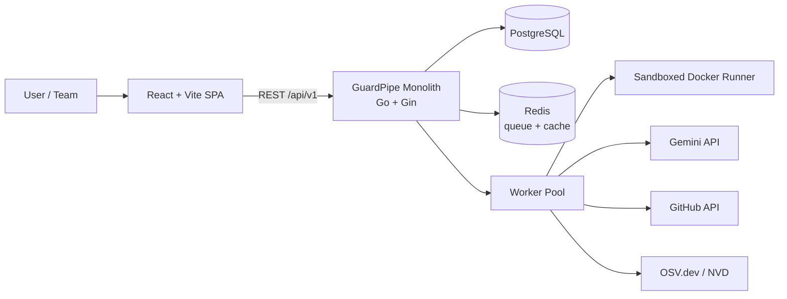

# GuardPipe — Documentation

**AI-Powered Software Supply Chain Security Platform**

> *"Can this software safely reach production?"*

| | |
|---|---|
| **Project** | GuardPipe |
| **Institution** | United International University |
| **Course** | *[Course Name / Code]* |
| **Section** | *[Section]* |
| **Team size** | 6 |
| **Repository** | `Ruhanyat-994/GuardPipe` |
| **Doc baseline version** | 1.0 |
| **Last updated** | 2026-07-29 |

---

## 1. What this folder is

This folder is the **single source of truth** for GuardPipe's requirements, architecture, and process. It was written *before* implementation so that six people can work in parallel without colliding.

**Rule:** if the code disagrees with these documents, one of the two is a bug. Open an issue and resolve it — do not let them silently diverge.

---

## 2. Reading order

If you are new to the team, read in this order. Total time ≈ 90 minutes.

| # | Document | Read if you are… | Time |
|---|---|---|---|
| 1 | [01 — Project Charter](01-project-charter.md) | everyone | 8 min |
| 2 | [02 — Software Requirements Specification](02-srs.md) | everyone | 25 min |
| 3 | [03 — Architecture Overview](03-architecture-overview.md) | everyone | 15 min |
| 4 | [04 — Backend Architecture](04-backend-architecture.md) | backend | 15 min |
| 5 | [05 — Module Specifications](05-module-specifications.md) | backend (read *your* module fully) | 20 min |
| 6 | [06 — Database Design](06-database-design.md) | backend | 12 min |
| 7 | [07 — API Specification](07-api-specification.md) | backend + frontend | 12 min |
| 8 | [08 — Frontend Architecture](08-frontend-architecture.md) | frontend | 12 min |
| 9 | [09 — UI/UX & Design System](09-ui-ux-design-system.md) | frontend + design | 12 min |
| 10 | [10 — AI Integration (Gemini)](10-ai-integration.md) | AI module owner | 10 min |
| 11 | [11 — Risk Scoring & Severity](11-risk-scoring-and-severity.md) | backend + frontend | 8 min |
| 12 | [12 — Security & Threat Model](12-security-and-threat-model.md) | everyone | 12 min |
| 13 | [13 — DevOps & Environments](13-devops-and-environments.md) | everyone (setup) | 10 min |
| 14 | [14 — GitHub Workflow](14-github-workflow.md) | **everyone, day one** | 10 min |
| 15 | [15 — Testing Strategy](15-testing-strategy.md) | everyone | 10 min |
| 16 | [16 — Project Plan](16-project-plan.md) | everyone | 12 min |
| 17 | [17 — Architecture Decision Records](17-adr/README.md) | curious / challenging a decision | varies |
| 18 | [18 — Glossary](18-glossary.md) | reference | — |

**Minimum viable onboarding (30 min):** 01 → 03 → 14 → your module section in 05.

---

## 3. Document status

| Document | Version | Status | Owner |
|---|---|---|---|
| 01 — Project Charter | 1.0 | Draft | Team Lead |
| 02 — SRS | 1.0 | Draft | Team Lead + all |
| 03 — Architecture Overview | 1.0 | Draft | Backend Lead |
| 04 — Backend Architecture | 1.0 | Draft | Backend Lead |
| 05 — Module Specifications | 1.0 | Draft | All module owners |
| 06 — Database Design | 1.0 | Draft | Backend Lead |
| 07 — API Specification | 1.0 | Draft | Backend Lead |
| 08 — Frontend Architecture | 1.0 | Draft | Frontend Lead |
| 09 — UI/UX & Design System | 1.0 | Draft | Design Owner |
| 10 — AI Integration | 1.0 | Draft | AI Owner |
| 11 — Risk Scoring | 1.0 | Draft | Backend Lead |
| 12 — Security & Threat Model | 1.0 | Draft | Security Owner |
| 13 — DevOps & Environments | 1.0 | Draft | DevOps Owner |
| 14 — GitHub Workflow | 1.0 | Draft | Team Lead |
| 15 — Testing Strategy | 1.0 | Draft | QA Owner |
| 16 — Project Plan | 1.0 | Draft | Team Lead |
| 17 — ADRs | 1.0 | Accepted | Backend Lead |
| 18 — Glossary | 1.0 | Draft | All |

`Draft` → `Reviewed` → `Approved`. A document becomes **Approved** when it has been merged to `main` after review by at least two team members.

---

## 4. The 30-second architecture



**One Go binary. Nine security modules inside it. One database. One dashboard.**

---

## 5. How to change a document

Documentation follows the exact same workflow as code — see [14 — GitHub Workflow](14-github-workflow.md).

1. Branch: `docs/<topic>` — e.g. `docs/update-risk-formula`
2. Commit: `docs(<scope>): <what changed>` — e.g. `docs(srs): add FR-CICD-004 for reusable workflow checks`
3. Open a PR, request review from the document's owner
4. Bump the version in the document header and add a row to its revision history
5. Squash-merge

**Any change to `02-srs.md`, `06-database-design.md`, or `07-api-specification.md` requires two approvals** — these are shared contracts and a silent change breaks other people's work.

---

## 6. Conventions used across all documents

| Convention | Meaning |
|---|---|
| **shall** | mandatory requirement |
| **should** | strong recommendation, deviation must be justified in a PR |
| **may** | optional |
| `FR-XXX-nnn` | functional requirement ID |
| `NFR-XXX-nnn` | non-functional requirement ID |
| `ADR-nnnn` | architecture decision record |
| **Core** | must ship for the demo |
| **Stretch** | ship only if the schedule allows; cut without guilt |
| ```` ```mermaid ```` | diagrams — render natively on GitHub |

---

## 7. Standards this documentation follows

| Area | Standard |
|---|---|
| Requirements | ISO/IEC/IEEE 29148:2018 |
| Architecture description | arc42 + C4 model (levels 1–3) |
| Decision records | MADR / Nygard ADR format |
| API design | REST + OpenAPI 3.1 conventions, RFC 9457 problem details |
| Commit messages | Conventional Commits 1.0.0 |
| Versioning | Semantic Versioning 2.0.0 |
| Accessibility | WCAG 2.1 Level AA |
| Vulnerability classification | CVE, CWE, CVSS v3.1 / v4.0 |
| Security guidance | OWASP Top 10 2021, OWASP ASVS 4.0, CIS Benchmarks, NIST SSDF (SP 800-218) |
